# PolytopiaGuide
A guide for the mobile game *The Battle for Polytopia*, formatted as a technical manual.

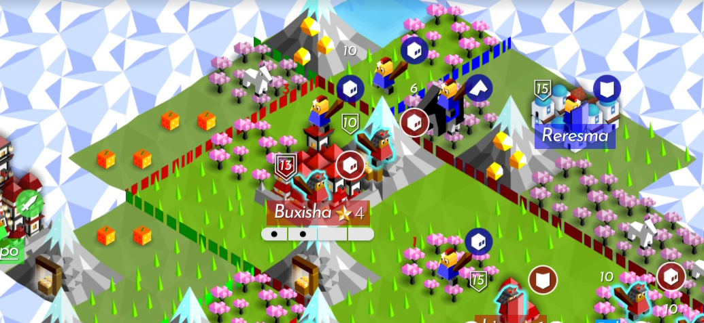

# Get started

*The Battle for Polytopia* is an award-winning turn-based strategy game. 

Link to analysis [here](analysis/text.txt).

*Polytopia* is a ‘4X’ (Explore, Expand, Exploit, Exterminate) type game, similar to the *Civilization* series, albeit with much more streamlined and fast-paced game mechanics and a brightly-coloured, low-polygon art style. 

Versions of *Polytopia* are available for iOS, Android, Windows, Mac, and Linux (via Steam), and Nintendo Switch. 

This unofficial guide uses screenshots from the Android and Switch versions of the game, but the strategies and tactics discussed here can be applied to any version. 

This guide has been written with beginners in mind. It explains the core concepts of *Polytopia*, from how to interact with the game, to a complete explanation of the combat mechanic. 

## How to download Polytopia – on iPhone, Android, PC, or Switch

1. Download Polytopia from:

* [iOS App Store](https://apps.apple.com/gb/app/the-battle-of-polytopia/id1006393168)
* [Google Play](https://play.google.com/store/apps/details?id=air.com.midjiwan.polytopia&hl=en_GB)
* [Steam](https://store.steampowered.com/app/874390/The_Battle_of_Polytopia/)
* [Epic Games](https://store.epicgames.com/en-US/p/the-battle-of-polytopia-12fed6)
* [Nintendo Store](https://www.nintendo.com/en-gb/Games/Nintendo-Switch-download-software/The-Battle-of-Polytopia-2273167.html)

2. Open the game

3. Click ‘New Game’ to start a single player game against computer-controlled opponents or Click ‘Multiplayer’ to set up a game against human opponents

## Select a game mode

There are five game modes in Polytopia:

### Single Player

* **Perfection** – 30 turn limit, most points wins.

* **Domination** – No turn limit, capture all cities. 

* **Creative** – Custom map mode, play for points, territory – or play forever.

### Multiplayer

* **Glory** – No turn limit, first player to amass a set number of points wins. 

* **Might** – Capture all capital cities to win. No score limit. 

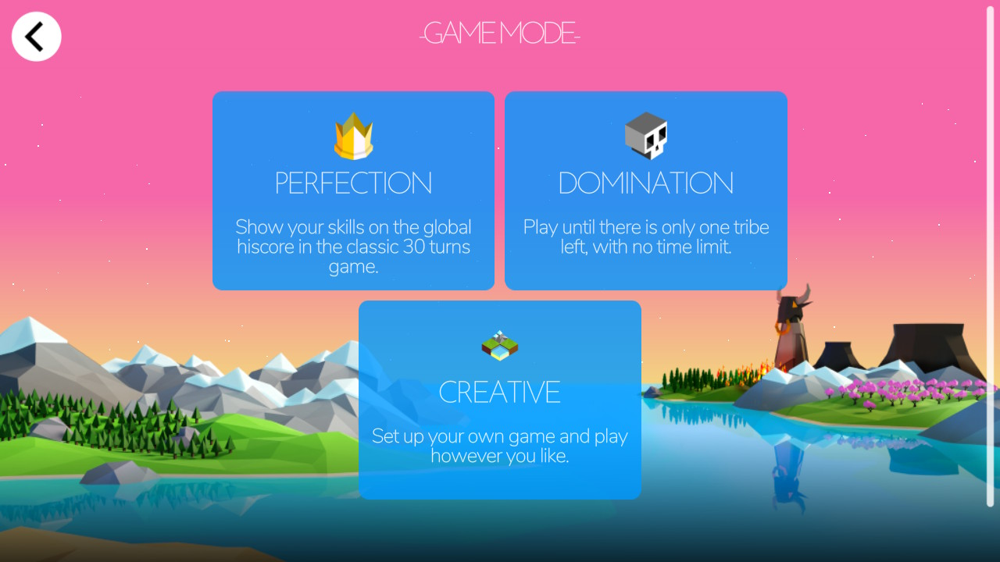

#### Perfection

**Perfection** mode games are limited to 30 turns and take place on 256-tile maps. The winner is whoever has earned the most points after 30 turns. 

Points are obtained by taking over cities, upgrading cities, building monuments and temples, expanding your city’s population and borders, defeating enemy units, and exploring sections of the map – see the section [Point scoring explained](#point-scoring-explained) for a breakdown of how points are earned. 

#### Domination

**Domination** mode games are not turn-limited. They continue until one player controls every city on the map. Map sizes range from 121 tiles to 324 tiles in size. 

Points are accrued throughout Domination games, but they have no bearing on victory.

#### Creative

**Creative** mode lets you customise the standard game settings, play on maps as large as 900 tiles, play on all-land maps, a big landmass dotted with lakes, a pangea, continents, archipelagoes, or on sea maps dotted with small islands. 

You can play Perfection or Domination-mode games, or play forever on **Infinity**-mode games, which have no score or turn limit – you decide when the game ends. 

Creative games let you play against up to 15 computer-controlled opponents, or play against no-one, if you want to peacefully explore the map, and build up your cities without interference. 

#### Glory

**Glory** games are won by the first player to score a certain amount of points. Point thresholds for victory can be set at the following levels:

* 5,000
* 10,000
* 15,000
* 20,000
* 25,000

Glory games are similar to Perfection games in that the object of the game is to gather points, not conquer enemy tribes – although taking over enemy territory will earn you points, making victory easier. 

#### Might

**Might** games are won by capturing the capital cities of all enemy tribes, and holding them for at least one turn. There are no turn limits or point limits. 

Might games are similar to Domination games in that the object of the game is conquest, the only real difference being you only have to capture and hold the capital cities.

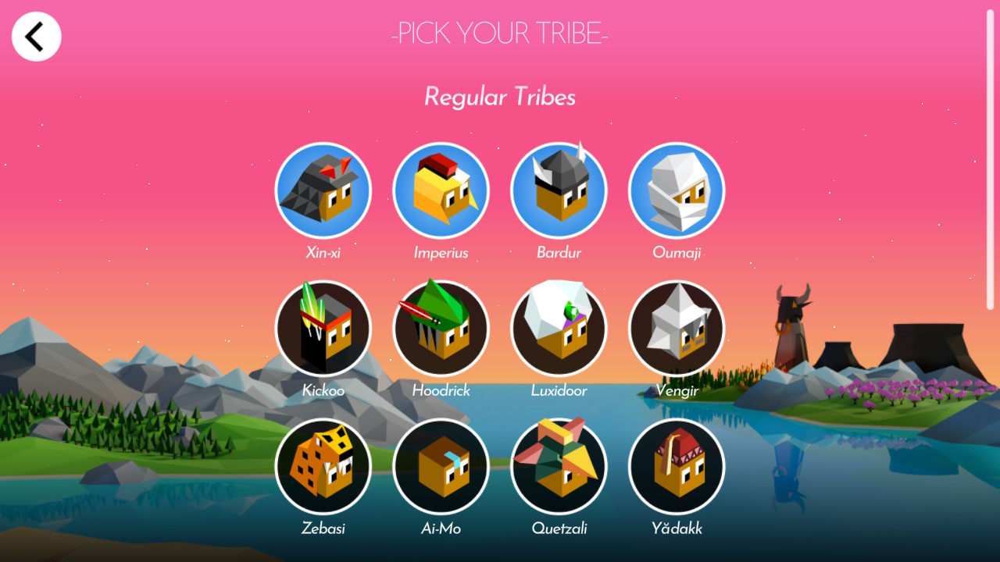

## Tribes 

Once you have selected a game mode, it’s time to pick your tribe.

In *Polytopia*, you can choose from one of the four starting tribes. More tribes can be unlocked with in-game purchases. 

The four free regular tribes on Polytopia are:

* [Xin-xi](#xin-xi).
* [Imperius](#imperius).
* [Bardur](#bardur).
* [Oumaji](#oumaji).

#### Xin-xi

An East Asia-themed tribe, which starts out in a grassy, temperate biome. Xin-xi cities feature pagoda-shaped buildings, and many of their units have kabuto-style helmets. While you can’t build Mines on your first turn, playing as Xin-xi gives you the advantage of being able to see where any nearby Metal Deposits are, which allows you to start planning your economy from the first turn. The default Xin-xi colour is red.

* Starting unit: **Warrior**.
* Starting number of Stars: **7**.
* Starting technology: **Climbing** – allows units to scale **Mountains**, reveals **Metal Deposits** (mining Metal Deposits requires the **Mining** technology).

#### Imperius

A Greco-Roman-themed tribe, also based in a temperate biome. Porticos and temples in the Classical style dot their cities, and their units wear plumed helmets, similar to those of Roman centurions and Greek hoplites. Imperius players have the advantage of being able to upgrade their capital city on the first turn. The default Imperius colour is blue.

Starting unit: **Warrior**.
Starting number of Stars: **5**.
Starting technology: **Organisation** – allows cities to harvest **Fruit** (grow city population by one), reveals **Crops** that can be turned into **Farms** (building Farms requires the **Farming** technology).

#### Bardur

A Norse-Germanic themed tribe, based in a snowy Alpine biome. Bardur structures are rough-looking, wattle-and-daub-type fortresses, and their units wear horned helmets of the stereotypical Viking style. As with Imperius, Bardur players can grow their capital city’s population on the first turn. The default Bardur colour is black.

Starting unit: **Warrior**..
Starting number of Stars: **5**.
Starting technology: **Hunting** – allows cities to hunt **Wild Animals** (grow city population by one).

#### Oumaji

An Arab-Egyptian-style tribe, who start out in a desert. Their buildings are crowned with minarets and resemble clay and wood beam structures from north Africa. Wearing turbans and starting with a fast-moving Rider instead of the typical Warrior, Oumaji have a speed advantage in the early stages of games. The default Oumaji colour is yellow.

Starting unit: **Rider**.
Starting number of Stars: **6**.
Starting technology: **Riding** (allows you to train **Rider** units).

The other regular tribes on Polytopia aren’t available with free versions of the game – they need to be unlocked with in-game purchases. They are:

* [Kickoo](#kickoo).
* [Hoodrick](#hoodrick).
* [Luxidoor](#luxidoor).
* [Vengir](#vengir).
* [Zebasi](#zebasi). 
* [Ai-Mo](#zebasi).
* [Quetzali](#quetzali).
* [Yădakk](#yădakk).

#### Kickoo

A Polynesia-themed tribe, who start out in a grassland biome, with the sea not far away. Kickoo buildings are fashioned from wood and are thatched with banana leaves. Always starting next to two Water tiles – even on Dryland (‘Dryland’) maps – Kickoo players can easily upgrade their capital city, and start building navies before most players have even researched Fishing. The default Kickoo colour is lime green.

Starting unit: **Warrior**.
Starting number of Stars: **5**.
Starting technology: **Fishing** – allows cities to catch **Fish** (grow city population by one) and build **Ports** (grow city population by one, allow land units to embark).

#### Hoodrick

A vaguely Robin Hood-themed tribe whose units wear feathered caps, Hoodrick tribes start out in heavily forested sections of the map and have Archery as their starting technology. Naturally, their starting unit is an Archer instead of the usual Warrior. The default Hoodrick colour is brown.

Starting unit: **Archer**.
Starting number of Stars: **7**.
Starting technology: **Archery** – allows cities to train **Archers**, provides a defence bonus in **Forest** tiles.

#### Luxidoor

A South Asia-themed tribe who start off in a bigger capital city that’s already been upgraded to Level 3 – although there are none of the usual upgrades like a Workshop or City Walls present, and you only get two Stars to begin with. Luxidoor players also do not benefit from a starting technology, although you will be able to research one on your second turn, and expand your capital to Level 4 very quickly. Luxidoor units wear turbans and long flowing robes. The default Luxidoor colour is purple.

Starting unit: **Warrior**.
Starting number of Stars: **2**.
Starting technology: None.

#### Vengir

A fantasy-themed tribe who inhabit a blasted Mordor/Morrowind-esque wasteland, Vengir tribes start with a Swordsman and access to Smithery, making them a dangerous tribe for other players to encounter early on, although it’ll be a while before you can build Forges – or much else. The default Vengir colour is white.

Starting unit: **Swordsman**.
Starting number of Stars: **5**.
Starting technology: Smithery – allows cities to train **Swordsmen** and build **Forges** (two Population points per adjacent Mine).

#### Zebasi 

Zebasi are a desert-based tribe who start with access to the Farming technology, proximity to Fields with Crops, and enough Stars to build a Farm, and therefore can upgrade their capital city on the first turn. As well as a great head start, Zebasi players tend to have room to expand, despite not having access to any strong units for the first few turns at least. Zebasi buildings resemble Sudano-Sahelian architecture, and the default Zebasi colour is orange. 

Starting unit: **Warrior**.
Starting number of Stars: **5**.
Starting technology: **Farming** – allows cities to build **Farms** (two Population points, can only be built on tiles with **Crops**).

#### Ai-Mo

A Himalayan-Andean themed tribe, Ai-Mo starts out with the Philosophy technology – which means cheaper access to technology on the first turn – and they ride giant llamas into battle. Ai-Mo also starts out with a Mind Bender, so you can convert any enemies who get too close, and heal your own units right from the start. The default Ai-Mo colour is turquoise. 

Starting unit: **Mind Bender**.
Starting number of Stars: **5**.
Starting technology: **Philosophy** – allows cities to train **Mind Benders**, triggers conditions for the **Tower of Wisdom** monument.

#### Quetzali

Quetzali is a Mesoamerican-themed tribe who build stepped pyramid-shaped monuments, wear bird-shaped helmets, and use ostrich-type birds for their mounted units. Starting with the Strategy technology, Quetzali is well protected during the vital early stages of the game, can easily forge alliances via Peace Treaties, and begin with a larger-than-average amount of Stars. The default Quetzali colour is jade green.  

Starting unit: **Defender**.
Starting number of Stars: **7**.
Starting technology: **Strategy** – Allows cities to train **Defenders** and send **Peace Treaties** to rival tribes.

#### Yădakk

Yădakk is an Anatolia-themed tribe who wear rich red robes and have access to the Roads technology from the start. Yădakk players also begin with a large amount of Stars, so they can get exploring and building trade networks early on, giving players the potential to upgrade their capital to Level 2 without having to extract any resources. The default Yădakk colour is maroon.  

Starting unit: **Warrior**.
Starting number of Stars: **7**.
Starting technology: **Roads** – Allows cities to build **Bridges** and **Roads**.

> **Note:** Stars is the in-game currency in *Polytopia* – read the [Starting currency](#starting-currency) and [Stars Per Turn (SPT)](#stars-per-turn-spt) sections for a full explanation.


## Choose the number of opponents

After picking your tribe, you will be asked to choose your opponents as well as choose which type of map you want to play on.

In single player games against computer-controlled opponents, you will be asked to pick how many opponents you want to play against, between **1–15**. 

In multiplayer games, you can either create a local **Pass & Play** type game, where you take a turn and then share your mobile device or Nintendo Switch with friends, or organise an **Online** game with friends you’ve added, or with random players via a lobby.

The maximum number of players supported at any one time is **16**.

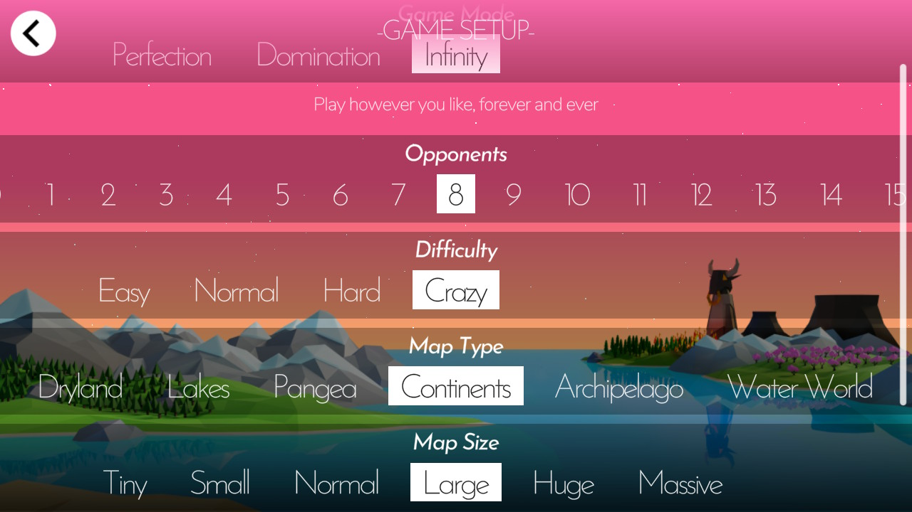

## Choose the difficulty level

In single-player mode, pick from one of four difficulty levels – **Easy**, **Normal**, **Hard**, **Crazy**.

The difficulty level determines the aggression of computer-controlled opponents. On Easy and Normal difficulty, tribes tend to not attack you unless provoked, whereas on Hard and Crazy difficulty, you will often be attacked without warning. 

The difficulty level does **not** determine the amount of damage that enemy units can deal and receive – read [the Combat section](#combat) for a [breakdown of the damage formulas](#the-polytopia-combat-formulas-explained).

## Pick your opponents

You can’t manually select which tribes you play against in single player games – *Polytopia* will randomly select which tribes you play against when you press ‘Start Game’.

You can however influence who you play against by enabling and disabling tribes from the ‘Pick Your Tribe’ menu. 

Select a tribe, and click the ‘Disable/Enable’ toggle in the top-right corner: 

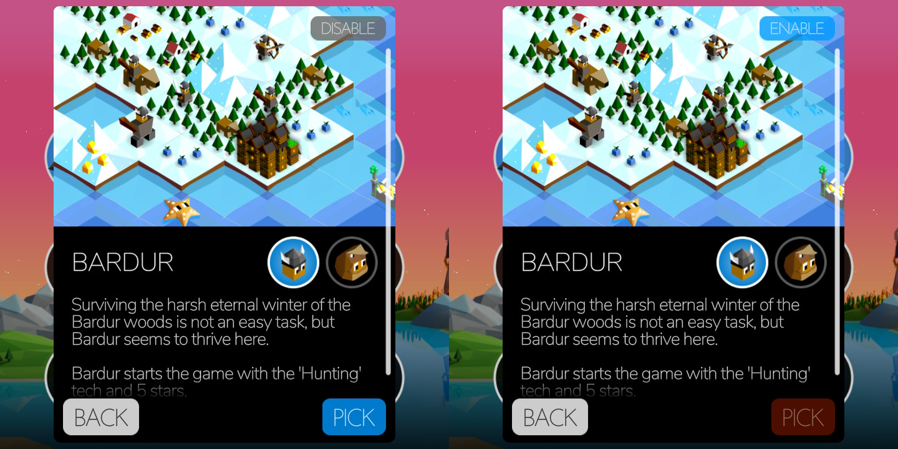

For example, if you only want to play against Xin-xi and Imperius, you could disable all other tribes. If you wanted to play on an all-desert map, you could enable Oumaji and Zebasi, and no other tribes. 

In multiplayer games against human players, you will be asked to pick both the size of the map and the type of map you want to play on, and there are no restrictions on which tribes can be selected. 

## Choose a map size

There are six map sizes in *Polytopia*:

* Tiny: 121 tiles (11x11).
* Small: 196 tiles (14x14).
* Normal: 256 tiles (16x16).
* Large: 324 tiles (18x18).
* Huge: 400 tiles (20x20).
* Massive: 900 tiles (30x30).

In single player **Perfection** games, the map size is locked to Normal size (256 tiles). 

In **Domination** games, the map size varies depending on how many opponents you choose to play against. Domination map sizes vary as follows:

<table>
  <tr>
   <td>Number of opponents
   </td>
   <td>Map size
   </td>
   <td>Map size in tiles
   </td>
  </tr>
  <tr>
   <td>1
   </td>
   <td>Tiny
   </td>
   <td>121
   </td>
  </tr>
  <tr>
   <td>2
   </td>
   <td>Small
   </td>
   <td>196
   </td>
  </tr>
  <tr>
   <td>3
   </td>
   <td>Normal
   </td>
   <td>256
   </td>
  </tr>
  <tr>
   <td>4–15
   </td>
   <td>Large
   </td>
   <td>324
   </td>
  </tr>
</table>

**Creative**, **Glory**, and **Might **modes give greater freedom with regards to the type of map you’ll play on. 

As well as being able to pick from all map sizes, from Tiny to Massive, Creative, Glory, and Might modes let you pick from the following map types:

* **Dryland:** A large landmass with no Water or Ocean tiles.
* **Lakes:** Large landmass dotted with rivers and lakes.
* **Pangaea:** A large landmass bordered by the sea on all sides.
* **Continents: **Multiple landmasses and some small islands. 
* **Archipelago:** Small continents and island chains. 
* **Water World:** A vast ocean dotted with tiny islands – despite the name, not entirely Water and Ocean tiles.

By default, the procedurally generated maps on Perfection and Domination games have a roughly even distribution of land and sea tiles, and more closely resemble the Pangaea and Continents map types. 

Multiplayer games on Tiny maps are also capped at a maximum of 9 players in total (8 opponents), whereas all other map sizes can host up to 16 players in total (15 opponents).

Once you’ve chosen your game type, picked your opponents and chosen a map, it’s time to start the game.

![Screenshot of a single-player game of Polytopia, showing the stating position of an Imperius player; a Warrior stands in the city of Rere. To the northwest and northeast are two pieces of Fruit, and there are Mountain tiles to the southwest and east. All other surrounding tiles are Forest tiles. There is more Fruit to the west and south, beyond the current borders of Rere, as well as more Forest tiles, one with a Wild Animal resource, a Water tile to the northeast and another Mountain tile to the southwest.](photos/Polytopia-guide-start-the-game.png)

## Start the game

Your *Polytopia* game will start with a small portion of the map visible to you, with the rest covered by fog-of-war.

From the first turn, you have at your disposal:

* A **starting unit**. 
* A small number of **Stars**. 
* Your **starting technology**. 
* Your **capital city**, with a 3x3 **border**.

### Take a look around

Before you make your first move with your starting unit, take a look at your surroundings. 

Zoom out of the map to get a better idea of where you are in relation to everything, zoom back in. 

Click on a tile to learn more about the terrain. 

In the screengrab above, you can see that the game tells you that you need to research **Climbing** in order to be able to move units on to **Mountain** tiles. 

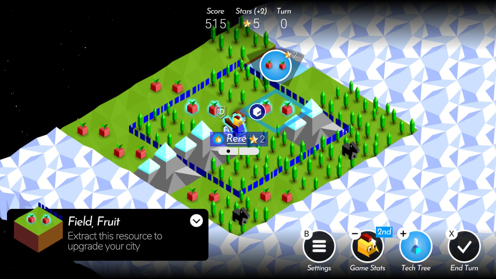

Click on the tiles with **resources**. If the resource is available for you to extract, the game will render the resource with a glowing blue outline. 

Resources can only be extracted, mined, or used if they’re within your city’s borders. In the screengrab above, only _some_ of the **Fruit** is rendered with the blue outline – read [How to grow your city’s Population](#how-to-grow-your-citys-population) for information on border expansion.

If there are resources nearby but you can’t currently extract them, the dialog box will tell you which [technology](#technology) you need to research in order to do so.

Make a note of the terrain, which resources are close by, and where the edges of the map are. Are you on the coast, or further inland?

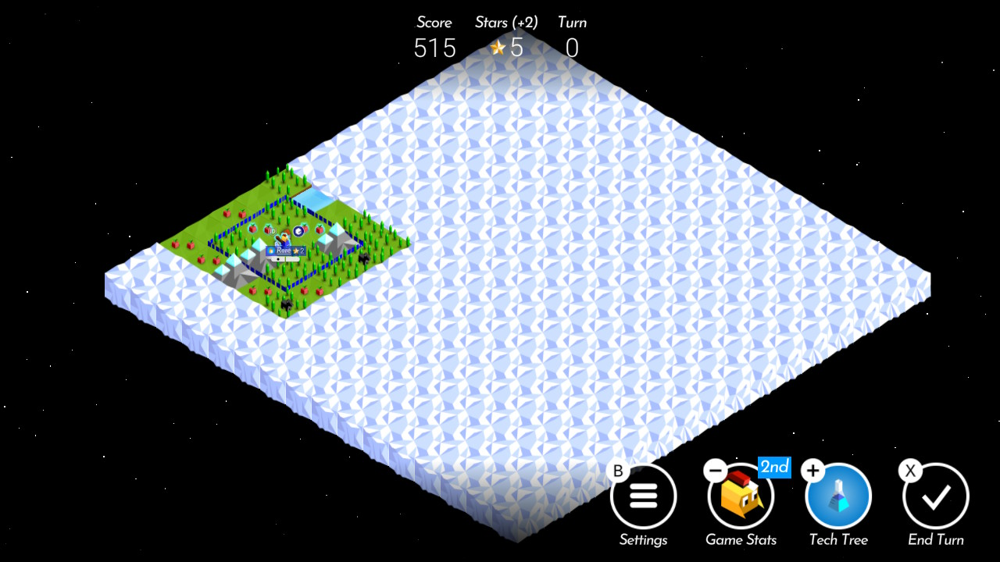

While you can’t see the whole of the map straight away, you can use what information you have to start thinking strategically. 

Zooming out all the way lets you find out where the corners of the map are in relation to your capital, and where danger might come from. 


### Terrain types

Every tile on the map features a different terrain type. 

Different types of terrain confer different bonuses and penalties, depending on the type of unit crossing them, and depending on which technologies have been researched:

<table>
  <tr>
   <td><strong>Terrain Type</strong>
   </td>
   <td><strong>Features</strong>
   </td>
   <td><strong>Potential Resources</strong>
   </td>
   <td><strong>Supported Buildings and Structures</strong>
   </td>
  </tr>
  <tr>
   <td>Field
   </td>
   <td>Default terrain, no defence bonus, no movement penalty
   </td>
   <td>Fruit, Crops (which can be converted to Farms)
   </td>
   <td>Farms, Windmills, Sawmills, Forges, Markets, Temples, all Monuments, Roads
   </td>
  </tr>
  <tr>
   <td>Forest
   </td>
   <td>Defence bonus (with Forestry tech), movement reduced to 1 (unless Roads are present)
   </td>
   <td>Wild Animals
   </td>
   <td>Lumber Huts, Forges, Roads
   </td>
  </tr>
  <tr>
   <td>Mountains
   </td>
   <td>Defence bonus (with Climbing tech), impassable until Climbing is researched, then reduced to 1
   </td>
   <td>Metal Deposits
   </td>
   <td>Mines, Mountain Temples
   </td>
  </tr>
  <tr>
   <td>Water
   </td>
   <td>Defence bonus (with Aquaculture tech), impassable until Fishing is researched
   </td>
   <td>Fish
   </td>
   <td>Ports, Water Temples, all Monuments
   </td>
  </tr>
  <tr>
   <td>Ocean
   </td>
   <td>Defence bonus (with Aquaculture tech), impassable until Sailing is researched
   </td>
   <td>Starfish
   </td>
   <td>Water Temples
   </td>
  </tr>
</table>


### Move your starting unit 

To move your starting unit, click on the unit. 

In most cases your starting unit will be a **Warrior**.

The tiles highlighted by the blue circles indicate where this unit can move to. 

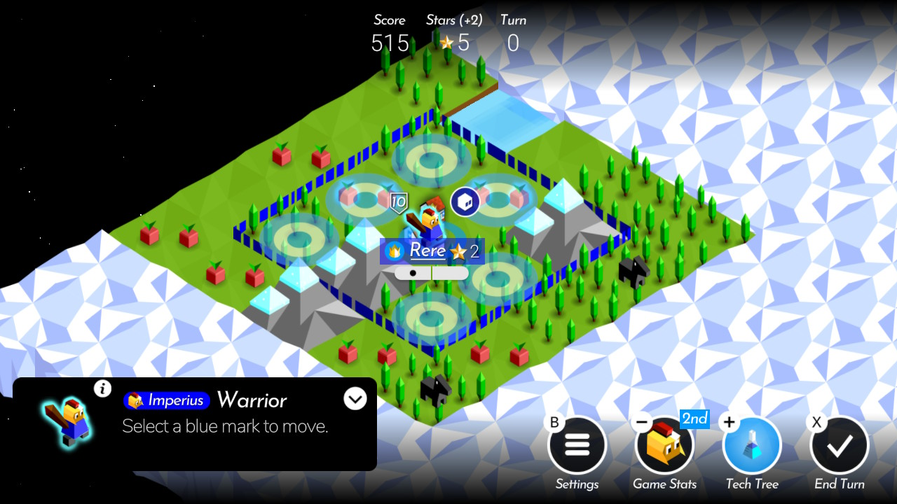

When you know where you want your unit to move, click on that tile to complete the move. 

Most units can move one tile per turn. Others, like **Riders**, **Knights**, and **seagoing units**, can move several tiles in one turn – check the Move statistics [of all units here](#lists-of-units).  


#### Removing fog-of-war

As units move across the map, they remove fog-of-war. 

Most units have a standard **sight range** of **3x3** tiles, which means they can see into tiles immediately adjacent to them, removing the fog-of-war as they move. 

If you move a unit on to a **Mountain** tile, their sight range is extended to **5x5** – double the range. 

The **Scout** naval unit and the **Cloak** land/naval unit have sight ranges of 5x5 as standard. **Cloaks** do not get to extend their sight range any further, even if they are moved onto **Mountain** tiles. 

### Actions after moving your first unit

You now have some choices to make:

1. [Train another unit](#train-another-unit).
2. [Extract resources](#extract-resources).
3. [Research a new technology](#research-a-new-technology).
4. [Save your Stars](#save-your-stars).


#### Train another unit

Click on your capital city. This pulls up a list of units which are available to train. 

Training units costs Stars – read the [Lists of units](#lists-of-units) section for a full breakdown of unit costs.

Unless you have a starting technology like **Riding**, you will most likely only be able to train another Warrior on your first turn. 

When you’ve trained a unit, it will appear on the city tile and can be moved on the following turn. 

You cannot train a unit in a city if there’s another unit occupying the city tile. 


#### Extract resources

Some **resources** – like **Fruit**, **Fish**, or **Wild Animals** – will be placed close to your capital city.

Depending on the starting technology of your chosen tribe, you may be able to extract the resources on your first turn.

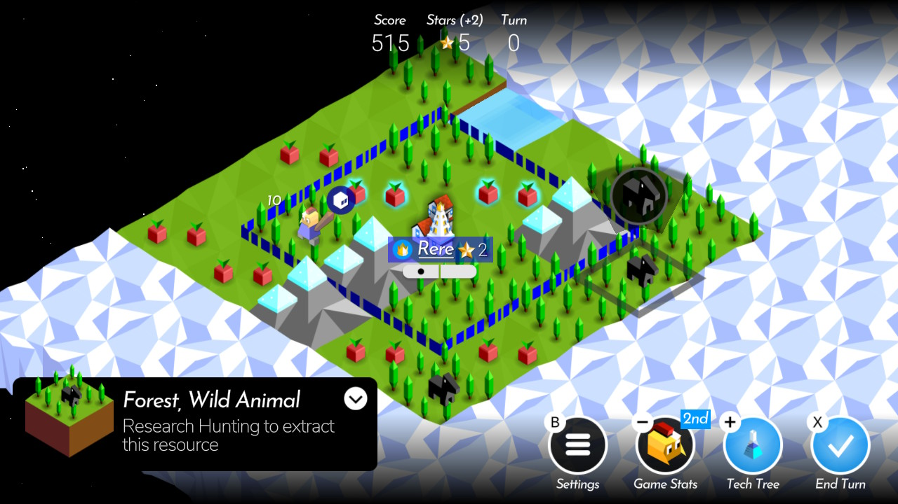

If you have access to resources on your first turn, and enough Stars to spend on extracting them it’s a good idea to upgrade your capital city on your first turn. 

Upgraded cities generate more income, can train more units, and benefit from other features – see the [City upgrades](#city-upgrades) section for more details. 

```
Note: You can only extract resources that fall within your city's territory, as defined by the border. 

Similarly, you can only build structures and monuments on territory that you control.
```


#### Research a new technology

You will have enough stars on your first turn to research a new technology. 

Depending on your surroundings, it may be essential to do this, if you’re surrounded by valuable resources that you can’t yet extract. 

Read [the Technology section](#technology) for a breakdown of the entire technology tree and an explanation of research costs.


#### Save your Stars

You don’t have to spend all or any of your , and in some situations, it might be better to hold off on spending until your next turn. 


### Starting currency

The number of Stars you have to spend at any one time are displayed at the top of the screen.

Above this is a counter, showing you how many **Stars Per Turn (SPT)** you’re currently earning. 

You spend Stars to extract **resources** (which you do in order to expand your city’s **Population**), research new **technologies**, or train new **units**. 


### Ending the first turn

Once you have made all of your available moves and purchases, and there’s nothing left for you to do, click the ‘End Turn’ button in the bottom right corner. 


### The next turn – exploring the map

Once all the other players have taken their turns, it’s your turn again. 

You will see that the amount of Stars you now have will have grown by however many SPT your capital is generating. 

You are free to move your starting unit again, as well as any unit that you trained in your capital city. 

Now you’re exploring, be on the lookout for nearby **Villages**, mysterious **Ruins**, and faraway **Lighthouses** – as well as other tribes. 


### Capture Villages

Villages are the most important features on a map after your capital city – make capturing and converting them to your tribe a priority. 

To capture a village, move a unit onto the Village tile. 

On the next turn, provided that the unit has not been destroyed, you will be given the option to capture the Village.

Capturing a Village turns it into a Level 1 city with a random name and a 3x3 border the same colour as your tribe’s colour, indicating that it is now part of your realm. 


### Explore Ruins

To explore a Ruin, you need to move a unit onto the tile, wait one turn and then select ‘Explore’ on the following turn, the same as if you were capturing a Village.

Exploring a Ruin will yield one of the following bonuses:

* **Resources:** ten Stars.
* **Explorer:** An Explorer unit leaves the Ruin, moves fifteen times, uncovering any tiles with fog-of-war as it goes.
* **Scrolls of Wisdom:** A free new technology from one of the available branches on the tech tree.
* **Population:** +3 Population Points for your capital city.
* **Veteran Swordsman:** A Veteran Swordsman (20HP) is spawned (Ruin must be on a land tile).
* **Rammer:** A Veteran Rammer with 15HP is spawned (Ruin must be on an ocean tile, Veteran Rammer will become a Veteran Warrior if moved on to a land tile).


### Discover Lighthouses

Every game features four **Lighthouses**, one located in each corner of the map. 

To discover a Lighthouse, you merely need to move a unit within sight range of the corner of the map. 

Discovering a Lighthouse gives you +1 Population Point in your capital city. 

Discovering all four Lighthouses lets you build the **Eye of God** Monument (+3 Population Points).


### City Levels and Population growth

On the first turn, you will have your capital city, which starts at **Level 1** and generates two SPT. 

To the right of the city’s name is a star symbol and a number, indicating how many SPT the city generates (in this case, a ‘2’). 

The crown symbol to the left to the city’s name indicates that it’s your capital. 

Other cities have no symbols to the left of their names. 

### Stars Per Turn (SPT)

The number of Stars Per Turn (SPT) that a city generates corresponds to its Level. 

A Level 1 city will generate 1 SPT, a Level 2 city will generate 2 STP, and so on. 

Your capital city benefits from a permanent +1 SPT bonus. Once your capital has grown to Level 4, it will generate 5 SPT, and once it has grown to Level 5, it will generate 6 SPT. 

When a city reaches Level 2, one of the **upgrades** you can unlock is the **Workshop** – this gives a city permanent +1 SPT bonus. 

The Workshop’s bonus stacks with a capital city’s natural +1 STP rate – a capital city with a workshop would therefore earn +2 STP. 

The Park upgrade also gives a city a +1 STP bonus, which stacks with both the Workshop, and your capital city’s +1 STP bonus. 


### How to earn more Stars 

* **Meet rival tribes** – When you meet a rival tribe for the first time, you will automatically earn 1 Star plus 2 Stars per 1000 points of the enemy's score (rounded up) for a maximum of 11 Stars.
* **Explore Ruins** – One of the possible outcomes for [exploring Ruins](#explore-ruins) is a one-off bonus of ten Stars.
* **Choose the ‘Resources’ upgrade when a city reaches Level 3** – When a city upgrades to Level 3, one of the upgrade options you can choose is ‘Resources’ a one-off bonus of five Stars.
* **Clear Forests** – Researching the **Forestry** technology gives you the **Clear Forests** ability, which removes the trees from **Forest** tiles, [turning them into Field tiles](#terrain-types), and earns you one extra Star.
* **Disband units** – Researching the **Free Spirit** technology gives you access to the Disband action, which lets you retire units from the map, and earn back half the amount of Stars (rounded up) you originally spent on them.
* **Harvest Starfish** – Researching the **Seafaring ** technology gives you access to the Gather Starfish action, which lets you extract starfish from ocean squares, which earns you eight Stars. 


### Population Progress Bar

Underneath every city’s name is a segmented progress bar. The number of segments represents how much of an **increase in Population** the city needs to grow to the next Level. 

As you grow the population of your city, the grey segments of the progress bar will turn blue. Once a progress bar is filled, the city will expand, and move up one Level. 

In the screengrab above, Chalicha, a Level 3 city, will need you to grow its Population by three more Points in order to become a Level 4 city. 

As a city’s Population grows, it **generates more SPT**, it can train and **support** more units, and it can gain **upgrades**, like city defences and expanded borders.


### How to grow your city’s Population

* [Extract resources](#extract-resources-1)
* [Build structures](#build-structures)
* [Create Trade Routes to and from your capital city](#create-trade-routes-to-and-from-your-capital-city)
* [Build Temples](#build-temples)
* [Build Monuments](#build-monuments)
* [Explore Ruins](#explore-ruins-1)
* [Discover Lighthouses](#discover-lighthouses-1)


#### Extract resources

In the early stages of a city’s development, the fastest way to increase Population is to extract resources.

Once a resource has been extracted from a tile, it disappears from the map.

The following extractable resources will be placed close by to your capital city, and also any nearby Villages:

<table>
  <tr>
   <td><strong>Resource</strong>
   </td>
   <td><strong>Population Points</strong>
   </td>
   <td><strong>Cost</strong>
   </td>
   <td><strong>Req. Technology</strong>
   </td>
  </tr>
  <tr>
   <td>Fish
   </td>
   <td>1
   </td>
   <td>2
   </td>
   <td>Fishing
   </td>
  </tr>
  <tr>
   <td>Fruit
   </td>
   <td>1
   </td>
   <td>2
   </td>
   <td>Organisation
   </td>
  </tr>
  <tr>
   <td>Wild Animals
   </td>
   <td>1
   </td>
   <td>2
   </td>
   <td>Hunting
   </td>
  </tr>
</table>


#### Build structures

Other resources like **Lumber** and **Metal Deposits** cannot be extracted in the same way, but you can build specific structures – **Lumber Huts**, **Farms**, and **Mines** – that will provide Population Points:

* **Lumber Huts** can only be built on **Forest** tiles, and give you one Population Point. 
* **Farms** can only be built on **Field** tiles with **Crops** on them, and generate two Population Points.
* **Mines** can only be built on **Mountain** tiles with Metal Deposits and generate two Population Points.
* **Sawmills** and **Windmills** are structures which generate one additional Population for every Lumber Hut and Farm respectively they are adjacent to. 
* **Forges** generate an additional two Population Points for every adjacent **Mine**. 

<table>
  <tr>
   <td>
<strong>Building / Structure</strong>
   </td>
   <td><strong>Effects</strong>
   </td>
   <td><strong>Population Points</strong>
   </td>
   <td><strong>Cost</strong>
   </td>
   <td><strong>Req. Technology</strong>
   </td>
  </tr>
  <tr>
   <td>Lumber Hut
   </td>
   <td>Can only be built on Forest tiles
   </td>
   <td>1
   </td>
   <td>3
   </td>
   <td>Forestry
   </td>
  </tr>
  <tr>
   <td>Sawmill
   </td>
   <td>Can only be built on Fields, next to Lumber Huts
   </td>
   <td>+1 per adjacent Lumber Hut
   </td>
   <td>5
   </td>
   <td>Mathematics
   </td>
  </tr>
  <tr>
   <td>Farm
   </td>
   <td>Can only be built on Fields with Crops
   </td>
   <td>2
   </td>
   <td>5
   </td>
   <td>Farming
   </td>
  </tr>
  <tr>
   <td>Windmill
   </td>
   <td>Can only be built on Fields, next to Farms
   </td>
   <td>+1 per adjacent Farm
   </td>
   <td>5
   </td>
   <td>Construction
   </td>
  </tr>
  <tr>
   <td>Mine
   </td>
   <td>Can only be built on Mountain tiles with Metal Deposits
   </td>
   <td>2
   </td>
   <td>5
   </td>
   <td>Mining
   </td>
  </tr>
  <tr>
   <td>Forge
   </td>
   <td>Can only be built on Fields or Forests, next to Mines
   </td>
   <td>+2 per adjacent Mine
   </td>
   <td>5
   </td>
   <td>Smithery
   </td>
  </tr>
</table>


#### Create Trade Routes to and from your capital city

**Ports** let you create naval units, and give you one Population Point.

**Bridges** let you move land units over **Water** tiles, and **Roads** allow for land units to move across the map more quickly. 

**Bridges** and **Roads** do not generate any Population Points on their own.

Connecting a new city to your capital city by building **Ports**, **Bridges** and **Roads** between them will have the effect of creating a **Trade Route**. 

A completed **Trade Route** will generate one Population Point for both your capital and the city on the other end of the **Trade Route**.

<table>
  <tr>
   <td><strong>Building / Structure</strong>
   </td>
   <td><strong>Effects</strong>
   </td>
   <td><strong>Population Points</strong>
   </td>
   <td><strong>Cost</strong>
   </td>
   <td><strong>Req. Technology</strong>
   </td>
  </tr>
  <tr>
   <td>Port
   </td>
   <td>Trade Route, allows land units to embark/become Rafts, can only be built on Water tiles
   </td>
   <td>1 (+1 when forming a Trade Route)
   </td>
   <td>7
   </td>
   <td>Fishing
   </td>
  </tr>
  <tr>
   <td>Bridge
   </td>
   <td>Trade Route, halves movement cost over Water tiles, can only be built on Water tiles
   </td>
   <td>0 (+1 when forming a Trade Route)
   </td>
   <td>5
   </td>
   <td>Roads
   </td>
  </tr>
  <tr>
   <td>Road
   </td>
   <td>Trade Route, halves movement cost over land tiles, cannot be built on Mountain tiles
   </td>
   <td>0 (+1 when forming a Trade Route)
   </td>
   <td>3
   </td>
   <td>Roads
   </td>
  </tr>
</table>

```
Note: Roads can be built on neutral land tiles as well as land tiles within your city's borders.
```


#### Build Temples

**Temples** can be built on **Field**, **Mountain**, **Forest**, and **Ocean** tiles and give you one Population Point. 

The primary function of Temples is to generate large amounts of points and are therefore more useful if you're playing a Perfection or Glory game. 

<table>
  <tr>
   <td><strong>Building / Structure</strong>
   </td>
   <td><strong>Effects</strong>
   </td>
   <td><strong>Population Points</strong>
   </td>
   <td><strong>Cost</strong>
   </td>
   <td><strong>Req. Technology</strong>
   </td>
  </tr>
  <tr>
   <td>Temple
   </td>
   <td>Can only be built on Field tiles, produces 100 points, plus an extra 50 points every two turns (for a max. of 300 points)
   </td>
   <td>1
   </td>
   <td>20
   </td>
   <td>Free Spirit
   </td>
  </tr>
  <tr>
   <td>Mountain Temple
   </td>
   <td>Can only be built on Mountain tiles, produces 100 points, plus an extra 50 points every two turns (for a max. of 300 points)
   </td>
   <td>1
   </td>
   <td>20
   </td>
   <td>Meditation
   </td>
  </tr>
  <tr>
   <td>Forest Temple
   </td>
   <td>Can only be built on Forest tiles, produces 100 points, plus an extra 50 points every two turns (for a max. of 300 points)
   </td>
   <td>1
   </td>
   <td>15
   </td>
   <td>Spiritualism
   </td>
  </tr>
  <tr>
   <td>Water Temple
   </td>
   <td>Can only be built on Water or Ocean tiles, produces 100 points, plus an extra 50 points every two turns (for a max. of 300 points
   </td>
   <td>1
   </td>
   <td>20
   </td>
   <td>Aquatism
   </td>
  </tr>
</table>


#### Build Monuments

Other special types of buildings are **Monuments**. These don’t require you to spend any Stars to build, but do require you to fulfill certain conditions. 

For example, building the **Altar of Peace** requires you to have researched the **Meditation** technology, and not attack any enemies for five turns. 

All **Monuments** provide **+3 Population Points** to the city they’re built in, and provide 400 points to your total score. 

**Monuments** can only be built on **Field** and **Water** tiles. You can have more than one monument per city. 

**Monuments** can only be built once per game, so be careful when choosing a location for a monument – if you destroy a **Monument**, it cannot be rebuilt. 

<table>
  <tr>
   <td><strong>Name</strong>
   </td>
   <td><strong>Req. Conditions</strong>
   </td>
   <td><strong>Trigger</strong>
   </td>
  </tr>
  <tr>
   <td>Altar of Peace
   </td>
   <td><em>Pacifist </em>– make no attacks for five turns
   </td>
   <td>Researching the Meditation technology
   </td>
  </tr>
  <tr>
   <td>Tower of Wisdom
   </td>
   <td><em>Genius </em>– research all technologies
   </td>
   <td>Researching the Philosophy technology 
   </td>
  </tr>
  <tr>
   <td>Gate of Power
   </td>
   <td><em>Killer </em>– destroy ten enemy units
   </td>
   <td>Destroying an enemy unit
   </td>
  </tr>
  <tr>
   <td>Park of Fortune
   </td>
   <td><em>Metropolis</em> – grow a city to Level 5
   </td>
   <td>Upgrading a city
   </td>
  </tr>
  <tr>
   <td>Grand Bazaar
   </td>
   <td><em>Trade</em> – connect five cities to your capital
   </td>
   <td>Connecting a city to your capital
   </td>
  </tr>
  <tr>
   <td>Eye of God
   </td>
   <td><em>Explorer</em> – discover all four Lighthouses
   </td>
   <td>Discovering a Lighthouse
   </td>
  </tr>
  <tr>
   <td>Emperor’s Tomb
   </td>
   <td><em>Wealth</em> – accumulate 100 stars
   </td>
   <td>Researching the Trade technology
   </td>
  </tr>
</table>


#### Explore Ruins 

Exploring [**Ruins**](#explore-ruins) will also sometimes yield **+3 Population Points** for your capital city. 

#### Discover Lighthouses 

Discovering a [**Lighthouse**](#discover-lighthouses) gives you **+1 Population Point** in your capital city. 

### City upgrades

Whenever a city advances to the next Level, you’ll be given a choice of one of two upgrades:

<table>
  <tr>
   <td><strong>City Level</strong>
   </td>
   <td><strong>Upgrade No. 1</strong> 
   </td>
   <td><strong>Upgrade No. 2</strong>
   </td>
  </tr>
  <tr>
   <td>2
   </td>
   <td>Workshop
   </td>
   <td>Explorer
   </td>
  </tr>
  <tr>
   <td>3
   </td>
   <td>City Wall
   </td>
   <td>Resources
   </td>
  </tr>
  <tr>
   <td>4
   </td>
   <td>Border Growth
   </td>
   <td>Population Growth
   </td>
  </tr>
  <tr>
   <td>5+
   </td>
   <td>Super Unit
   </td>
   <td>Park
   </td>
  </tr>
</table>

```
Workshop: Grants a permanent +1 SPT bonus to the city. 

      OR

Explorer: A one-off unit that moves fifteen times randomly across the map, uncovering fog-of-war as it moves. It remains invisible to enemy units, and is removed from the map after it has moved fifteen times.
```


```
City Wall: Increases the city defence bonus from 1.5 to 4.

     OR

Resources: An additional five Stars.
```


```
Border Growth: Expands the city's border from 3x3 to 5x5. 

     OR

Population Growth: An additional +3 Population Points. 
```


```
Super Unit: Powerful units which can turn the tide of battle.

     OR

Park: Grants a 250 bonus points. 
```


### City Levels and unit support 

The maximum number of units a city can train and support at any one time corresponds to the number of segments on the city’s progress bar. 

The number of active units currently supported by a city is indicated by a dot in the centre of each segment of the progress bar. 

When a unit is defeated, the city that trained that unit regains the capacity to support another unit. 

Likewise, whenever a unit trained by City X takes over City Y – or converts a Village into a city – that unit’s support capacity is transferred to the new city. 


## Combat

Eventually, as you explore the map, you will encounter enemy tribes. Initial encounters might not always be hostile – but they often are. 

There are two types of unit attacks, **melee** and **ranged**. 

Melee units – like **Warriors**, **Riders**, and **Swordsmen **– can attack enemy units in adjacent tiles. If the enemy unit survives the attack, it will **retaliate**.

Ranged units – like **Archers**, **Catapults**, and **Bombers** – can fire at enemy units from a distance [indicated by the Range statistic](#discover-lighthouses). 

Ranged units will not receive retaliatory damage from melee units, unless they are occupying an adjacent tile. 

Most ranged units will retaliate if attacked by an adjacent melee unit or another ranged unit, assuming that they survived the attack. The only instance where a ranged unit will **not** offer retaliating fire is when the attacking unit is concealed by fog-of-war.

The Scout is a ranged naval unit that has an increased sight range, 

The **Bomber** is a ranged naval unit that has a special **splash** attack ability. This sees a projectile fired at a single unit which receives the brunt of the damage, but all adjacent units are also hit, or ‘splashed’, receiving smaller amounts of damage as well. Bombers also cannot retaliate. 


### How combat values work

Combat resolution in *Polytopia* is not random. It follows a specific formula, which you can use to work out exactly how much damage your units can expect to deal – and withstand – during encounters with the enemy. 

All units have two combat values for **attack** and **defence**, and all units have a number of ‘health points’ or ‘hit points’, abbreviated to **HP**. 

The attack value of a unit dictates how much attacking damage it can do, while the defence value reveals how much damage it can absorb. 

The overall amount of damage dealt and sustained is ultimately determined up a unit’s HP – a full strength unit will do significantly more damage than a unit that’s already lost most of its HP.

For example, the Warrior, the most basic unit of the game, has an attack value of 2, a defence value of 2, and 10HP. 

### The Polytopia combat formulas explained


#### Standard damage

The formulas for working out standard damage (which is the same for melee and ranged combat) is adapted from [Mikael Mayer’s *Polytopia Calculator*](https://mikaelmayer.github.io/polytopiacalculator/), with additional notes:


```
defenceBonus = 1 (on open field tiles with no modifiers), 1.5 (in cities, or Forests, Mountains, Water, Ocean tiles with the appropriate technology researched), 4 (in cities with city walls)

attackForce = attacker.attack * (attacker.health / attacker.maxHealth)
defenceForce = defender.defence * (defender.health / defender.maxHealth) * defenceBonus 

totalDamage = attackForce + defenceForce 
attackResult = round((attackForce / totalDamage) * attacker.attack * 4.5) 
defenceResult = round((defenceForce / totalDamage) * defender.defence * 4.5)

Results are rounded to the nearest whole number. 

Retaliation damage is based on the HP value a defending unit has before combat begins, assuming that the defending unit survives.
```


**Example 1:** a full-strength Warrior (Attack: 2, Defence: 2, HP: 10) attacked another full-strength Warrior (Attack: 2, Defence: 2, HP: 10) on an open Field with no defence modifiers, here’s how that combat would resolve:

* *Warrior A’s attackForce: 2 multiplied by 1 (the attacker’s health (10) divided by the attacker’s maximum health (also 10) equals 1) = **2**.*
* *Warrior B’s defenceForce: 2 multiplied by 1 (the defender’s health (10) divided by the attacker’s maximum health (also 10) equals 1) = **2**.*

The value for totalDamage = attackForce (2) + defenceForce (2). In this case, the result would be **4**. 

Now, we take the attackForce (2) and divide that by the totalDamage (4), which gives us **0.5**. 

This is then multiplied by the attacker’s attack value (2), which gives us **1**. 

This is then multiplied by the accelerator value (4.5), which gives us **4.5**. 

Results are rounded to the nearest whole number, so this gives us a total of **5**. 

This means that Warrior A reduces Warrior B’s HP by 5, taking it down to **5HP**. 

Warrior B then retaliates. 

As the defending unit’s HP loss does not affect the retaliation result, Warrior B takes Warrior A down to **5HP** as well. 

End result:

<table>
  <tr>
   <td>Warrior A
   </td>
   <td>5HP
   </td>
  </tr>
  <tr>
   <td>Warrior B
   </td>
   <td>5HP
   </td>
  </tr>
</table>


**Example 2:** the same scenario, but this time with Warrior B, the defending unit, stationed inside a city, which gives Warrior B a defence bonus of 1.5:


* *Warrior A’s attackForce: 2 multiplied by 1 (the attacker’s health (10) divided by the attacker’s maximum health (also 10) equals 1) = **2**.*
* *Warrior B’s defenceForce: 2 multiplied by 1 (the defender’s health (10) divided by the attacker’s maximum health (also 10) equals 1), multiplied by 1.5 = **3**.*

totalDamage = attackForce (2) + defenceForce (3) = **5**. 

– attackForce (2), divided by totalDamage (5) = **0.4**. 

– multiplied by the attack value (2) = **0.8**. 

– multiplied by the accelerator value (4.5) = **3.6.**

– rounded to the nearest whole number gives us a total of **4**. 

Warrior B retaliates. 

– defenceForce (3), divided by totalDamage (5) = **0.6**.

– multiplied by the defending value (2) = **1.2**.

– multiplied by the accelerator value (4.5) = **5.4.**

– rounded to the nearest whole number gives us a total of **5**. 

End result:

<table>
  <tr>
   <td>Warrior A
   </td>
   <td>5HP
   </td>
  </tr>
  <tr>
   <td>Warrior B
   </td>
   <td>6HP
   </td>
  </tr>
</table>


**Example 3:** the same scenario, but this time with Warrior B, the defending unit, stationed inside a city with city walls, which gives Warrior B a defence bonus of 4:


* *Warrior A’s attackForce: 2 multiplied by 1 (the attacker’s health (10) divided by the attacker’s maximum health (also 10) equals 1) = **2**.*
* *Warrior B’s defenceForce: 2 multiplied by 1 (the defender’s health (10) divided by the attacker’s maximum health (also 10) equals 1), multiplied by 4 = **8**.*

totalDamage = attackForce (2) + defenceForce (8) = **10**. 

– attackForce (2), divided by totalDamage (10) = **0.2**. 

– multiplied by the attack value (2) = **0.4**. 

– multiplied by the accelerator value (4.5) = **1.8.**

– rounded to the nearest whole number gives us a total of **2**. 

Warrior B retaliates. 

– defenceForce (8), divided by totalDamage (10) = **0.8**.

– multiplied by the defending value (2) = **1.6**.

– multiplied by the accelerator value (4.5) = **7.2.**

– rounded to the nearest whole number gives us a total of **7**. 

End result:


<table>
  <tr>
   <td>Warrior A
   </td>
   <td>3HP
   </td>
  </tr>
  <tr>
   <td>Warrior B
   </td>
   <td>8HP
   </td>
  </tr>
</table>


#### Splash damage

Attacks with splash damage are attacks which have an extra area-of-effect. This sees all units on tiles adjacent to the primary target take damage as well. 

The damage taken by the primary target is worked out in the exact same way as it would be if the unit was hit by a standard ranged attack. 

The damage taken by any surrounding units is worked out in the same way, but the result is then **divided by 2**, and the result is **rounded down to the nearest whole number**. 

Below is the formula for working out splash damage from projectiles, taken from the [*Polytopia* wiki](https://polytopia.fandom.com/wiki/Combat), with added comments: 

```
attackForce = attacker.attack * (attacker.health / attacker.maxHealth)
defenseForce = defender.defense * (defender.health / defender.maxHealth) * defenseBonus 
totalDamage = attackForce + defenseForce 

attackResult = round((attackForce / totalDamage) * attacker.attack * 4.5) 
attackSplash = attackResult / 2
```

Example: Bomber A attacks Rider B, which is based in a Forest. To the north of Rider B is Defender C, which sits in a city with City Walls, and therefore gets a defence bonus of 4.  

For the purposes of this example, Bomber A has 10HP, and is located out of melee range, so Rider B cannot retaliate. 

We’ll work out the damage inflicted on Rider B first. 


* *Bomber A’s attackForce: 3 multiplied by 1 (the attacker’s health (10) divided by the attacker’s maximum health (also 10) equals 1) = **3**.*
* *Rider B’s defenceForce: 1 multiplied by 1 (the defender’s health (10) divided by the defender’s maximum health (also 10) equals 1), multiplied by 1 = **1**.*

totalDamage = attackForce (3) + defenceForce (1) = **4**. 

– attackForce (3), divided by totalDamage (11) = **0.75**. 

– multiplied by the attack value (3) = **2.25**. 

– multiplied by the accelerator value (4.5) = **10.125.**

– rounded to the nearest whole number gives us a total of **10**.

Bomber A destroys Rider B. 

Calculating **splash damage** to Defender C in the adjacent city. 


* *Bomber A’s attackForce: 3 multiplied by 1 (the attacker’s health (10) divided by the attacker’s maximum health (also 10) equals 1) = **3**.*
* *Defender C’s defenceForce: 3 multiplied by 1 (the defender’s health (10) divided by the defender’s maximum health (also 10) equals 1), multiplied by 4 = **12**.*

totalDamage = attackForce (3) + defenceForce (12) = **15**. 

– attackForce (3), divided by totalDamage (11) = **0.2**. 

– multiplied by the attack value (3) = **0.6**. 

– multiplied by the accelerator value (4.5) = **2.7**

– rounded to the nearest whole number gives us a total of **3**.

As the splash damage is halved (to 1.5) and then rounded down, this inflicts **1HP** of damage on Defender C. 


### Healing

A damaged unit may choose to **heal** itself during its turn instead of moving or attacking. 

Healing sees a unit recover **4HP** if it’s based on home territory, or 2HP if based in neutral or enemy territory.

If you do nothing with a unit that has taken damage, it will **automatically heal itself** at the end of the turn.

The **Mind Bender** unit has the ‘Heal Others’ ability, which restores **4HP** to all adjacent friendly units. 

A unit cannot ‘recover’ HP beyond its natural maximum HP level. 


### Veteran status

After a unit kills **three** enemy units, it can be promoted to veteran status, which gives it an additional **5HP**, and restores the unit to full health. 

Note that super units cannot be promoted to veteran status, and kills made by naval units do not count towards gaining the veteran promotion.


### Zones of control

All units in Polytopia exert a **zone of control**, which means that if a unit moves onto a tile adjacent to a tile occupied by an enemy unit, that unit cannot move any further beyond those adjacent tiles, even if its Move statistic would normally allow it to.

Knowing how zones of control work is key to holding up enemy flanks, and preventing fast-moving units like **Riders** and **Knights** from dominating the map.

Destroying an enemy unit naturally removes the zone of control. 

Note that the **Cloak** unit ignores zones of control, whether it’s visible or invisible to the enemy.

## Lists of units


### Regular Tribes: Land units

<table>
  <tr>
   <td><strong>Unit Name</strong>
   </td>
   <td><strong>Attack</strong>
   </td>
   <td><strong>Defence</strong>
   </td>
   <td><strong>HP</strong>
   </td>
   <td><strong>Move</strong>
   </td>
   <td><strong>Range</strong>
   </td>
   <td><strong>Cost</strong>
   </td>
   <td><strong>Req. Technology</strong>
   </td>
  </tr>
  <tr>
   <td>Warrior
   </td>
   <td>2
   </td>
   <td>2
   </td>
   <td>10
   </td>
   <td>1
   </td>
   <td>1
   </td>
   <td>2
   </td>
   <td>n/a
   </td>
  </tr>
  <tr>
   <td>Defender
   </td>
   <td>1
   </td>
   <td>3
   </td>
   <td>15
   </td>
   <td>1
   </td>
   <td>1
   </td>
   <td>3
   </td>
   <td>Strategy
   </td>
  </tr>
  <tr>
   <td>Rider
   </td>
   <td>2
   </td>
   <td>1
   </td>
   <td>10
   </td>
   <td>2
   </td>
   <td>1
   </td>
   <td>3
   </td>
   <td>Riding
   </td>
  </tr>
  <tr>
   <td>Archer
   </td>
   <td>2
   </td>
   <td>1
   </td>
   <td>10
   </td>
   <td>1
   </td>
   <td>2
   </td>
   <td>3
   </td>
   <td>Archery
   </td>
  </tr>
  <tr>
   <td>Swordsman
   </td>
   <td>3
   </td>
   <td>3
   </td>
   <td>15
   </td>
   <td>1
   </td>
   <td>1
   </td>
   <td>5
   </td>
   <td>Smithery
   </td>
  </tr>
  <tr>
   <td>Knight
   </td>
   <td>3.5
   </td>
   <td>1
   </td>
   <td>10
   </td>
   <td>3
   </td>
   <td>1
   </td>
   <td>8
   </td>
   <td>Chivalry
   </td>
  </tr>
  <tr>
   <td>Catapult
   </td>
   <td>4
   </td>
   <td>0
   </td>
   <td>10
   </td>
   <td>1
   </td>
   <td>3
   </td>
   <td>8
   </td>
   <td>Mathematics
   </td>
  </tr>
  <tr>
   <td>Mind Bender
   </td>
   <td>0
   </td>
   <td>1
   </td>
   <td>10
   </td>
   <td>1
   </td>
   <td>1
   </td>
   <td>5
   </td>
   <td>Philosophy
   </td>
  </tr>
  <tr>
   <td>Cloak
   </td>
   <td>0
   </td>
   <td>0.5
   </td>
   <td>5
   </td>
   <td>2
   </td>
   <td>1
   </td>
   <td>8
   </td>
   <td>Diplomacy
   </td>
  </tr>
  <tr>
   <td>Dagger/Pirate
   </td>
   <td>2
   </td>
   <td>2
   </td>
   <td>10
   </td>
   <td>1
   </td>
   <td>1
   </td>
   <td>n/a
   </td>
   <td>Diplomacy
   </td>
  </tr>
  <tr>
   <td>Giant
   </td>
   <td>5
   </td>
   <td>4
   </td>
   <td>40
   </td>
   <td>1
   </td>
   <td>1
   </td>
   <td>n/a
   </td>
   <td>n/a
   </td>
  </tr>
</table>


* **Warrior:** Cheap all-rounder available to all tribes at the start of the game. 
* **Defender:** Powerful defensive unit. Cannot move and attack in the same turn. 
* **Rider:** Fast, cheap, can move again after attacking, weak defence. 
* **Archer: **Inexpensive ranged unit, can move and fire. 
* **Swordsman:** Powerful melee unit, but not cheap to unlock or train.
* **Knight:** Fast, hard-hitting, unique **persist** ability means they can attack multiple times in one turn. Weak defence, expensive to unlock, high unit cost.
* **Catapult: **Highest attack in the game, but also the weakest defence. Cannot move and fire in the same turn. 
* **Mind Bender:** Can heal friendly units and convert enemy units to their side. Cannot move and heal or convert in the same turn, and cannot retaliate.
* **Cloak:** Turns invisible when it moves across the map, and ignores terrain movement penalties. If a Cloak attacks an enemy city, it will incite a revolt, which sees a number of **Dagger** or **Pirate** units spawned. 

    Any units inside the city will be hit with an attack force of **2**. If the city is unoccupied when it is attacked by a **Cloak**, a **Dagger** unit will immediately spawn on the city’s tile, and will begin capturing it. The city will also produce no Stars on the opponent’s next turn


    **Cloaks** will be discovered if an enemy unit tries to move onto the same tile it occupies, and can be attacked. **Cloaks** are not immune to splash damage. **Cloaks** cannot attack enemy units, they can only attack cities. 

* **Dagger/Pirate:** **Daggers** have stats equivalent to that of a **Warrior**, but have the unique **surprise **ability, which prevents an attacked unit from retaliating. They cannot be trained, and are only created when a **Cloak** attacks a city. 
* The number of **Daggers** spawned is the same as the infiltrated city’s Level (up to a maximum of five). A **Pirate** is essentially a seaborne equivalent of a **Dagger**. **Daggers **and **Pirates **cannot be upgraded to Veteran status. 
* **Giant:** A large, powerful unit with the best stats in the game. Cannot be trained, only chosen as the **Super Unit** upgrade when a city reaches Levels 5 and beyond. **Giants **cannot be upgraded to Veteran status.


### Regular Tribes: Naval units

<table>
  <tr>
   <td><strong>Unit Name</strong>
   </td>
   <td><strong>Attack</strong>
   </td>
   <td><strong>Defence</strong>
   </td>
   <td><strong>HP</strong>
   </td>
   <td><strong>Move</strong>
   </td>
   <td><strong>Range</strong>
   </td>
   <td><strong>Cost</strong>
   </td>
   <td><strong>Req. Technology</strong>
   </td>
  </tr>
  <tr>
   <td>Raft
   </td>
   <td>0
   </td>
   <td>2
   </td>
   <td>n/a
   </td>
   <td>2
   </td>
   <td>2
   </td>
   <td>n/a
   </td>
   <td>Fishing
   </td>
  </tr>
  <tr>
   <td>Rammer
   </td>
   <td>3
   </td>
   <td>3
   </td>
   <td>n/a
   </td>
   <td>3
   </td>
   <td>1
   </td>
   <td>5
   </td>
   <td>Aquaculture
   </td>
  </tr>
  <tr>
   <td>Scout
   </td>
   <td>2
   </td>
   <td>1
   </td>
   <td>n/a
   </td>
   <td>3
   </td>
   <td>2
   </td>
   <td>5
   </td>
   <td>Sailing
   </td>
  </tr>
  <tr>
   <td>Bomber
   </td>
   <td>3
   </td>
   <td>2
   </td>
   <td>n/a
   </td>
   <td>2
   </td>
   <td>3
   </td>
   <td>15
   </td>
   <td>Navigation
   </td>
  </tr>
  <tr>
   <td>Juggernaut
   </td>
   <td>4
   </td>
   <td>4
   </td>
   <td>n/a
   </td>
   <td>2
   </td>
   <td>1
   </td>
   <td>n/a
   </td>
   <td>n/a
   </td>
  </tr>
  <tr>
   <td>Dagger/Pirate
   </td>
   <td>2
   </td>
   <td>2
   </td>
   <td>10
   </td>
   <td>1
   </td>
   <td>1
   </td>
   <td>n/a
   </td>
   <td>Diplomacy
   </td>
  </tr>
</table>


Unlike land-based units, naval units cannot be trained in cities; they must be created at **ports** (which cost seven Stars and require the **Fishing** technology to build).

Naval units are created by moving a land unit onto a **Water** tile that has had a **Port** built on it. 

Note that the **HP** of all naval units is determined by the HP of the land unit that ‘creates’ it.

For example, a Veteran Defender with 20HP can therefore be turned into a naval unit with 20HP, a regular Swordsman with 15HP can become a naval unit with 15HP, while a damaged Warrior with 7HP would become a damaged naval unit with 7HP, and so on. 

The exception to this is the **Pirate** – the water-borne version of the **Dagger** – which always starts with 10HP. 

In combat, the attack and defence force of naval units are worked out in the exact same way as it is for land units. 

Naval units can heal and be healed in the same way as land units. 


#### Creating naval units

When you move a land unit onto a port, the unit will be immediately converted into a **Raft**. 

A unit on a **Raft** can move around on **Water** tiles. **Rafts** have a defence value of 2, but cannot attack other units, nor can they retaliate – they’re essentially transport ships.

By spending Stars, you can upgrade units on **Rafts** to one of three vessel types:


* **Rammer:** A sea-bourne melee unit. As the name implies, it can attack other units by ramming into them. It can retaliate, but only if rammed by another Rammer, or attacked by an adjacent land unit. 
* **Scout:** A fast-moving vessel with a ranged attack that can move and fire in the same turn, and can retaliate in the same way that an **Archer** would.
* **Bomber:** A battleship with a powerful ranged attack that benefits from splash damage, which damages the target, and any adjacent enemy units. Bombers cannot move and fire in the same turn, and they cannot retaliate. 

**Giants** moved onto a port will become **Juggernauts**. These are melee naval units, and attack enemy ships in the same way that **Rammers** do.

Whenever **Juggernauts** move or attack enemy units, they also damage adjacent enemy units, in the same way that the **Bomber’s** splash area-of-effect does.


## Peace Treaties and Embassies

The **Strategy** and **Diplomacy** technologies lets you sign **Peace Treaties** with rival tribes, and build Embassies in their capital cities.


### Signing a Peace Treaty

Signing a **Peace Treaty** with another tribe or player requires them to accept the treaty – and vice versa. 

A computer-controlled player will not accept an offering of a Peace Treaty from you if you have consistently attacked them in the past, or have moved units into territory controlled by them. You can improve your relationship with a computer-controlled player by ceasing attacks and moving units away from their cities. 

If both sides agree to a Peace Treaty, this will generate an extra **2 SPT** for both tribes. 


### Building an Embassy

Building an Embassy costs five Stars, and if you build an Embassy in the capital city of a tribe you’ve signed a Peace Treaty with, both tribes get **4 SPT** instead. 

While two tribes are at peace, they cannot attack each other’s units, and do not exert a zone of control. 

**Cloak** units, which would normally be invisible, can also be seen by both players. 


### Breaking a Peace Treaty

Peace Treaties can be broken at any time, but the player who wants to break the treaty cannot attack the other player on that turn, and any units within the other player’s borders will be forcibly [Disbanded](#disbanding-units). 

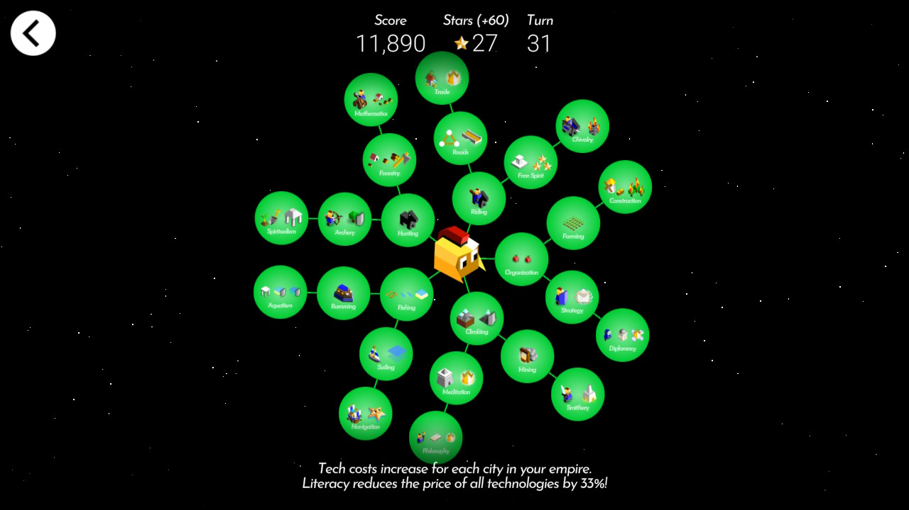

## Technology

Researching new Technologies lets you create new units, new buildings, exploit new resources, and perform new actions. 

The Technology tree has five main branches that fork once, creating **three Tiers**. 

At the start of the game, Tier 1 technologies cost five Stars, Tier 2s cost six Stars, and Tier 3s cost seven Stars to research.  

For **each additional city that joins your tribe**, technology research costs **increase** by one, two, or three Stars for Tier 1, Tier 2, and Tier 3 technologies, respectively. 


### Tier 1 Technologies

<table>
  <tr>
   <td><strong>Technology</strong>
   </td>
   <td><strong>Effects</strong>
   </td>
   <td><strong>Cost (+ inc. per city)</strong>
   </td>
   <td><strong>Next Tier Tech(s)</strong>
   </td>
  </tr>
  <tr>
   <td>Climbing
   </td>
   <td>Allows units to scale Mountains, gives units a defence bonus on Mountain tiles, reveals metal deposits
   </td>
   <td>5 (+1)
   </td>
   <td>Meditation, Mining
   </td>
  </tr>
  <tr>
   <td>Organisation
   </td>
   <td>Allows cities to harvest Fruit, reveals Crops that can be turned into Farms
   </td>
   <td>5 (+1)
   </td>
   <td>Strategy, Farming
   </td>
  </tr>
  <tr>
   <td>Riding
   </td>
   <td>Allows cities to train Riders
   </td>
   <td>5 (+1)
   </td>
   <td>Free Spirit, Roads,
   </td>
  </tr>
  <tr>
   <td>Hunting
   </td>
   <td>Allows cities to hunt Wild Animals
   </td>
   <td>5 (+1)
   </td>
   <td>Forestry, Archery
   </td>
  </tr>
  <tr>
   <td>Fishing
   </td>
   <td>Allows cities to build Ports, catch Fish, allows naval units to move across Water tiles
   </td>
   <td>5 (+1)
   </td>
   <td>Ramming, Sailing
   </td>
  </tr>
</table>


### Tier 2 Technologies

<table>
  <tr>
   <td><strong>Technology</strong>
   </td>
   <td><strong>Effects</strong>
   </td>
   <td><strong>Cost (+ inc. per city)</strong>
   </td>
   <td><strong>Next Tier Tech</strong>
   </td>
  </tr>
  <tr>
   <td>Meditation
   </td>
   <td>Allows cities to build Mountain Temples, triggers conditions for the Altar of Peace monument
   </td>
   <td>6 (+2)
   </td>
   <td>Philosophy
   </td>
  </tr>
  <tr>
   <td>Mining
   </td>
   <td>Allows cities to build Mines
   </td>
   <td>6 (+2)
   </td>
   <td>Smithery
   </td>
  </tr>
  <tr>
   <td>Strategy
   </td>
   <td>Allows cities to train Defenders, allows players to send Peace Treaties to rival tribes
   </td>
   <td>6 (+2)
   </td>
   <td>Diplomacy
   </td>
  </tr>
  <tr>
   <td>Farming
   </td>
   <td>Allows cities to build Farms on Field tiles with Crops
   </td>
   <td>6 (+2)
   </td>
   <td>Construction
   </td>
  </tr>
  <tr>
   <td>Free Spirit
   </td>
   <td>Allows cities to build Temples, and Disband units (removes unit from map, generates half the unit cost rounded down in Stars)
   </td>
   <td>6 (+2)
   </td>
   <td>Chivalry
   </td>
  </tr>
  <tr>
   <td>Roads
   </td>
   <td>Allows cities to build Roads and Bridges
   </td>
   <td>6 (+2)
   </td>
   <td>Trade
   </td>
  </tr>
  <tr>
   <td>Forestry
   </td>
   <td>Allows cities to build Lumber Huts and Clear Forest tiles (turns Forest tiles into fields, generates one Star)
   </td>
   <td>6 (+2)
   </td>
   <td>Mathematics
   </td>
  </tr>
  <tr>
   <td>Archery
   </td>
   <td>Allows cities to train Archers, gives units a defence bonus on Forest tiles
   </td>
   <td>6 (+2)
   </td>
   <td>Spiritualism
   </td>
  </tr>
  <tr>
   <td>Ramming
   </td>
   <td>Allows Rafts to be upgraded to Rammers
   </td>
   <td>6 (+2)
   </td>
   <td>Aquaculture
   </td>
  </tr>
  <tr>
   <td>Sailing
   </td>
   <td>Allows Rafts to be upgraded to Scouts, allows naval units to move across Ocean tiles
   </td>
   <td>6 (+2)
   </td>
   <td>Navigation
   </td>
  </tr>
</table>

### Tier 3 Technologies

<table>
  <tr>
   <td><strong>Technology</strong>
   </td>
   <td><strong>Effects</strong>
   </td>
   <td><strong>Cost (+ inc. per city)</strong>
   </td>
   <td><strong>Next Tier Tech</strong>
   </td>
  </tr>
  <tr>
   <td>Philosophy
   </td>
   <td>Allows cities to train Mind Benders, triggers conditions for the Tower of Wisdom monument
   </td>
   <td>7 (+3)
   </td>
   <td>n/a
   </td>
  </tr>
  <tr>
   <td>Smithery
   </td>
   <td>Allows cities to train Swordsmen, build Forges, 
   </td>
   <td>7 (+3)
   </td>
   <td>n/a
   </td>
  </tr>
  <tr>
   <td>Diplomacy
   </td>
   <td>Allows cities to train Cloaks, build Embassies
   </td>
   <td>7 (+3)
   </td>
   <td>n/a
   </td>
  </tr>
  <tr>
   <td>Construction
   </td>
   <td>Allows cities to build Windmills, use Burn Forest ability
   </td>
   <td>7 (+3)
   </td>
   <td>n/a
   </td>
  </tr>
  <tr>
   <td>Chivalry
   </td>
   <td>Allows cities to train Knights, Destroy buildings
   </td>
   <td>7 (+3)
   </td>
   <td>n/a
   </td>
  </tr>
  <tr>
   <td>Trade
   </td>
   <td>Allows cities to build Markets, triggers conditions for the Emperor’s Tomb monument
   </td>
   <td>7 (+3)
   </td>
   <td>n/a
   </td>
  </tr>
  <tr>
   <td>Mathematics
   </td>
   <td>Allows cities to train Catapults, build Sawmills
   </td>
   <td>7 (+3)
   </td>
   <td>n/a
   </td>
  </tr>
  <tr>
   <td>Spiritualism
   </td>
   <td>Allows cities to build Forest Temples, use the Grow Forest ability
   </td>
   <td>7 (+3)
   </td>
   <td>n/a
   </td>
  </tr>
  <tr>
   <td>Aquaculture
   </td>
   <td>Allows cities to build Water Temples, gives units a defence bonus on Water and Ocean tiles
   </td>
   <td>7 (+3)
   </td>
   <td>n/a
   </td>
  </tr>
  <tr>
   <td>Navigation
   </td>
   <td>Allows Rafts to be upgraded to Bombers, allows naval units to Gather Starfish (yields eight Stars)
   </td>
   <td>7 (+3)
   </td>
   <td>n/a
   </td>
  </tr>
</table>

### Disbanding units 

Researching the **Free Spirit** technology gives you access to the Disband action, which lets you retire units from the map, and earn back half the amount of Stars (rounded up) you originally spent on them. 

Reasons for wanting to Disband a unit include:

* Your cities cannot support any more units 
* You want to deny your rivals the opportunity to destroy your unit(s) 
* You need some extra Stars 

### Destroying buildings

Researching the **Chivalry** technology gives you access to the **Destroy** action. 

This lets you remove structures like Sawmills, Windmills, Forges and Markets if you realise later on that these structures could sit in a more advantageous place on the map. 

Destroy is free to use, but unlike the similar Disband ability, using Destroy does not return any Stars to the player.

Using Destroy on a structure immediately removes any Population Points or Stars generated by the structure. It is therefore possible for a city to slip into negative Population, potentially reducing its STP to zero. 

This aspect of Destroy can be used offensively, in 'scorched earth' manner; in a situation where a city you control is about to be captured. Using Destroy on everything before capture denies your opponent a lucrative prize, and requires them to spend Stars on rebuilding.


### Expanding and rebuilding Lumber Huts and Farms

You can use the **Destroy** action in tandem with the **Grow Forest** and **Burn Forest** actions to create more **Lumber Huts** and **Farms** for your cities. 

This greatly improves the output of **Sawmills** and **Windmills**, and has the potential to upgrade your cities up several levels. 

Because expanding and rebuilding farms costs a lot of Stars, this strategy is best deployed in Domination and Might games, when you’ll be taking lots of turns, and can guarantee a return on your investment. 

It costs five Stars to use Grow Forest, which can only be performed on an empty Field tile. 

From there you can either build a Lumber Hut (three Stars) or use Burn Forest (five Stars) to turn the Forest tile into Crops, which can then be turned into a Farm (five Stars). 

It therefore costs a total of **eight Stars** to turn a Field tile into a Forest tile with a Lumber Hut, which gives you one Population Point, plus another, if it’s built next to a Sawmill. 

Building a Farm from scratch costs **fifteen Stars**, which nets you two Population Points, and another if the Farm is built next to a Windmill. 

<table>
  <tr>
   <td><strong>Action</strong>
   </td>
   <td><strong>Effects</strong>
   </td>
   <td><strong>Population Points</strong>
   </td>
   <td><strong>Cost</strong>
   </td>
   <td><strong>Req. Technology</strong>
   </td>
  </tr>
  <tr>
   <td>Grow Forest
   </td>
   <td>Creates a new Forest tile on a Field tile
   </td>
   <td>n/a
   </td>
   <td>5
   </td>
   <td>Spiritualism
   </td>
  </tr>
  <tr>
   <td>Lumber Hut
   </td>
   <td>Builds a Lumber Hut on a Forest tile
   </td>
   <td>1
   </td>
   <td>3
   </td>
   <td>Forestry
   </td>
  </tr>
  <tr>
   <td><strong><em>Total:</em></strong>
   </td>
   <td>
   </td>
   <td>
   </td>
   <td><strong>8</strong>
   </td>
   <td>
   </td>
  </tr>
</table>


<table>
  <tr>
   <td><strong>Action</strong>
   </td>
   <td><strong>Effects</strong>
   </td>
   <td><strong>Population Points</strong>
   </td>
   <td><strong>Cost</strong>
   </td>
   <td><strong>Req. Technology</strong>
   </td>
  </tr>
  <tr>
   <td>Grow Forest
   </td>
   <td>Creates a new Forest tile on a Field tile
   </td>
   <td>n/a
   </td>
   <td>5
   </td>
   <td>Spiritualism
   </td>
  </tr>
  <tr>
   <td>Burn Forest
   </td>
   <td>Turns a Forest tile into a Field tile with <strong>Crops</strong>
   </td>
   <td>n/a
   </td>
   <td>5
   </td>
   <td>Construction
   </td>
  </tr>
  <tr>
   <td>Farm
   </td>
   <td>Builds a Farm on a Field tile with Crops
   </td>
   <td>2
   </td>
   <td>5
   </td>
   <td>Farming
   </td>
  </tr>
  <tr>
   <td><strong><em>Total:</em></strong>
   </td>
   <td>
   </td>
   <td>
   </td>
   <td><strong>15</strong>
   </td>
   <td>
   </td>
  </tr>
</table>


## Point scoring explained

In **Perfection** and **Glory** games, the winner is either whoever amasses the most points after 30 turns, or whoever earns a set amount of points first. 

Note that points are still calculated in **Domination** and **Might **games, but they have no bearing on victory conditions. 

Points are earned for performing the following actions, grouped into the following categories:


### Army & Territory

* **Units:** 5 points per Star of a unit’s cost. Training a Warrior (cost: two Stars) would therefore earn you 10 points. You gain no points for naval unit upgrades, converted enemy units, nor do you lose points for disbanding units. 
* **Super Units:** 50 points per Super Unit created. 
* **Territory:** 20 points per tile covered by your city’s territory. 
* **Exploration:** 5 points per map tile uncovered. 


### Cities

* **Cities:** 100 points per city controlled, plus 50 points per Level above Level 1.
* **Park:** 250 points per Park upgrade.


### Monuments and Temples

* **Monuments:** 400 points each.
* **Temples:** 100 points, plus an extra 50 points every two turns (for a max. of 300 points)


### Science


* **Technology:** 100 points per tier of the technology.

# Summary of player’s guide

Winning at *Polytopia *requires you to pay attention to two layers of action – your units and your cities.

You need a strong economy to train and support a large army, but you also need a large army to defend and support a strong economy.

Understanding how these two layers of action relate is key to winning games against skilled opponents. 

While the strategy you’ll take every time you play depends on your starting terrain, starting technology and available resources, here are some general tips to keep in mind:


* Explore early, explore often – *see [Removing fog-of-war](#removing-fog-of-war)*.
* Grow your capital city to *at least* Level 3 at the earliest opportunity – *see [How to grow your city’s Population](#how-to-grow-your-citys-population)*.
* Don’t expand your capital’s borders until you know where the surrounding Villages – which you should turn into your Cities – are located – *see [Actions after moving your first unit](#actions-after-moving-your-first-unit)*.
* Lighthouses will always be sitting in the corners, go to the nearest one as soon as you can – *see [Discover Lighthouses](#discover-lighthouses)*.
* Investing in technology early pays off in the long run – *see [Technology](#technology)*.
* Make sure you research Philosophy early. The 33% technology research discount becomes less useful as the game progresses – *see [Tier 3 Technologies](#tier-3-technologies)*.
* As soon as you can support more units, train them – *see [Lists of units](#lists-of-units)*.
* Warriors are fine to begin with, but as soon as you can afford to regularly train Swordsmen, don’t go back to Warriors – *see [Lists of units](#lists-of-units)*.
* Similarly, Defenders are great; cheap, flexible, can hold up an enemy flank, but Swordsmen are just as good on the defence, and they can move and attack in the same turn. Defenders can’t – *see [Lists of units](#lists-of-units)*.
* Catapults have a great range and high attack, but weak defence. A single Knight can go through a line of catapults like a knife through butter, so keep them spread out – *see [Lists of units](#lists-of-units)*.
* Any unit can capture a city, even if it’s on 1HP  – *see [Lists of units](#lists-of-units)*.
* Ruins are great – especially if they give you a population boost – but don’t prioritise them over Villages – *see [Explore Ruins](#explore-ruins)*.
* Don’t build a Monument until you are 100% sure where it’s going to sit in your territory – *see [Build Monuments](#build-monuments)*. 
* Finally, be flexible – if conditions aren’t optimal, make do. 


# Polytopia *Perfection* game – turn-by-turn analysis

This is a match report of a standard Perfection game of *Polytopia* played with the default four tribes, intended to demonstrate the core mechanics of the game. 

All movements and actions of player and enemy units are recorded, with the player’s actions and reactions to enemy movements and thoughts on the evolving shape of the game recorded.


## Format of Turns


* **Turn Number:** The number of the turn.
* **Enemy Actions [Tribe Name]:** Describing all observable movements of computer-controlled enemy tribes; units moved, instances of combat, units trained, resources extracted, structures built. 
* **Player actions:** The corresponding actions taken by the player. 
* **Player thoughts:** Written as notes, in the singular voice, to provide additional context to the decisions made, reveal the overall strategy, explain technology research decisions, and generally add flavour to the report. 
* **City upgrades:** A table containing information about all of the cities, the upgrades they’ve unlocked, and their current level. 
* **Stars:** The amount of Stars left over at the end of the turn, along with the SPT count, providing a snapshot of the state of the player’s evolving economy.


## Definitions


### Unit naming convention

Units created by the player are named by combining their unit type with a number.

The first Defender unit created would be called simply ‘**Defender 1**’, the second Defender ‘**Defender 2**’, and so on. 

Whenever a unit achieves Veteran status, its name simply has the word ‘Veteran’ added – following the example above, ‘**Defender 1**’ would become ‘**Veteran Defender 1**’.


#### Land units becoming naval units 

Whenever a land unit moves onto a **Port** tile, it is automatically converted to a **Raft**; the unit’s name will then be written as ‘**[unit name] (Raft)**’.

The exception to the rule is when a **Giant** unit moves to a **Port** tile, and is automatically converted to a **Juggernaut**. The unit’s name will then be written as ‘**Juggernaut X (Giant X)**’

Whenever a unit is upgraded from a **Raft** to another naval unit, the naming convention described above will be followed.

*Example: **Scout 1**, **Scout 2**, **Scout 3**, etc*

For additional clarity, the unit’s original name will be displayed next to the naval unit’s name in parenthesis.


    *Example: **Defender 2** moved on to a tile with a **Port**, converted to **Defender 2 (Raft)**, upgraded to **Scout 1 (Defender 2)**.*

Fog-of-war on the map obscuring the movements of computer-controlled opponents means that the same naming methodology cannot be extended to computer-controlled units on the board, as it is not possible to determine which units were created first, nor is it possible to accurately track the movements of units which move into and out of the fog-of-war.

From the screengrabs and the descriptions of enemy movements in each turn, it should be clear which units are being referred to, such as in the example below:


```
Oumaji attacked Warrior 5 with the damaged Rider (5HP), delivering 2HP of damage. 

Warrior 5 retaliates, destroying the Oumaji Rider. 
```


### Descriptions of unit movement 

Unit movement will be described in terms of cardinal (north, south, east, west) and ordinal (northeast, southeast, southwest, northwest) directions. 

When a unit moves across more than one tile per turn, the unit’s direction of travel will be written sequentially; if a unit first moves north and then moves northeast, in the description that would be written as ‘Moved **[unit name]** north and northeast’.

Additional descriptions detailing the unit’s destination, any enemy units they encounter, or any new terrain revealed, may also be added here. 

For example, in the turn below (Turn 8), a unit is moved to a **Mountain**, and the elevated position reveals a larger portion of the map:


    *Moved **Warrior 2 (5HP)** east to the **Mountain** tile, removing the fog-of-war around the Bardur city. *


    *Discovered the Bardur city of **Bufla**, where the **Archer** that attacked **Warrior 2 (5HP)** is stationed.*

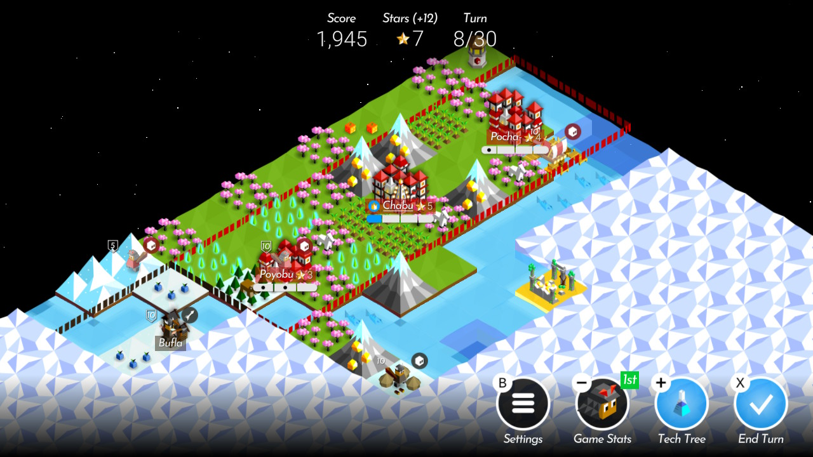

### Descriptions of unit movement – embarking and disembarking

Whenever a land unit moves to a Port, it is automatically converted, either to a **Raft** and may be upgraded to a **Scout**, **Rammer**, or **Bomber**, or is converted to a **Juggernaut**. 

If a unit is upgraded at the same time it moves on to a **Port** tile, that action should be written like this;


    *Bardur moved a **Warrior** to the **Port** in **Bufla**, converting it to **Warrior (Raft)**, upgraded to a **Scout (Warrior)**. *

If a unit is upgraded later on, then the action will be written like this;


    *Upgraded **Swordsman 4 (Raft)** to **Scout 2 (Swordsman 4)** (five Stars).*

When a naval unit moves to a land tile, it disembarks, effectively becoming a land unit again;


    *Moved **Scout 2 (Swordsman 4) **to the tile south of **Moroip**, disembarking.*

When a **Giant** embarks and becomes a **Juggernaut**, the unit will deliver splash damage to all enemy units on adjacent tiles. 

In the turn below (Turn 18), the selected unit is moved to the **Port** tile;

    *Moved **Giant 3** southwest and south on to the **Port** tile south of **Poyobu**, converting it to **Juggernaut 3 (Giant 3)**, destroying the damaged **Bardur Warrior (5HP)** with splash damage.*

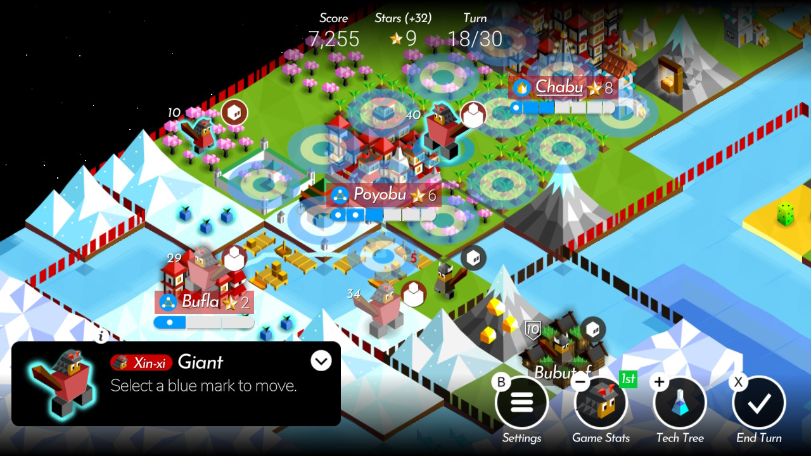

When a Juggernaut disembarks – when it moves to a land tile and effectively becomes a Giant again – it will also deliver splash damage in the same manner. 

Such an action (and any resulting combats) will be written as in this example from Turn 20: 


    *Moved **Juggernaut 1 (Giant 1)** south on to the **Mountain** tile, disembarking, becoming **Giant 1**, attacking a damaged **Bardur Archer** and a **Bardur Warrior** defending the city of **Gurøro** with splash damage;*


        ***Juggernaut 1 (Giant 1) attacked the damaged Bardur Archer (5HP) dealing 5HP of splash damage, destroying it.***


        ***Juggernaut 1 (Giant 1) attacked a Bardur Warrior in Gurøro dealing 3HP of splash damage, (taking the Bardur Warrior down to 7HP).***


### Description of costs – training units, upgrading units, researching technology

Costs of actions, such as training units, or building structures will be written as words and displayed in parenthesis: 

*Trained **Warrior 2** in Chabu (two Stars).*

If a unit in a **Raft** is upgraded to a **Scout**, **Rammer**, or **Bomber**, that cost will be displayed as follows:


    *Moved **Swordsman 7** west, converted to **Swordsman 7 (Raft)**, upgraded to **Bomber 4 (Swordsman 7)** (fifteen Stars).*

Costs of building new structures will be displayed as follows:

*Built a **Windmill** (five Stars) near the farms in **Poyobu** (+4 Population Points). *

Costs of building the same structure more than once may be totalled up and counted as one single cost: 

*Built two **Ports** (fourteen Stars) and a **Lumber Hut** (three Stars) in Bufla. *

Costs of actions that take place on the same tile may be totalled up and written as if one single action;


    *Used **Grow Forest**, **Burn Forest,** and built a **Farm** (thirteen Stars) two tiles north of **Chabu**. *

Researching technologies will be displayed in the same manner:

 


    *Researched **Philosophy** (thirteen Stars), researched **Mining** (seven Stars). *


```
Reminder: Because the cost of researching technology varies depending on both the level of the technology, the number of cities currently controlled, and whether or not Philosophy has been researched (which reduces the ongoing costs of technology research by 33%) it cannot always be assumed that the cost of research will be the same. 
```


### Descriptions of instances of combat

Instances of combat will be described using the following formula:


```
[attacking unit] attacked [defending unit] dealing [amount of damage in HP] of damage (taking [defending unit] to [new HP level]).

[defending unit, if not destroyed] retaliates, dealing [amount of damage in HP] of damage (taking [attacking unit] to [new HP level]).
```


    *Example: **Imperius Rider** attacked **Oumaji Rider**, dealing **6HP** of damage (reducing **Oumaji Rider** to **4HP**). *


    ***Oumaji Rider retaliates, dealing 2HP of damage to Imperius Rider (reducing it to 8HP).***

Unless specified, all attacking and defending units should be assumed to have the full complement of HP.

If an attacking or defending unit has previously sustained damage, their current level of HP before combat will be written next to their name in brackets.


    *Example: **Oumaji Rider (5HP)** attacked **Warrior 5**, dealing 2HP of damage (reducing **Warrior 5** to 8HP). *


    ***Warrior 5 retaliates, destroying the Oumaji Rider. ***


#### Descriptions of combat involving splash damage 

Instances of combat where several units are attacked at the same time with splash damage will be written up as one instance of combat, but with the damage dealt to all affected units written on separately indented lines.


    *Example: **Juggernaut 2 (Giant 2)** moved south one tile and disembarked, attacking two Bardur Warriors with splash damage;*


        ***Giant 2 attacked a damaged Bardur Warrior (5HP) dealing 5HP of splash damage, destroying it. ***


        ***Giant 2 attacked a Bardur Warrior dealing 5HP of splash damage, (taking the Bardur Warrior down to 5HP).***

If only one unit is attacked with splash damage, then the instance of combat will be written up as if it were a regular 1-vs-1 engagement. 


## Game settings


* Difficulty: Normal.
* Number of opponents: 3.
* Tribes selected: Bardur, Imperius, Oumaji, Xin-xi.
* Player’s tribe: Xin-xi. 


## Match report 


### Game opens

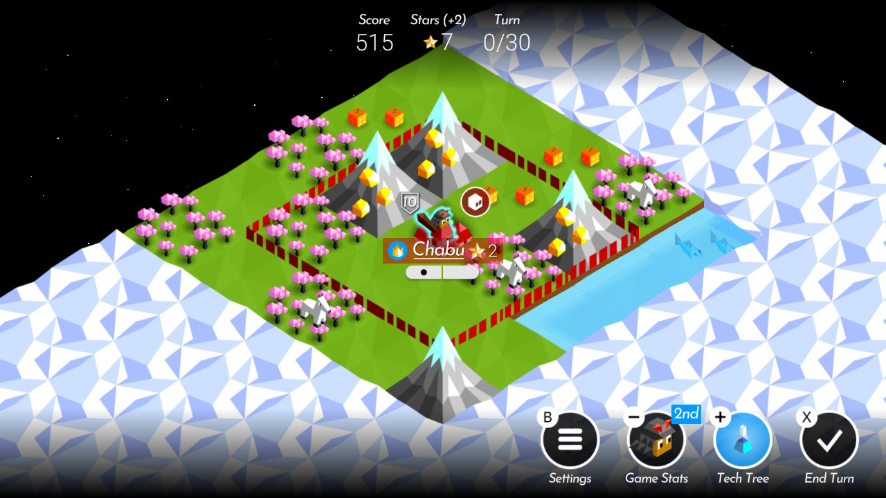

Game opens near the top corner of the map. 

**Chabu**, the capital city, sits between three **Mountain **tiles with **Metal Deposits**. 

A **Field** tile with **Fruit** lies to the northeast, and a **Forest** tile with **Wild Animals** sits to the southeast. To the southwest are two **Field** tiles and another **Forest** tile.

Further southwest are more **Forest** tiles, further south is another **Mountain** tile, and three **Water** tiles sit to the southeast.

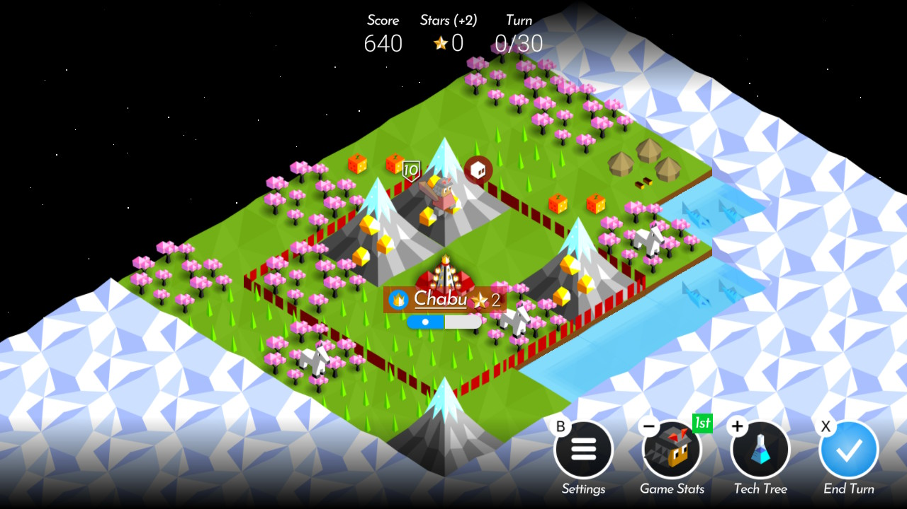

### Turn 0


#### Player actions


    Researched **Organisation** (five Stars). Crops are revealed on the two **Field** tiles to the southwest.


    Extracted the **Fruit** (two Stars) from the tile to the northeast of **Chabu**, for +1 Population Point. 


    Moved **Warrior 1** north, revealing a new **Village**, plus two more **Water** tiles, one with **Fish**. 


```
Extracting the Fruit clears the way for the Forge I'll eventually build once I've researched Smithery. The main reason for moving Warrior 1 north is to head for the northernmost Lighthouse – a guaranteed extra Population Point for Chabu – but the presence of the Village changes things; I should capture that first before heading for the Lighthouse.
```


<table>
  <tr>
   <td><strong>City</strong>
   </td>
   <td><strong>Level</strong>
   </td>
   <td><strong>SPT</strong>
   </td>
   <td><strong>Upgrades and Buildings</strong>
   </td>
   <td><strong>Monuments and Temples</strong>
   </td>
   <td><strong>Points</strong>
   </td>
  </tr>
  <tr>
   <td>Chabu
   </td>
   <td>1
   </td>
   <td>2
   </td>
   <td>
   </td>
   <td>
   </td>
   <td>100
   </td>
  </tr>
</table>


Ended turn.

*Stars left over: 0*

*SPT: 2*

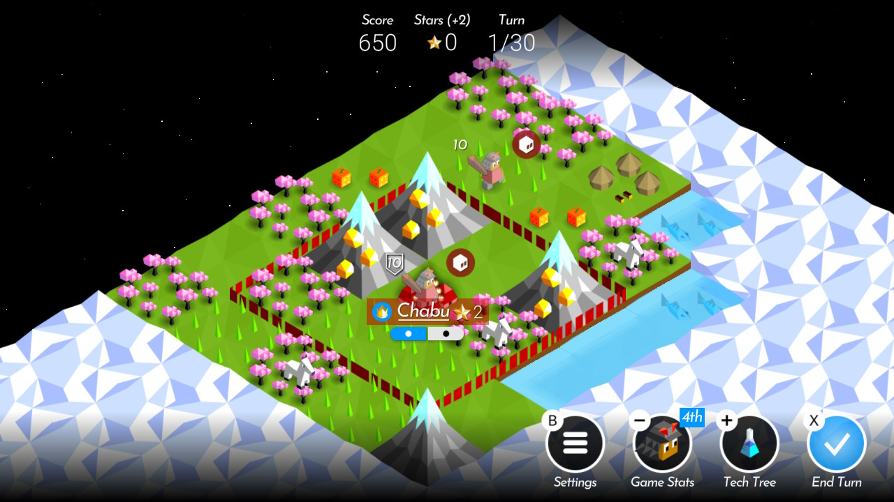

### Turn 1 


#### Player actions

Moved **Warrior 1** northeast. 

Trained **Warrior 2** in **Chabu** (two Stars).


<table>
  <tr>
   <td><strong>City</strong>
   </td>
   <td><strong>Level</strong>
   </td>
   <td><strong>SPT</strong>
   </td>
   <td><strong>Upgrades and Buildings</strong>
   </td>
   <td><strong>Monuments and Temples</strong>
   </td>
   <td><strong>Points</strong>
   </td>
  </tr>
  <tr>
   <td>Chabu
   </td>
   <td>1
   </td>
   <td>2
   </td>
   <td>
   </td>
   <td>
   </td>
   <td>100
   </td>
  </tr>
</table>


Ended turn.

*Stars left over: 0*

*SPT: 2*

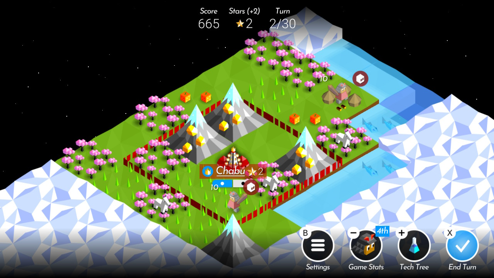

### Turn 2


#### Player actions

Moved **Warrior 1** east to the Village, started capture.

Moved **Warrior 2** south. 


<table>
  <tr>
   <td><strong>City</strong>
   </td>
   <td><strong>Level</strong>
   </td>
   <td><strong>SPT</strong>
   </td>
   <td><strong>Upgrades and Buildings</strong>
   </td>
   <td><strong>Monuments and Temples</strong>
   </td>
   <td><strong>Points</strong>
   </td>
  </tr>
  <tr>
   <td>Chabu
   </td>
   <td>1
   </td>
   <td>2
   </td>
   <td>
   </td>
   <td>
   </td>
   <td>100
   </td>
  </tr>
</table>


Ended turn.

*Stars left over: 2*

*SPT: 2*

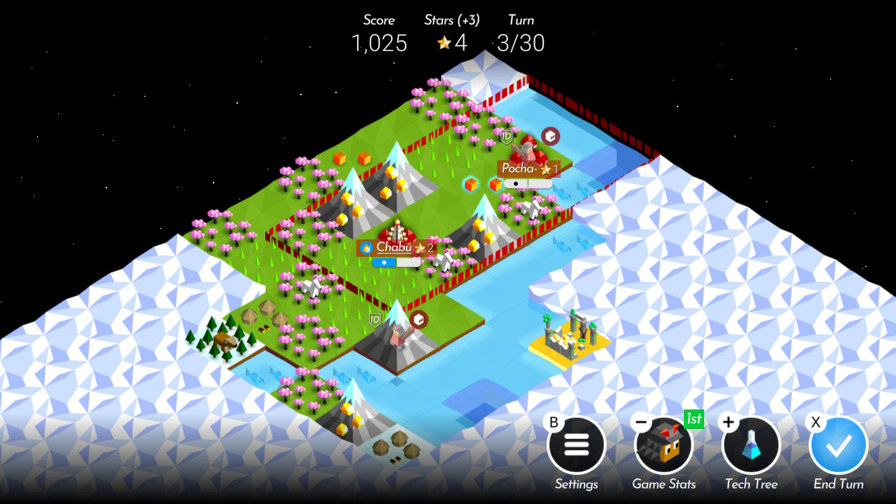

### Turn 3 


#### Player actions


    Moved **Warrior 2** south to the **Mountain** tile, revealing another **Village** to the west, and some **Ruins** to the east, across the sea. 

Captured the **Village** with **Warrior 1**, converting it to the city of **Pocha-**.


<table>
  <tr>
   <td><strong>City</strong>
   </td>
   <td><strong>Level</strong>
   </td>
   <td><strong>SPT</strong>
   </td>
   <td><strong>Upgrades and Buildings</strong>
   </td>
   <td><strong>Monuments and Temples</strong>
   </td>
   <td><strong>Points</strong>
   </td>
  </tr>
  <tr>
   <td>Chabu
   </td>
   <td>1
   </td>
   <td>2
   </td>
   <td>
   </td>
   <td>
   </td>
   <td>100
   </td>
  </tr>
  <tr>
   <td>Pocha-
   </td>
   <td>1
   </td>
   <td>1
   </td>
   <td>
   </td>
   <td>
   </td>
   <td>100
   </td>
  </tr>
</table>


```
Terrain to the southwest and east features snow and desert terrain, indicating that Bardur and Oumaji are nearby – I can expect some visitors soon. 

I'm now thinking about researching Fishing – so I can grow the population of Pocha- and eventually build Ports. If Oumaji units come at me via the sea, I need to be able to counter them.
```


Ended turn.

*Stars left over: 4*

*SPT: 3*

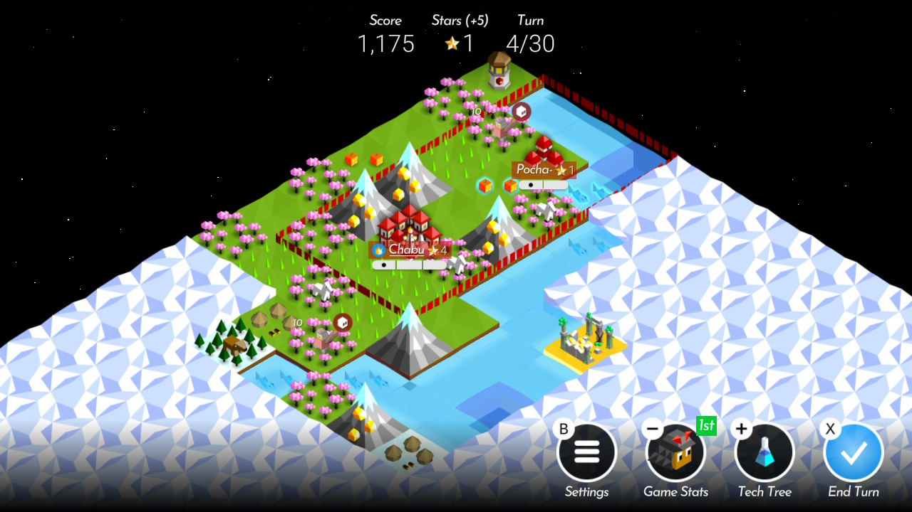

### Turn 4


#### Player actions


    Moved **Warrior 1** northwest, discovering the northern **Lighthouse** (+1 Population Point for **Chabu**).


    ***Chabu upgraded to Level 2. Upgrade chosen: Workshop.***

Moved **Warrior 2** west towards the **Village**. 

Researched **Fishing** (six Stars). 


<table>
  <tr>
   <td><strong>City</strong>
   </td>
   <td><strong>Level</strong>
   </td>
   <td><strong>SPT</strong>
   </td>
   <td><strong>Upgrades and Buildings</strong>
   </td>
   <td><strong>Monuments and Temples</strong>
   </td>
   <td><strong>Points</strong>
   </td>
  </tr>
  <tr>
   <td>Chabu
   </td>
   <td>2
   </td>
   <td>4
   </td>
   <td>Workshop
   </td>
   <td>
   </td>
   <td>150
   </td>
  </tr>
  <tr>
   <td>Pocha-
   </td>
   <td>1
   </td>
   <td>1
   </td>
   <td>
   </td>
   <td>
   </td>
   <td>100
   </td>
  </tr>
</table>


```
This has worked out nicely – my capital is now generating 4 SPT and next turn I'll be able to upgrade my second city and get a Workshop there, too. These cities will give me a good financial bedrock, freeing me up to choose Explorers as upgrades in frontier cities. 
```


Ended turn. 

*Stars left over: 1*

*SPT: 5*

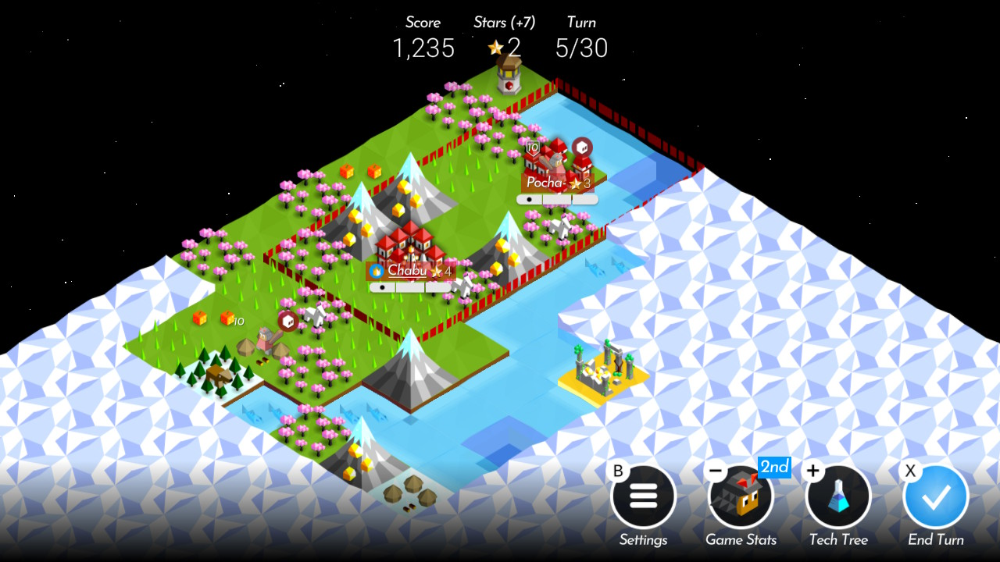

### Turn 5


#### Player actions

Moved **Warrior 1** southeast into **Pocha-**. 

Extracted **Fruit **(two Stars) and **Fish **(two Stars) next to **Pocha-** (+2 Population Points).


    ***Pocha- upgraded to Level 2. Upgrade chosen: Workshop.***


<table>
  <tr>
   <td><strong>City</strong>
   </td>
   <td><strong>Level</strong>
   </td>
   <td><strong>SPT</strong>
   </td>
   <td><strong>Upgrades and Buildings</strong>
   </td>
   <td><strong>Monuments and Temples</strong>
   </td>
   <td><strong>Points</strong>
   </td>
  </tr>
  <tr>
   <td>Chabu
   </td>
   <td>2
   </td>
   <td>4
   </td>
   <td>Workshop
   </td>
   <td>
   </td>
   <td>150
   </td>
  </tr>
  <tr>
   <td>Pocha-
   </td>
   <td>2
   </td>
   <td>3
   </td>
   <td>Workshop
   </td>
   <td>
   </td>
   <td>150
   </td>
  </tr>
</table>


Ended turn.

*Stars left over: 2*

*SPT: 7*

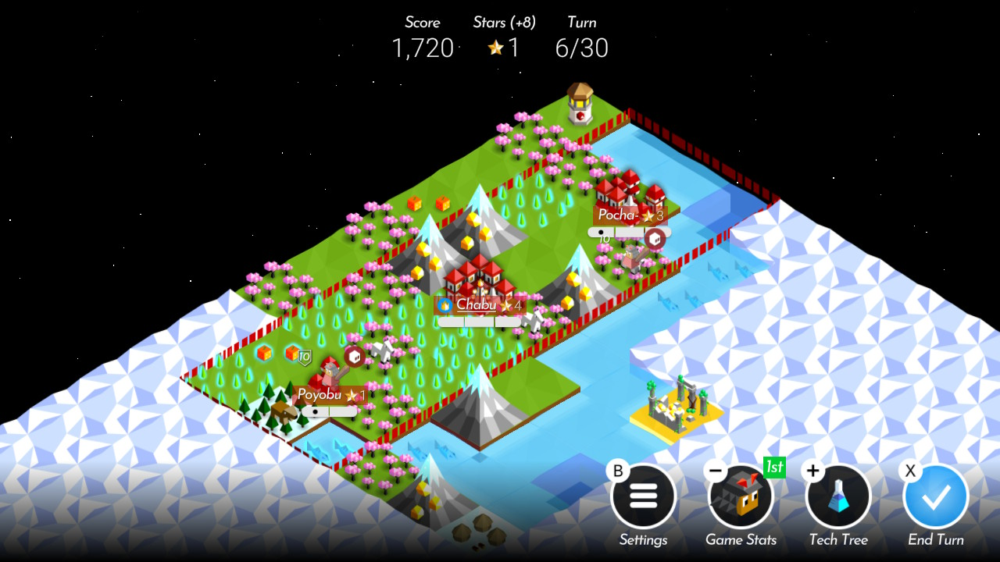

### Turn 6 


#### Player actions

Researched **Farming **(eight Stars). 

Captured the **Village** with **Warrior 2**, converting it to the city of **Poyobu**.

Moved **Warrior 1** south, to remove the fog-of-war tile. 


<table>
  <tr>
   <td><strong>City</strong>
   </td>
   <td><strong>Level</strong>
   </td>
   <td><strong>SPT</strong>
   </td>
   <td><strong>Upgrades and Buildings</strong>
   </td>
   <td><strong>Monuments and Temples</strong>
   </td>
   <td><strong>Points</strong>
   </td>
  </tr>
  <tr>
   <td>Chabu
   </td>
   <td>2
   </td>
   <td>4
   </td>
   <td>Workshop
   </td>
   <td>
   </td>
   <td>150
   </td>
  </tr>
  <tr>
   <td>Pocha-
   </td>
   <td>2
   </td>
   <td>3
   </td>
   <td>Workshop
   </td>
   <td>
   </td>
   <td>150
   </td>
  </tr>
  <tr>
   <td>Poyobu
   </td>
   <td>1
   </td>
   <td>1
   </td>
   <td>
   </td>
   <td>
   </td>
   <td>100
   </td>
  </tr>
</table>


```
All of my cities have Fields with Crops nearby, so this will allow me to grow them quickly. 

Still no sign of Bardur or Oumaji. I should get a good amount of Stars from both emissaries when I first meet them, but also, I only have two Warriors trained, so I'm vulnerable. 
```


Ended turn.

*Stars left over: 1*

*SPT: 8*

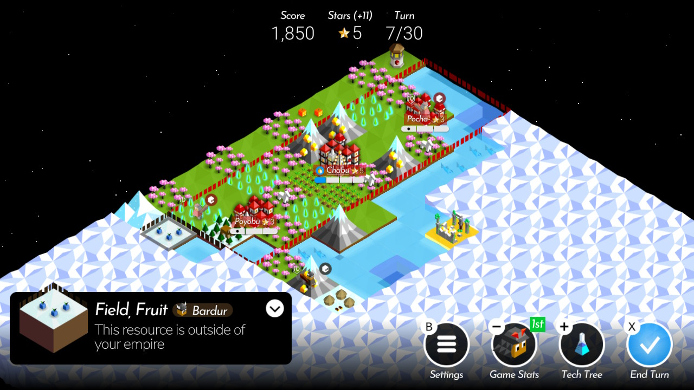

### Turn 7


#### Enemy actions – Bardur


    A **Bardur Warrior** appears to the southeast of **Poyobu**, moving onto the **Mountain** tile with **Metal Deposits**. 

The **Bardur** emissary offers five Stars.


#### Player actions

Moved **Warrior 1** north back into **Pocha-**.

Built two **Farms** in Chabu (ten Stars) (+4 Population Points).


    ***Chabu upgraded to Level 3. Upgrade chosen: Resources.*** 


    Extracted the **Fruit** (two Stars) and **Fish** (two Stars) next to **Poyobu** (+2 Population Points).


    ***Poyobu upgraded to Level 2. Upgrade chosen: Workshop.***

Moved **Warrior 2** west, revealing the borders of a **Bardur** city. 


<table>
  <tr>
   <td><strong>City</strong>
   </td>
   <td><strong>Level</strong>
   </td>
   <td><strong>SPT</strong>
   </td>
   <td><strong>Upgrades and Buildings</strong>
   </td>
   <td><strong>Monuments and Temples</strong>
   </td>
   <td><strong>Points</strong>
   </td>
  </tr>
  <tr>
   <td>Chabu
   </td>
   <td>3
   </td>
   <td>5
   </td>
   <td>Workshop, Resources, Farms (2)
   </td>
   <td>
   </td>
   <td>200
   </td>
  </tr>
  <tr>
   <td>Pocha-
   </td>
   <td>2
   </td>
   <td>3
   </td>
   <td>Workshop
   </td>
   <td>
   </td>
   <td>150
   </td>
  </tr>
  <tr>
   <td>Poyobu
   </td>
   <td>2
   </td>
   <td>3
   </td>
   <td>Workshop
   </td>
   <td>
   </td>
   <td>150
   </td>
  </tr>
</table>


```
I'm considering researching Meditation, with a view to getting Philosophy soon after that. 

I want to be able to build the Altar of Peace monument (for points, and the +3 Population) as soon as possible. This will require me to not attack anyone for five turns – I should research Meditation before any fighting starts.
```


Ended turn.

*Stars left over: 5*

*SPT: 11*


### Turn 8 


#### Enemy actions – Bardur

Bardur **Warrior** moves southeast on to the **Village** tile to the southeast of **Poyobu**.


    A **Bardur Archer** fires at **Warrior 2** from the fog-of-war, dealing **5HP** of damage (reducing **Warrior 2** to **5HP**). **Warrior 2** cannot retaliate (out of range).


#### Player actions


    Moved **Warrior 2 (5HP)** east to the **Mountain** tile, removing the fog-of-war around the **Bardur** city. 


    Discovered the **Bardur** city of **Bufla**, where the **Archer** that attacked **Warrior 2 (5HP)** is stationed.

Trained **Warrior 3** (two Stars) in **Poyobu**.

Built a **Port** (seven Stars) and a **Farm** (five Stars) in **Pocha-** (+3 Population Points).


    ***Pocha- upgraded to Level 3. Upgrade chosen: Resources.***

Moved **Warrior 1** southwest onto the **Port**, converting it to **Warrior 1 (Raft)**. 


<table>
  <tr>
   <td><strong>City</strong>
   </td>
   <td><strong>Level</strong>
   </td>
   <td><strong>SPT</strong>
   </td>
   <td><strong>Upgrades and Buildings</strong>
   </td>
   <td><strong>Monuments and Temples</strong>
   </td>
   <td><strong>Points</strong>
   </td>
  </tr>
  <tr>
   <td>Chabu
   </td>
   <td>3
   </td>
   <td>5
   </td>
   <td>Workshop, Resources, Farms (2)
   </td>
   <td>
   </td>
   <td>200
   </td>
  </tr>
  <tr>
   <td>Pocha-
   </td>
   <td>3
   </td>
   <td>4
   </td>
   <td>Workshop, Resources, Ports (1), Farms (1)
   </td>
   <td>
   </td>
   <td>200
   </td>
  </tr>
  <tr>
   <td>Poyobu
   </td>
   <td>2
   </td>
   <td>3
   </td>
   <td>Workshop
   </td>
   <td>
   </td>
   <td>150
   </td>
  </tr>
</table>


```
Warrior 2 will not likely survive the next turn. I moved it to the nearby Mountain tile, so I can get a better look at Bardur's territory, thanks to the extended line of sight afforded by the Mountain.

The presence of Fish tiles indicates that there's a Village to the southeast of Pocha- – I'll move Warrior 1 (Raft) in that direction next turn.

```


End turn.

*Stars left over: 7*

*SPT: 12*

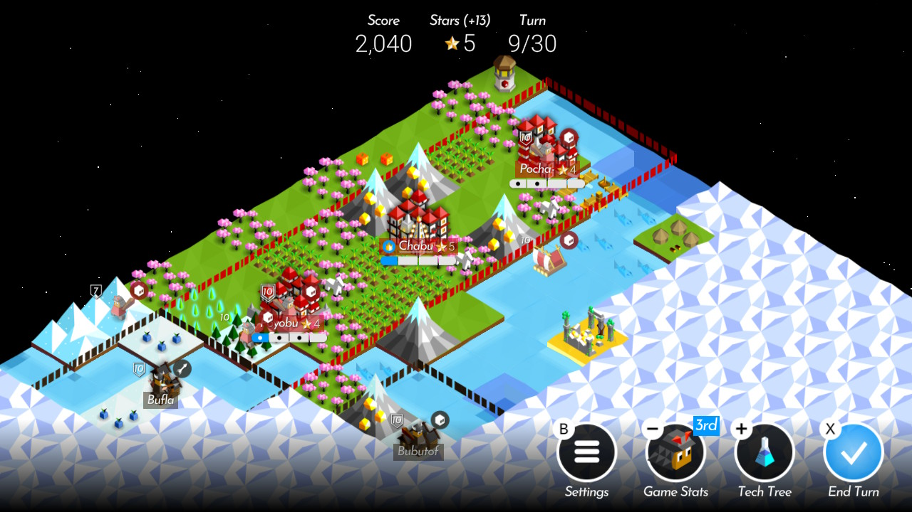

### Turn 9 


#### Enemy actions – Bardur

Bardur captures the **Village** to the south, turning it into the city of **Bubutof**.


    Bardur **Archer** in **Bufla** does not fire on **Warrior 2**. 


#### Player actions

Healed **Warrior 2** for **2HP** (restoring it to **7HP**).

Moved **Warrior 3** southwest, towards **Bufla**, revealing another **Water** tile.

Built two **Farms** (ten Stars) in **Poyobu** (+4 Population Points).


    ***Poyobu upgraded to Level 3. Upgrade chosen: City Walls.***

Trained **Warrior 4** (two Stars) in **Poyoba**. 


    Moved **Warrior 1 (Raft)** southwest, towards the **Ruins** – discovered a landmass with a **Village** to the east. 

Trained **Warrior 5** (two Stars) in **Pocha-**.


<table>
  <tr>
   <td><strong>City</strong>
   </td>
   <td><strong>Level</strong>
   </td>
   <td><strong>SPT</strong>
   </td>
   <td><strong>Upgrades and Buildings</strong>
   </td>
   <td><strong>Monuments and Temples</strong>
   </td>
   <td><strong>Points</strong>
   </td>
  </tr>
  <tr>
   <td>Chabu
   </td>
   <td>3
   </td>
   <td>5
   </td>
   <td>Workshop, Resources, Farms (2)
   </td>
   <td>
   </td>
   <td>200
   </td>
  </tr>
  <tr>
   <td>Pocha-
   </td>
   <td>3
   </td>
   <td>4
   </td>
   <td>Workshop, Resources, Ports (1), Farms (1)
   </td>
   <td>
   </td>
   <td>200
   </td>
  </tr>
  <tr>
   <td>Poyobu
   </td>
   <td>3
   </td>
   <td>4
   </td>
   <td>Workshop, Farms (2), City Walls
   </td>
   <td>
   </td>
   <td>200
   </td>
  </tr>
</table>


```
There are two land routes to the Bardur city of Bufla, which I will be able to easily defend, but I need to build a Port on the tile immediately to the south of Poyoba soon, so I can ferry my own units across the waves, and build naval units. 

The fact that the Bardur Archer did not fire on my Warrior is likely because it cannot see it, presumably due to fog-of-war. 

I hope that I can get Warrior 1 (Raft) over to that Village before Oumaji gets there. 
```


Ended turn. 

*Stars left over: 5*

*SPT: 13*

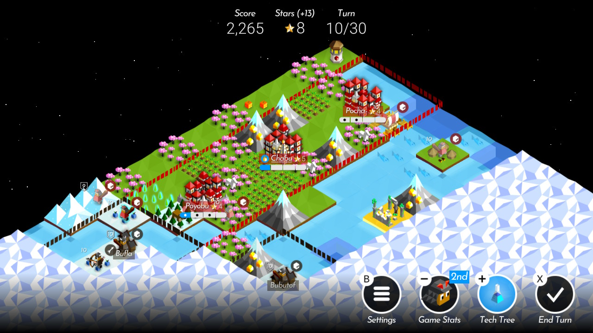

### Turn 10 


#### Enemy actions – Bardur

Moved the **Warrior** south from **Bubutof**, and trained another **Warrior**.

Moved the **Archer** out of **Bufla**, and trained a **Warrior**. 


#### Player actions

Healed **Warrior 2** for **2HP** (restoring it to **9HP**).


    Moved **Warrior 3** west, just outside **Bufla**, but did not attack the **Bardur Warrior**. 

Moved **Warrior 4** southeast. 


    Moved **Warrior 1 (Raft)** east, disembarking to the **Village** on the landmass – which is revealed to be a one-tile island – and started capturing the **Village**. 

Moved **Warrior 5** onto the Port, converting it to **Warrior 5 (Raft)**. 


    Researched **Meditation** (ten Stars) – *Pacifist* quest (make no attacks for five turns) initiated. 


<table>
  <tr>
   <td><strong>City</strong>
   </td>
   <td><strong>Level</strong>
   </td>
   <td><strong>SPT</strong>
   </td>
   <td><strong>Upgrades and Buildings</strong>
   </td>
   <td><strong>Monuments and Temples</strong>
   </td>
   <td><strong>Points</strong>
   </td>
  </tr>
  <tr>
   <td>Chabu
   </td>
   <td>3
   </td>
   <td>5
   </td>
   <td>Workshop, Resources, Farms (2)
   </td>
   <td>
   </td>
   <td>200
   </td>
  </tr>
  <tr>
   <td>Pocha-
   </td>
   <td>3
   </td>
   <td>4
   </td>
   <td>Workshop, Resources, Ports (1), Farms (1)
   </td>
   <td>
   </td>
   <td>200
   </td>
  </tr>
  <tr>
   <td>Poyobu
   </td>
   <td>3
   </td>
   <td>4
   </td>
   <td>Workshop, Farms (2), City Walls
   </td>
   <td>
   </td>
   <td>200
   </td>
  </tr>
</table>


```
I intend to check Bardur's advance into my territory by placing a Warrior at the two land bridges, while I wait for the clock to run down on the Pacifist quest. 

This will also buy me time to build a Port south of Poyoba and start building up a navy. 

I intend to move Warrior 5 (Raft) south, towards the Ruins and grab whatever's in there, hopefully before Oumaji. 

I will research Philosophy next turn, which will significantly lower technology research costs for the rest of the game.
```


Ended turn. 

*Stars left over: 8*

*SPT: 13*

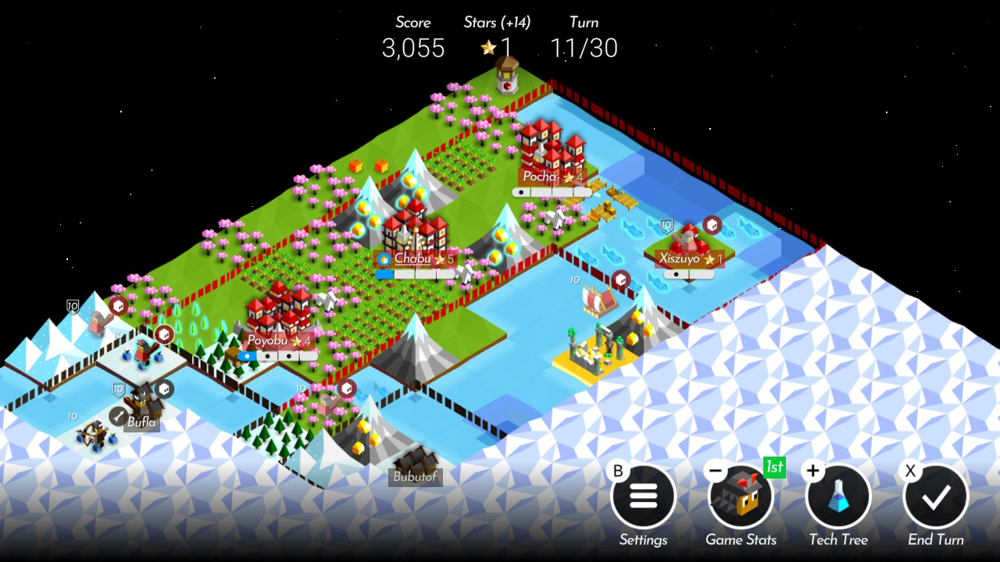

### Turn 11


#### Enemy actions – Bardur

Moved the **Warrior** south from **Bubutof**, trained no more units.

The **Archer** and **Warrior** in and around **Bufla** did not move.


#### Player actions

Healed **Warrior 2** for **1HP** (restoring it to **10HP**). 

**Warrior 3** held its position.

Moved **Warrior 4** south, towards the **Bardur** city of **Bubutof**. 

Moved **Warrior 5** south, towards the **Ruins**. 


    Researched **Philosophy** (thirteen Stars), researched **Mining** (seven Stars). 

Captured the **Village** with **Warrior 1**, converting it to the city of **Xiszuyo**.


<table>
  <tr>
   <td><strong>City</strong>
   </td>
   <td><strong>Level</strong>
   </td>
   <td><strong>SPT</strong>
   </td>
   <td><strong>Upgrades and Buildings</strong>
   </td>
   <td><strong>Monuments and Temples</strong>
   </td>
   <td><strong>Points</strong>
   </td>
  </tr>
  <tr>
   <td>Chabu
   </td>
   <td>3
   </td>
   <td>5
   </td>
   <td>Workshop, Resources, Farms (2)
   </td>
   <td>
   </td>
   <td>200
   </td>
  </tr>
  <tr>
   <td>Pocha-
   </td>
   <td>3
   </td>
   <td>4
   </td>
   <td>Workshop, Resources, Ports (1), Farms (1)
   </td>
   <td>
   </td>
   <td>200
   </td>
  </tr>
  <tr>
   <td>Poyobu
   </td>
   <td>3
   </td>
   <td>4
   </td>
   <td>Workshop, Farms (2), City Walls
   </td>
   <td>
   </td>
   <td>200
   </td>
  </tr>
  <tr>
   <td>Xiszuyo
   </td>
   <td>1
   </td>
   <td>1
   </td>
   <td>
   </td>
   <td>
   </td>
   <td>100
   </td>
  </tr>
</table>


```
The zone of control extended by Warrior 4 will inhibit advances from Bardur, and give me a free hand to build up my forces.

It was important to research Philosophy before researching Mining – Mining would have otherwise cost ten Stars. 

Similarly, researching Philosophy before acquiring the city of Xiszuyo meant it cost thirteen Stars. Had I captured Xiszuyo first, it would have cost sixteen Stars. 

Next turn, I plan to upgrade my capital city Chabu with some Mines.
```


Ended turn. 

*Stars left over: 8*

*SPT: 13*

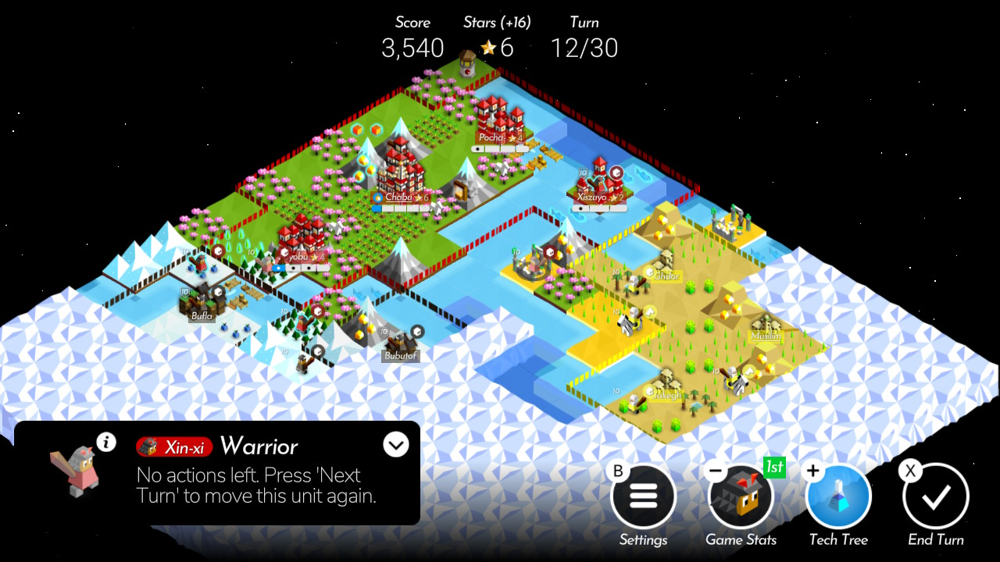

### Turn 12


#### Enemy actions – Bardur

Bardur moves its **Archer** southwest away from **Bufla** and into the fog-of-war. 

Bardur builds a **Port** on the tile immediately northeast of **Bufla**.  


#### Player actions

Moved **Warrior 3** east, and **Warrior 2** southeast, down from the **Mountain** tile. 


    Moved **Warrior 4** southwest, to give me a better look at the terrain around **Bufla**. Discovered another **Bardur Warrior** to the south. **Warrior 4** will likely be attacked next turn. 


    Moved **Warrior 5 (Raft)** south, onto the land tile with the **Ruins **– revealing the yellow border of an **Oumaji** city to the east. 

Built two **Mines** (ten Stars) in **Chabu** (+4 Population Points).


    ***Chabu upgraded to Level 4. Upgrade chosen: Border Growth.***

Extracted two **Fish** (four Stars) next to **Xiszuyo** (+2 Population Points).


    ***Xiszuyo upgraded to Level 2. Upgrade chosen: Explorer.***


    The **Explorer** from **Xiszuyo** travelled southeast, meeting **Oumaji** and revealing much of the **Oumaji** territory; including the cities of **Ghdor**, **Musilim**, and **Bakegh**. 

The **Oumaji** emissary offers five Stars.


<table>
  <tr>
   <td><strong>City</strong>
   </td>
   <td><strong>Level</strong>
   </td>
   <td><strong>SPT</strong>
   </td>
   <td><strong>Upgrades and Buildings</strong>
   </td>
   <td><strong>Monuments and Temples</strong>
   </td>
   <td><strong>Points</strong>
   </td>
  </tr>
  <tr>
   <td>Chabu
   </td>
   <td>4
   </td>
   <td>6
   </td>
   <td>Workshop, Resources, Farms (2), Mines (2), Border Growth
   </td>
   <td>
   </td>
   <td>250
   </td>
  </tr>
  <tr>
   <td>Pocha-
   </td>
   <td>3
   </td>
   <td>4
   </td>
   <td>Workshop, Resources, Ports (1), Farms (1)
   </td>
   <td>
   </td>
   <td>200
   </td>
  </tr>
  <tr>
   <td>Poyobu
   </td>
   <td>3
   </td>
   <td>4
   </td>
   <td>Workshop, Farms (2), City Walls
   </td>
   <td>
   </td>
   <td>200
   </td>
  </tr>
  <tr>
   <td>Xiszuyo
   </td>
   <td>2
   </td>
   <td>2
   </td>
   <td>Explorer
   </td>
   <td>
   </td>
   <td>150
   </td>
  </tr>
</table>


```
Bardur has been able to build a Port before I can, which is concerning, but by positioning Warrior 2 and Warrior 3 either side of the Port, I can attack and destroy the Warrior if it moves onto the tile and becomes a Raft – units on Rafts don't retaliate, so I can attack with impunity. 

I do need to build a Port in Poyobu soon, though.

Warrior 4 could be moved up toward Bufla to flank the Warrior stationed there, but it's also vulnerable to attack from both of the Bardur Warriors stationed around Bubutof. 

I upgraded my capital to Level 4, expanding the borders. Next turn I'll upgrade it again and get my first Giant. 

I finally met Oumaji – they don't appear to have developed their economy much, there's unextracted Fruit, Crops not turned into Farms, and no Mines.

All of the cities I can see are on Level 2, with the exception of Ghdor, which is on Level 1 – they're not a threat, for the time being.
```


Ended turn. 

*Stars left over: 6*

*SPT: 16*

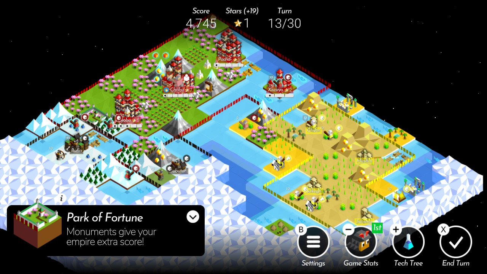

### Turn 13


#### Enemy actions – Oumaji


    An **Oumaji Rider** attacked **Warrior 5**, dealing **5HP** of damage (reducing **Warrior 5** to **5HP**).

**Warrior 5** retaliates, dealing **5HP** of damage (reducing **Oumaji Rider **to **5HP**).

The **Oumaji Rider** retreated, moving southeast and south. 


#### Enemy actions – Bardur


    The **Bardur Archer** moved northeast from out of the fog-of-war and fired on **Warrior 4**, dealing **5HP** of damage. **Warrior 4** cannot retaliate (out of range).


#### Player actions

Researched **Smithery** (eleven Stars). 

Built a **Forge** (five Stars) in Pocha- (+4 Population Points, for the two adjacent **Mines**). 


    ***Pocha- upgraded to Level 4. Upgrade chosen: Border Growth.***

Built a **Forge** (five Stars) in **Chabu** (+4 Population Points, for the two adjacent **Mines**). 


    ***Chabu upgraded to Level 5. Upgrade chosen; Super Unit (Giant 1).***


    *Metropolis* quest completed (upgrade a city to Level 5), **Park of Fortune** monument unlocked. 

Built **Park of Fortune** in **Poyobu** (+3 Population Points).


    ***Poyobu upgraded to Level 4. Upgrade chosen: Border Growth.***


    Examined the **Ruins** with **Warrior 5**, earned another **Explorer**, which revealed some more of the **Oumaji** lands, including another city, **Jidormu** – and a landmass towards the south with a **Village** on it. 


    Moved **Warrior 4** south, to explore more of **Bardur’s** territory, revealing a new stretch of coastline, south of **Bubutof**.


<table>
  <tr>
   <td><strong>City</strong>
   </td>
   <td><strong>Level</strong>
   </td>
   <td><strong>SPT</strong>
   </td>
   <td><strong>Upgrades and Buildings</strong>
   </td>
   <td><strong>Monuments and Temples</strong>
   </td>
   <td><strong>Points</strong>
   </td>
  </tr>
  <tr>
   <td>Chabu
   </td>
   <td>5
   </td>
   <td>7
   </td>
   <td>Workshop, Resources, Farms (2), Mines (2), Border Growth
   </td>
   <td>
   </td>
   <td>300
   </td>
  </tr>
  <tr>
   <td>Pocha-
   </td>
   <td>4
   </td>
   <td>5
   </td>
   <td>Workshop, Resources, Ports (1), Farms (1), Forge, Border Growth
   </td>
   <td>
   </td>
   <td>250
   </td>
  </tr>
  <tr>
   <td>Poyobu
   </td>
   <td>4
   </td>
   <td>5
   </td>
   <td>Workshop, Farms (2), City Walls, Border Growth
   </td>
   <td>Park of Fortune
   </td>
   <td>650
   </td>
  </tr>
  <tr>
   <td>Xiszuyo
   </td>
   <td>2
   </td>
   <td>2
   </td>
   <td>Explorer
   </td>
   <td>
   </td>
   <td>150
   </td>
  </tr>
</table>


```
Really productive turn; I upgraded three cities, and am now kicking out a healthy amount of SPT. 

I also have a Giant now, which I'm going to send towards Bardur – by the time it gets to Poyobu, I'll have built a Port so I can turn Giant 1 into a Juggernaut 1 and break up the defences of Bufla. 

Warrior 4 will likely not survive – at least I was able to use it to discover more of the terrain.

Getting an Explorer from the Ruins was a stroke of luck, as it revealed huge swathes of Oumaji's territory, saving me from having to do it myself. 

Getting to the eastern Lighthouse is going to be difficult, because of the two land tiles preventing me from sailing around. I would have to go via the sea in the centre – or find/train another Explorer. 
```


Ended turn. 

*Stars left over: 1*

*SPT: 19*

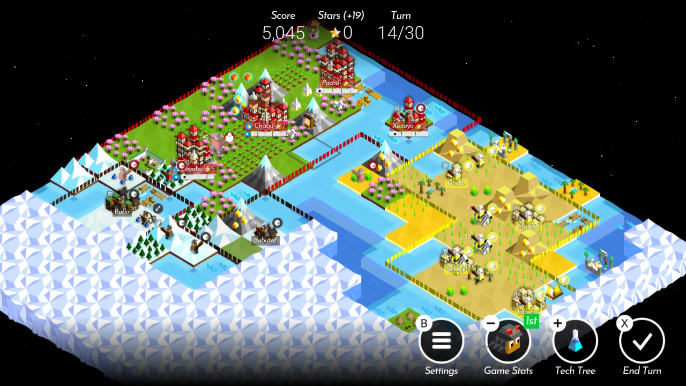

### Turn 14


#### Enemy actions – Oumaji

Oumaji trained **Warriors **in **Ghdor**, **Musilim**, and **Jidormu**, and a **Rider** in **Bakegh**. 

Oumaji extracted **Fruit** in **Musilim**, **Jidormu**, and **Bakegh**.


#### Enemy actions – Bardur


    Bardur’s **Warrior** attacked and destroyed **Warrior 4**. 


    Bardur’s **Archer** fired at **Warrior 2**, delivering **5HP** of damage (reducing **Warrior 2** to **5HP**). **Warrior 2** cannot retaliate (out of range).


#### Player actions

Healed **Warrior 2** for 2HP (restoring it to **7HP**).

Researched **Riding** (six Stars) and **Roads** (eight Stars). 


    Built two **Roads** (six Stars) heading southwest (six Stars), connecting **Chabu** and **Poyoba** (+1 Population Point in each city). 

Moved **Giant 1** southwest two tiles.

Healed **Warrior 5** for **2HP** (restoring it to **7HP**).


<table>
  <tr>
   <td><strong>City</strong>
   </td>
   <td><strong>Level</strong>
   </td>
   <td><strong>SPT</strong>
   </td>
   <td><strong>Upgrades and Buildings</strong>
   </td>
   <td><strong>Monuments and Temples</strong>
   </td>
   <td><strong>Points</strong>
   </td>
  </tr>
  <tr>
   <td>Chabu
   </td>
   <td>5
   </td>
   <td>7
   </td>
   <td>Workshop, Resources, Farms (2), Mines (2), Border Growth
   </td>
   <td>
   </td>
   <td>300
   </td>
  </tr>
  <tr>
   <td>Pocha-
   </td>
   <td>4
   </td>
   <td>5
   </td>
   <td>Workshop, Resources, Ports (1), Farms (1), Forge, Border Growth
   </td>
   <td>
   </td>
   <td>250
   </td>
  </tr>
  <tr>
   <td>Poyobu
   </td>
   <td>4
   </td>
   <td>5
   </td>
   <td>Workshop, Farms (2), City Walls, Border Growth
   </td>
   <td>Park of Fortune
   </td>
   <td>650
   </td>
  </tr>
  <tr>
   <td>Xiszuyo
   </td>
   <td>2
   </td>
   <td>2
   </td>
   <td>Explorer
   </td>
   <td>
   </td>
   <td>150
   </td>
  </tr>
</table>


```
Next turn, I will build Ports in Xiszuyo and Poyoba, which will connect all of my cities to my capital, and set the stage for the siege of Bulfa.

Bardur has lots of units in the field, but they're all cheap units with low defence. 

Turning Giant 1 into a Juggernaut means I will be able to damage lots of units at once, and mop up what remains with Warrior 2 and Warrior 3.

I'm safe from Oumaji for the time being. I need to keep a look out to see if a port is built in Ghdor. 

Later on, I might be able to get Oumaji to sign a Peace Treaty, which would give me a free hand to take over Bardur's territory. 
```


Ended turn.

*Stars left over: 0*

*SPT: 19*

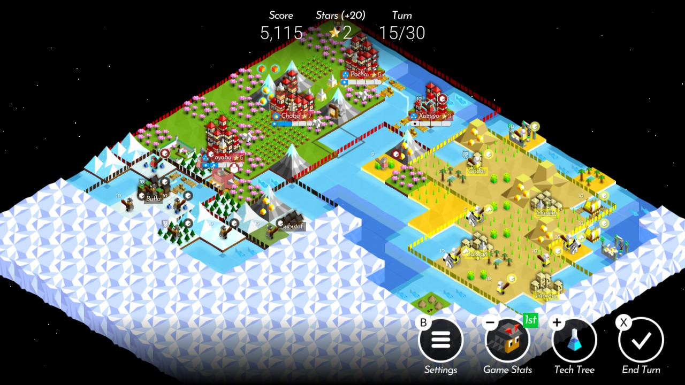

### Turn 15


#### Enemy actions – Oumaji

Moved **Warrior** northeast towards the **Ruins**. 

Moved **Warrior** east to the **Port** in **Musilim**, becoming a **Warrior (Raft)**.

Moved **Rider** northeast of Bakegh southeast and east.

Moved **Rider** in Bakegh southwest.

Moved **Rider** west of Musilim southwest.

Trained no units. 


#### Enemy actions – Bardur

Moved **Warrior** northeast to the **Port** in **Bufla**, becoming a **Warrior (Raft)**.


#### Player actions


    *Pacifist *quest completed (make no attacks for five turns), **Altar of Peace** monument unlocked.


    Built two **Roads** (six Stars) heading northeast connecting **Chabu** and **Pocha-** (+1 Population Point in each city).


    Extracted **Fish** near **Xiszuyo** (two Stars), and built a **Port** (seven Stars) on the same tile, connecting **Chabu** and **Xiszuyo** (+1 Population Point in each city).


    ***Xiszuyo upgraded to Level 3. Upgrade chosen: Resources.*** 

Built a **Port** (seven Stars) in **Poyobu**. 


    Moved **Giant 1** on to the **Port** tile, converting it to **Juggernaut 1 (Giant 1)**. 


    **Juggernaut (Giant 1)** deals **7HP** of splash damage to the nearby **Bardur Warrior (Raft)** (reducing it to **3HP**). 

**Warrior 3** attacks and destroys the **Bardur Warrior (Raft)**.

Healed **Warrior 2** for **2HP** (restoring it to **9HP**).

Healed **Warrior 5** for **2HP** (restoring it to **9HP**).


<table>
  <tr>
   <td><strong>City</strong>
   </td>
   <td><strong>Level</strong>
   </td>
   <td><strong>SPT</strong>
   </td>
   <td><strong>Upgrades and Buildings</strong>
   </td>
   <td><strong>Monuments and Temples</strong>
   </td>
   <td><strong>Points</strong>
   </td>
  </tr>
  <tr>
   <td>Chabu
   </td>
   <td>5
   </td>
   <td>7
   </td>
   <td>Workshop, Resources, Farms (2), Mines (2), Border Growth
   </td>
   <td>
   </td>
   <td>300
   </td>
  </tr>
  <tr>
   <td>Pocha-
   </td>
   <td>4
   </td>
   <td>5
   </td>
   <td>Workshop, Resources, Ports (1), Farms (1), Forge, Border Growth
   </td>
   <td>
   </td>
   <td>250
   </td>
  </tr>
  <tr>
   <td>Poyobu
   </td>
   <td>4
   </td>
   <td>5
   </td>
   <td>Workshop, Farms (2), City Walls, Border Growth
   </td>
   <td>Park of Fortune
   </td>
   <td>650
   </td>
  </tr>
  <tr>
   <td>Xiszuyo
   </td>
   <td>3
   </td>
   <td>3
   </td>
   <td>Explorer, Ports (1), Resources
   </td>
   <td>
   </td>
   <td>200
   </td>
  </tr>
</table>


```
Neither Oumaji or Bardur attacked this turn, and now that I've unlocked the Altar of Peace monument, I can attack with impunity. 

I'm going to build the Altar of Peace in Poyobu, which will upgrade the city, and allow me to choose another Giant, which I will immediately send towards Bardur. I'm not yet sure where I'm going to build it. 

I eventually want to build a circle of Farms around the city, build a Windmill for optimal population growth, on the Forest tile with Wild Animals that's immediately northeast of Poyobu. That will give me the greatest amount of population growth. 

I need to research Forestry, so that I can start cutting down trees, which will give me more room to build. 

All of my cities are now connected – I need two more cities and a connection to my capital in order to unlock the Grand Bazaar monument. 
```


Ended turn.

*Stars: 2*

*SPT: 20*

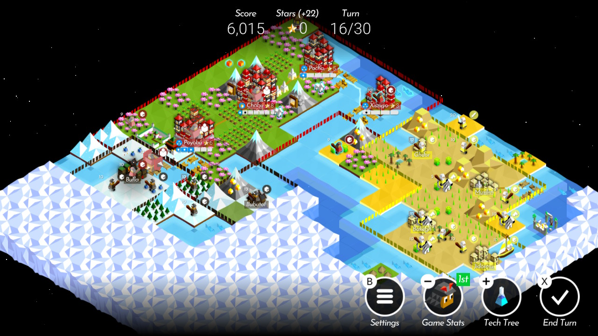

### Turn 16


#### Enemy actions – Oumaji

Oumaji examined the **Ruins** to the east, earned a **Veteran Swordsman**. 


    Oumaji upgraded its **Warrior (Raft)** to a **Scout (Warrior)**; **Scout (Warrior)** moved south, south, and southwest. 

Oumaji moved all **Riders** and **Warriors** to the south and southeast. 

 \
Enemy actions – Bardur 


    Bardur Warrior attacked **Juggernaut 1 (Giant 1)**, dealing **3HP** of damage (taking **Juggernaut 1 (Giant 1)** to **37HP**). 


    Bardur moved a **Warrior** to the **Port** in **Bufla**, turning it into a **Warrior (Raft)**, upgraded to a **Scout (Warrior)**. 


#### Player actions

Moved **Juggernaut 1** west, attacking and destroying the **Bardur Scout**. 

**Juggernaut 1** deals collateral splash damage to two nearby **Bardur Warriors**; 


        The **Bardur Warrior** based in the city of **Bufla** (which provides a defence bonus of 1.5) receives 5HP of damage (taking the **Bardur Warrior** down to **5HP**). 

	


        The **Bardur Warrior** standing on a **Field** tile (no defence bonus) receives **6HP** of damage (taking the **Bardur Warrior **down to **4HP**).


    Moved** Warrior 2 (9HP)** north.


    Moved **Warrior 3** west, attacked and destroyed the damaged **Bardur Warrior** in **Bufla**. 

**Warrior 3** begins capturing **Bufla**. 

Researched **Hunting** (six Stars) and **Forestry** (eight Stars). 


    Extracted two **Wild Animals** (four Stars), extracted **Fish** (two Stars) near **Poyobu** (+3 Population Points).


    ***Poyobu upgraded to Level 5. Upgrade chosen: Super Unit (Giant 2).***


    Used **Clear Forest** on the tiles to the immediate northeast and southwest of **Poyobu** (earning two Stars). 


    Used **Clear Forest** on the **Forest** tile two tiles to the northwest of **Chabu** (earning one Star). 


    Used the five Stars earned from clearing **Forest** tiles to build a **Mine** on the remaining **Mountain** tile with **Metal Deposits** next to **Chabu** (+4 Population Points).


    ***Chabu upgraded to Level 6. Upgrade chosen: Super Unit (Giant 3).***

Built the **Altar of Peace** southwest of **Poyobu** (+3 Population Points).

Healed **Warrior 5** for **1HP** (restoring it to **10HP**).


<table>
  <tr>
   <td><strong>City</strong>
   </td>
   <td><strong>Level</strong>
   </td>
   <td><strong>SPT</strong>
   </td>
   <td><strong>Upgrades and Buildings</strong>
   </td>
   <td><strong>Monuments and Temples</strong>
   </td>
   <td><strong>Points</strong>
   </td>
  </tr>
  <tr>
   <td>Chabu
   </td>
   <td>6
   </td>
   <td>8
   </td>
   <td>Workshop, Resources, Farms (2), Mines (2), Border Growth
   </td>
   <td>
   </td>
   <td>350
   </td>
  </tr>
  <tr>
   <td>Pocha-
   </td>
   <td>4
   </td>
   <td>5
   </td>
   <td>Workshop, Resources, Ports (1), Farms (1), Forge, Border Growth
   </td>
   <td>
   </td>
   <td>250
   </td>
  </tr>
  <tr>
   <td>Poyobu
   </td>
   <td>5
   </td>
   <td>6
   </td>
   <td>Workshop, Farms (2), City Walls, Border Growth
   </td>
   <td>Park of Fortune, Altar of Peace
   </td>
   <td>1100
   </td>
  </tr>
  <tr>
   <td>Xiszuyo
   </td>
   <td>3
   </td>
   <td>3
   </td>
   <td>Explorer, Ports (1), Resources
   </td>
   <td>
   </td>
   <td>200
   </td>
  </tr>
</table>


```
I now have three Giants on the board, which I will send southwest towards Bardur – things appear to be going well on that flank, but I still haven't found their capital, and I need to maintain pressure. 

I did a lot of tree felling this turn, all of which paves the way for me upgrading Poyobu with a Windmill, once I've researched Construction. This, combined with a Market, will provide a significant boost to my economy. 

Oumaji getting a Veteran Swordsman could be dangerous, but they've also moved most of their units south, most likely because they've made contact with Imperius, who will be lurking in the fog towards the bottom of the map. 

The fact that I can see what they're doing means that if they start to move any forces in my direction, I'll know about it and adjust my strategy accordingly.

Both Bardur and Oumaji have researched Sailing, which I have yet to do. I need to think about investing in the seafaring branches of the technology tree.
```


Ended turn.

*Stars left over: 0*

*SPT: 22*

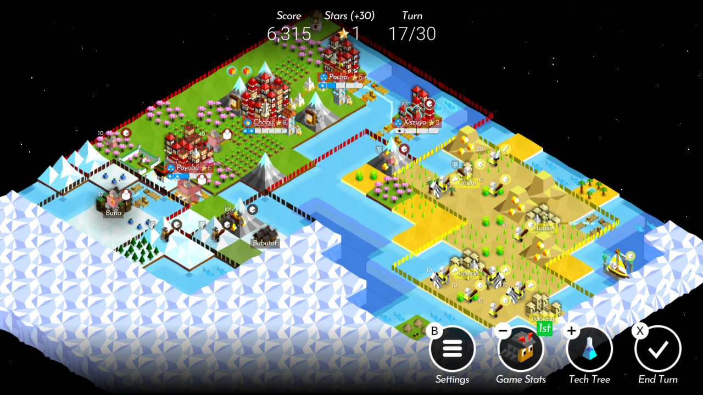

### Turn 17 


#### Enemy actions – Oumaji

Oumaji moved **Veteran Swordsman** southwest towards Ghdor.

Oumaji damaged **Rider (5HP)** northwest towards **Warrior 5**. 

Oumaji moved **Warrior** northwest towards **Ghdor**. 

Oumaji moved **Rider** south of **Bakegh** northwest one tile. 

Ouamji moved **Warrior** southeast of **Bakegh** southwest. 

Oumaji moved **Warrior** northwest of **Jimordu** southwest. 

Ouamji moved **Rider** in Bakegh south one tile. 

Oumaji moved **Rider** next to the **Ruins** in the sea southwest two tiles. 

Oumaji moved **Scout (Warrior)** northwest two tiles to the **Ruins**. 


#### Enemy actions – Bardur 


    Bardur attacked **Warrior 3** with a **damaged Warrior (4HP)**, dealing **2HP** of damage (reducing **Warrior 3** to **8HP**). 


    **Warrior 3** retaliates, destroying the damaged Bardur **Warrior**. 


    Bardur attacked **Warrior 3** with an **Archer**, dealing **4HP** of damage (reducing **Warrior 3** to **4HP**) **Warrior 3** cannot retaliate. 


    Bardur attacked **Warrior 3** with a **Warrior**, destroying **Warrior 3**, lifting the siege of **Bufla**. 


#### Player actions


    Attacked the Bardur **Warrior** in **Bufla** with **Juggernaut 1 (Giant 1)**, destroying it. As **Juggernaut 1 (Giant 1)** moves onto the land tile, it disembarks, becoming **Giant 1**. 

**Giant 1** begins capturing **Bufla**. 

Moved **Giant 2** south onto the **Port** tile, converting it to **Juggernaut 2 (Giant 2)**. 

Moved **Giant 3** southwest two tiles, towards **Poyobu**.

Researched **Trade** (eleven Stars). 


    Extracted the **Wild Animal** (two Stars) south of **Pocha-** (+1 Population Point), used **Clear Forest** on the same tile (earned one Star). 


    Built a **Market** (five Stars) on the same tile. **Market** generates 5 SPT for Pocha- (due to the five adjacent **Forges**). 


    Used **Clear Forest** on the two **Forest** tiles to the south of **Poyobu** (next to the border with **Bubutof**), earning two Stars. 


    Extracted the **Wild Animal** (two Stars) next to **Chabu** (+1 Population Point), used **Clear Forest** on the same tile (earned one Star). 


    Built a **Market** (five Stars) on the same tile. **Market** generates 3 SPT (due to the three adjacent **Forges**) for Chabu.

Healed **Warrior 2** for **1HP** (restoring it to **10HP**).


    Moved **Warrior 5** northeast onto the **Mountain** tile, where it will have a bit of protection, thanks to the defence bonus. 


<table>
  <tr>
   <td><strong>City</strong>
   </td>
   <td><strong>Level</strong>
   </td>
   <td><strong>SPT</strong>
   </td>
   <td><strong>Upgrades and Buildings</strong>
   </td>
   <td><strong>Monuments and Temples</strong>
   </td>
   <td><strong>Points</strong>
   </td>
  </tr>
  <tr>
   <td>Chabu
   </td>
   <td>6
   </td>
   <td>11
   </td>
   <td>Workshop, Resources, Farms (2), Mines (2), Border Growth, Market
   </td>
   <td>
   </td>
   <td>350
   </td>
  </tr>
  <tr>
   <td>Pocha-
   </td>
   <td>5
   </td>
   <td>10
   </td>
   <td>Workshop, Resources, Ports (1), Farms (1), Forge, Border Growth, Market
   </td>
   <td>
   </td>
   <td>300
   </td>
  </tr>
  <tr>
   <td>Poyobu
   </td>
   <td>5
   </td>
   <td>6
   </td>
   <td>Workshop, Farms (2), City Walls, Border Growth
   </td>
   <td>Park of Fortune, Altar of Peace
   </td>
   <td>1100
   </td>
  </tr>
  <tr>
   <td>Xiszuyo
   </td>
   <td>3
   </td>
   <td>3
   </td>
   <td>Explorer, Ports (1), Resources
   </td>
   <td>
   </td>
   <td>200
   </td>
  </tr>
</table>


```
Bit of a setback losing Warrior 3 and not being able to take Bufla this turn, but unless Bardur has lots of catapults hiding in the fog-of-war – unlikely – then I'll be able to capture it next turn. 

Building two Markets means I'm now generating 30 SPT, which gives me a lot more economic headroom.

I intend to move Warrior 5 back to the Port at Xiszuyo – once I have researched Navigation I can turn it into a Bomber and fire on Oumaji from the safety of the sea. 
```


	

Ended turn.

*Stars left over: 1*

*SPT: 30*

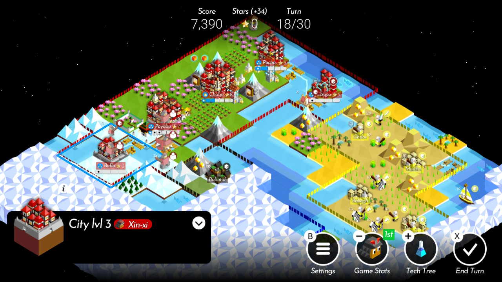

### Turn 18 


#### Enemy actions – Oumaji


    Oumaji attacked **Warrior 5** with a damaged Rider (5HP), dealing 2HP of damage (taking **Warrior 5** down to 8HP). **Warrior 5** retaliates, destroying the Oumaji Rider. 

Moved **Rider** southwest of **Bakegh** northeast two tiles. 

Examined the **Ruins** with the **Scout (Warrior)** – reward unknown. 

Trained a **Warrior** in **Musilim**.

Trained a **Warrior** in **Jimordu**.


#### Enemy actions – Bardur 


    Bardur attacked **Giant 1** with a **Warrior**, dealing 2HP of damage (taking **Giant 1** down to 35HP). **Giant 1** retaliates, destroying the Bardur **Warrior**.


    Bardur attacked **Giant 1** with a **Warrior**, dealing 2HP of damage (taking **Giant 1** down to 33HP). **Giant 1** retaliates, destroying the Bardur **Warrior**.


    Bardur attacked **Giant 1** with a Rider, dealing 3HP of damage (taking **Giant 1** down to 30HP). **Giant 1** retaliates, destroying the Bardur **Rider**.


    Bardur attacked **Giant 1** with a Rider, dealing 3HP of damage (taking **Giant 1** down to 30HP). **Giant 1** retaliates, destroying the Bardur **Rider**.


    Bardur attacked **Giant 1** with a damaged Rider (4HP), dealing 1HP of damage (taking **Giant 1** down to 29HP). **Giant 1** retaliates, destroying the damaged Bardur **Rider**.


    Bardur moved a Warrior east back to **Bubutof**.


#### Enemy actions – Imperius


    An Imperius city expanded its borders – a blue territory marker extended out from underneath the fog-of-war to the west of the Oumaji city of **Bakegh**. 


#### Player actions

 

*Killer* quest completed (destroy ten enemy units), **Gate of Power** monument unlocked.

Researched **Construction** (eleven Stars) and **Mathematics** (eleven Stars).


    **Giant 1** captured **Bufla**, which instantly created a Trade Route with **Chabu** (+1 Population Point in each city).


    **Juggernaut 2 (Giant 2)** moved south one tile and disembarked, attacking two Bardur **Warriors** with splash damage;


        **Giant 2** attacked a **damaged Bardur Warrior (5HP) **dealing 5HP of splash damage, destroying it. 


        **Giant 2** attacked a **Bardur Warrior** dealing 5HP of splash damage (reducing the **Bardur Warrior** to **5HP**).


    Moved **Giant 3** southwest and south on to the **Port** tile south of **Poyobu**, converting it to **Juggernaut 3 (Giant 3)**.


    **Juggernaut 3 (Giant 3)** attacked and destroyed the **damaged Bardur Warrior (5HP)** with splash damage. 

Moved **Warrior 2** south. 

Moved **Warrior 5** north, onto the **Port**, converting it to **Warrior 5 (Raft)**.

Built a **Windmill** (five Stars) near the farms in **Poyobu** (+4 Population Points). 


    ***Poyobu upgraded to Level 6. Upgrade chosen: Super Unit (Giant 4).***

Extracted **Fruit** from two tiles near **Bufla** (four Stars) (+2 Population Points). 


    ***Bufla upgraded to Level 3. Upgrade chosen: City Walls.***


<table>
  <tr>
   <td><strong>City</strong>
   </td>
   <td><strong>Level</strong>
   </td>
   <td><strong>SPT</strong>
   </td>
   <td><strong>Upgrades and Buildings</strong>
   </td>
   <td><strong>Monuments and Temples</strong>
   </td>
   <td><strong>Points</strong>
   </td>
  </tr>
  <tr>
   <td>Chabu
   </td>
   <td>6
   </td>
   <td>11
   </td>
   <td>Workshop, Resources, Farms (2), Mines (2), Border Growth, Market
   </td>
   <td>
   </td>
   <td>350
   </td>
  </tr>
  <tr>
   <td>Pocha-
   </td>
   <td>5
   </td>
   <td>10
   </td>
   <td>Workshop, Resources, Ports (1), Farms (1), Forge, Border Growth, Market
   </td>
   <td>
   </td>
   <td>300
   </td>
  </tr>
  <tr>
   <td>Poyobu
   </td>
   <td>6
   </td>
   <td>7
   </td>
   <td>Workshop, Farms (2), City Walls, Border Growth
   </td>
   <td>Park of Fortune, Altar of Peace
   </td>
   <td>1150
   </td>
  </tr>
  <tr>
   <td>Xiszuyo
   </td>
   <td>3
   </td>
   <td>3
   </td>
   <td>Explorer, Ports (1), Resources
   </td>
   <td>
   </td>
   <td>200
   </td>
  </tr>
  <tr>
   <td>Bufla
   </td>
   <td>3
   </td>
   <td>3
   </td>
   <td>City Walls, Ports (1)
   </td>
   <td>
   </td>
   <td>200
   </td>
  </tr>
</table>


```
Bufla captured – my first foothold in Bardur territory. 

I intend to push southwest and take whatever cities are there. This will give me control over the entire northwest edge of the map, preventing me from being flanked. 

I have a reasonably good idea of where the nearest Bardur city is hidden, and will push southwest next turn.
```


Ended turn.

*Stars left over: 1*

*SPT: 34*

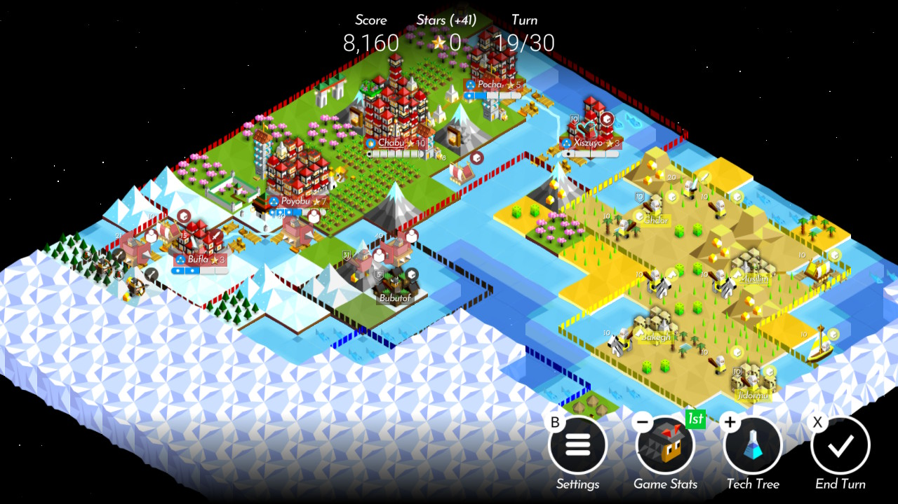

### Turn 19


#### Enemy actions – Oumaji


    Oumaji moved the **Warrior** in **Musilim** east to the **Port** tile, converting it to **Warrior (Raft)**.

Moved the **Scout** southwest one tile. 

Moved the **Rider** southeast of **Bakegh** north and northwest. 

Moved the **Rider** northwest of **Jimordu** north two tiles. 


    Moved the **Warrior** in **Ghdor** southwest. 


    Moved the **Warrior** southeast of **Ghdor** northeast. 


    Trained a **Warrior** in **Ghdor**. 


#### Enemy actions – Bardur


    Bardur attacked **Giant 1** with an **Archer**, dealing **4HP** of damage (reducing **Giant 1** to **25HP**). **Giant 1** could not retaliate.


    Bardur attacked **Giant 1** with a **Rider**, dealing 4HP of damage (reducing **Giant 1** to **21HP**). **Giant 1** retaliates, destroying the **Rider**.


    Bardur attacked **Giant 2** with a **Warrior**, dealing **3HP** of damage (taking **Giant 2 **down to **37HP**). **Giant 2** retaliates, destroying the **Warrior**.


    Bardur attacked **Giant 2** with a **Warrior**, dealing **3HP** of damage (taking **Giant 2** down to 34HP). **Giant 2** retaliates, destroying the **Warrior**.


    Bardur attacked **Giant 2** with a **Rider**, dealing **3HP** of damage (taking **Giant 2** down to 31HP). **Giant 2** retaliates, destroying the **Rider**.


#### Enemy actions – Imperius

No actions detected.


#### Player actions


    Built a **Market** (five Stars) in **Poyobu**. **Market** generates 4 SPT (due to the **Windmill** and the four adjacent **Farms**).

Moved **Giant 2** east, to the **Mountain** tile with **Metal Deposits** next to **Bubutof**. 


    Moved **Juggernaut 3 (Giant 3)** east and southeast, attacking the Bardur **Warrior **in **Bubutof **with splash damage, dealing **5HP** of damage (reducing it to **5HP**). 


    Moved **Giant 4** south on to the Port tile south of **Poyobu**, converting it to **Juggernaut 4 (Giant 4)**. 


    Built two **Ports** (fourteen Stars) on the west coast of **Bufla** for +1 Population Points each. 


    Moved **Giant 1** west to the western-most **Port** tile in **Bufla**, converting it to **Juggernaut 1 (Giant 1)**, attacking two Bardur **Archers** with splash damage:


        **Juggernaut 1 (Giant 1)** attacked a Bardur **Archer **dealing **5HP** of splash damage, (reducing the Bardur Archer to **5HP**).


        **Juggernaut 1 (Giant 1)** attacked a Bardur Archer dealing **5HP** of splash damage, (reducing the Bardur Archer to **5HP**).

Moved **Warrior 2** southwest, converting it to **Warrior 2 (Raft)**. 

Trained **Swordsman 1** (five Stars) in **Bufla**.


    Built the **Gate of Power** monument (+3 Population Points) northwest of **Chabu**, extracted the **Fruit** nearby (two Stars) (+1 Population Point). 


    ***Chabu upgraded to Level 7. Upgrade chosen: Park.***

Moved **Warrior 5** **(Raft)** two tiles west and southwest, on the coast of **Chabu**. 


    Used **Burn Forest** (three Stars) on the **Forest** tile southeast of **Poyobu**, turning it into **Crops**. Built a **Farm** on the **Crops** (five Stars) (+2 Population Points) next to the **Windmill** (+1 Population Point).

**Market **in **Poyobu** now produces 5 SPT.


<table>
  <tr>
   <td><strong>City</strong>
   </td>
   <td><strong>Level</strong>
   </td>
   <td><strong>SPT</strong>
   </td>
   <td><strong>Upgrades and Buildings</strong>
   </td>
   <td><strong>Monuments and Temples</strong>
   </td>
   <td><strong>Points</strong>
   </td>
  </tr>
  <tr>
   <td>Chabu
   </td>
   <td>7
   </td>
   <td>13
   </td>
   <td>Workshop, Resources, Farms (2), Mines (2), Border Growth, Market, Parks (1)
   </td>
   <td>Gate of Power
   </td>
   <td>1050
   </td>
  </tr>
  <tr>
   <td>Pocha-
   </td>
   <td>4
   </td>
   <td>10
   </td>
   <td>Workshop, Resources, Ports (1), Farms (1), Forge, Border Growth, Market
   </td>
   <td>
   </td>
   <td>250
   </td>
  </tr>
  <tr>
   <td>Poyobu
   </td>
   <td>6
   </td>
   <td>12
   </td>
   <td>Workshop, Farms (2), City Walls, Border Growth, Windmill, Market
   </td>
   <td>Park of Fortune, Altar of Peace
   </td>
   <td>1150
   </td>
  </tr>
  <tr>
   <td>Xiszuyo
   </td>
   <td>3
   </td>
   <td>3
   </td>
   <td>Explorer, Ports (1), Resources
   </td>
   <td>
   </td>
   <td>200
   </td>
  </tr>
  <tr>
   <td>Bufla
   </td>
   <td>3
   </td>
   <td>3
   </td>
   <td>City Walls, Ports (3)
   </td>
   <td>
   </td>
   <td>200
   </td>
  </tr>
</table>


```
I can now see more of Imperius's border. 

At this stage, I have four Giants out there causing problems for Bardur – I can afford to take a Park now and extend my lead with a 250 point bonus and an extra +1 SPT.

I'm going to offer Oumaji a Peace Treaty, which will let me upgrade my cities in the north without being disturbed.
```


Ended turn.

*Stars left over: 0*

*SPT: 41*

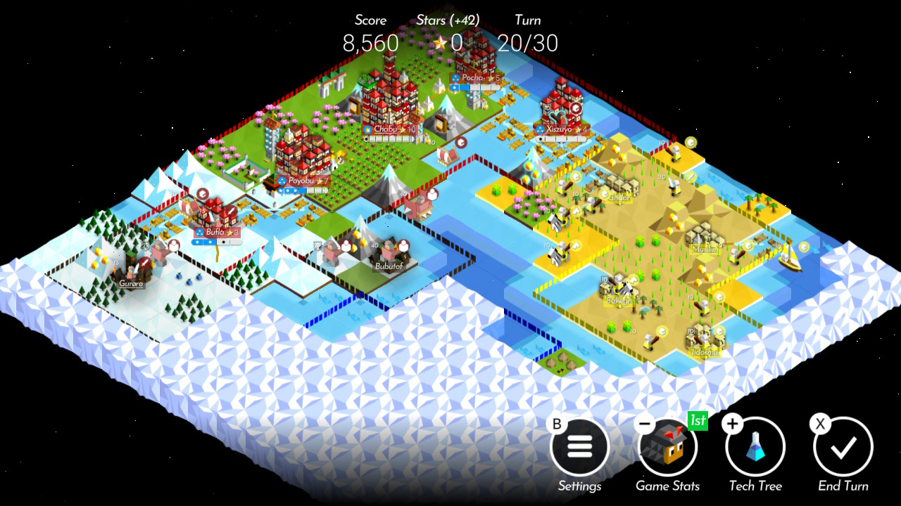

### Turn 20 


#### Enemy actions – Oumaji


    Oumaji moved the **Rider** in between the two **Mountain** tiles with **Metal Deposits** west two tiles. 


    Moved the **Rider** north of **Bakegh** northwest two tiles. 


    Moved the **Warrior** east of **Ghdor** north. 


    Moved the **Veteran Swordsman** southeast.


    Moved **Warrior (Raft)** east of **Musilim** southwest, disembarking.

Moved **Scout** north and northeast. 

Moved **Warrior** northwest of **Jimordu** northeast.

Moved **Warrior** in **Jimordu** west. 

Trained a **Warrior** in **Jimordu**. 

Built a port in **Ghdor**.


#### Enemy actions – Bardur


    Bardur moved a damaged **Archer** southeast into fog-of-war, and attacked **Swordsman 1**, dealing **2HP** of damage (taking **Swordsman 1** down to 13HP). 


    The other damaged Archer fired on **Warrior 2 (Raft)**, dealing **4HP** of damage (taking **Warrior 2 (Raft)** down to **6HP**). 


    **Giant 2** attacked with a **Rider**, taking it down to **29HP** – **Giant 2** retaliates and destroys the **Rider**. 


#### Enemy actions – Imperius

No actions detected. 


#### Player actions


    Moved **Juggernaut 3 (Giant 3)** south, destroying the **Bardur Warrior** defending the city of **Bubutof**, disembarking. 

**Giant 3** started capturing **Bubutof**.

Moved **Giant 2** southwest on to the **Mountain** tile, removing more fog-of-war. 


    Moved **Juggernaut 1 (Giant 1)** south on to the **Mountain** tile, disembarking, becoming **Giant 1**, attacking a damaged **Bardur Archer** and a **Bardur Warrior** defending the city of **Gurøro** with splash damage;


        **Juggernaut 1 (Giant 1)** attacked the damaged **Bardur Archer (5HP)** dealing **5HP** of splash damage, destroying it.


        **Juggernaut 1 (Giant 1)** attacked a **Bardur Warrior** in **Gurøro** dealing **3HP** of splash damage, (taking the Bardur Warrior down to **7HP**).

Built a **Road** (three Stars) directly south of **Bufla**. 


    Moved **Swordsman 1** south and southwest, where it attacks and destroys the Warrior in **Gurøro**. 

**Swordsman 1** started capturing **Gurøro**.


    Moved **Juggernaut 4 (Giant 4)** east two tiles. 

Healed **Warrior 2 (Raft)** for **4HP** (restoring it to **10HP**).

Healed **Warrior 5 (Raft)** for **2HP** (restoring it to **10HP**).

Researched **Strategy** (ten Stars). Offered Oumaji a Peace Treaty. 

Extracted **Fish** (two Stars) near **Xiszuyo** (+1 Population Point). 

Built three **Ports** (twenty-one Stars) around **Xiszuyo** (+3 Population Points). 


    ***Xiszuyo upgraded to Level 4. Upgrade chosen: Border Growth.***

Trained **Swordsman 2** (five Stars) in **Bufla.** 


<table>
  <tr>
   <td><strong>City</strong>
   </td>
   <td><strong>Level</strong>
   </td>
   <td><strong>SPT</strong>
   </td>
   <td><strong>Upgrades and Buildings</strong>
   </td>
   <td><strong>Monuments and Temples</strong>
   </td>
   <td><strong>Points</strong>
   </td>
  </tr>
  <tr>
   <td>Chabu
   </td>
   <td>7
   </td>
   <td>13
   </td>
   <td>Workshop, Resources, Farms (2), Mines (2), Border Growth, Market, Parks (1)
   </td>
   <td>Gate of Power
   </td>
   <td>1050
   </td>
  </tr>
  <tr>
   <td>Pocha-
   </td>
   <td>4
   </td>
   <td>10
   </td>
   <td>Workshop, Resources, Ports (1), Farms (1), Forge, Border Growth, Market
   </td>
   <td>
   </td>
   <td>250
   </td>
  </tr>
  <tr>
   <td>Poyobu
   </td>
   <td>6
   </td>
   <td>12
   </td>
   <td>Workshop, Farms (2), City Walls, Border Growth, Windmill, Market
   </td>
   <td>Park of Fortune, Altar of Peace
   </td>
   <td>1150
   </td>
  </tr>
  <tr>
   <td>Xiszuyo
   </td>
   <td>4
   </td>
   <td>4
   </td>
   <td>Explorer, Ports (1), Resources, Border Growth
   </td>
   <td>
   </td>
   <td>250
   </td>
  </tr>
  <tr>
   <td>Bufla
   </td>
   <td>3
   </td>
   <td>3
   </td>
   <td>City Walls, Ports (3)
   </td>
   <td>
   </td>
   <td>200
   </td>
  </tr>
</table>


```
Moved Juggernaut 4 (Giant 4) towards the middle sea to counter any possible naval threats coming up through the fog. I really need to research Sailing and then Navigation, and start building a navy. 

The good news is I am now generating enough SPT to create two Bombers (fifteen Stars) every turn. 
```


Ended turn.

*Stars left over: 0*

*SPT: 42*

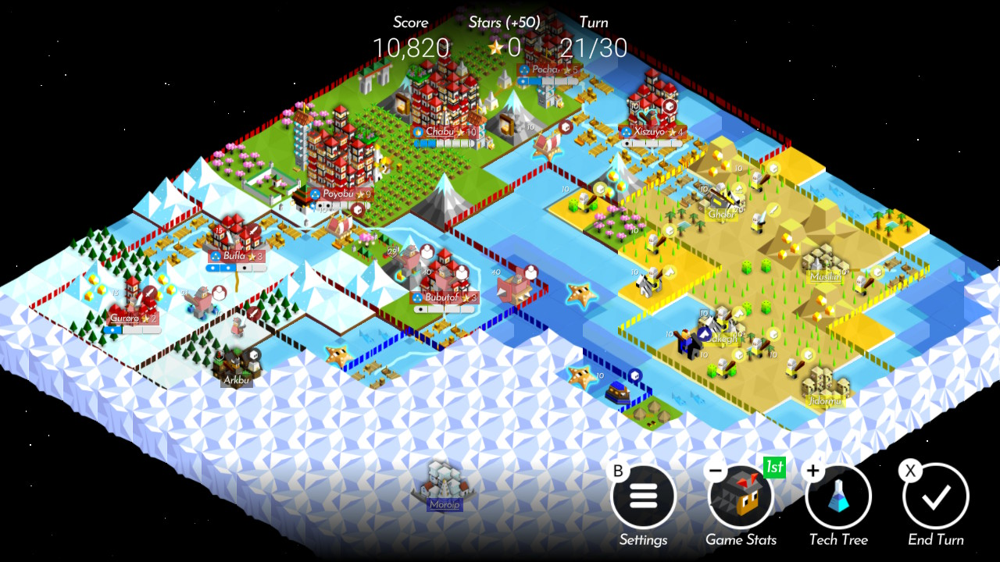

### Turn 21


#### Enemy actions – Oumaji


    Oumaji rejected the offer of a Peace Treaty.


    Moved **Veteran Swordsman** southwest. 


    Moved **Warrior** to the east of **Ghdor** southwest. 


    Moved **Warrior** to the west of **Ghdor** west.


    Moved **Warrior** to the southwest of **Ghdor** southwest. 


    Moved **Scout** south into the fog-of-war.


    Moved **Warrior** west of **Jimordu** northwest. 


    Moved **Warrior** north of **Jimordu** west.


    Moved **Warrior** in **Jimordu** northwest. 

Moved **Rider** in **Bakegh** southwest. 

Trained a **Rider** in **Bakegh**. 


    Trained a **Knight** in **Ghdor**.


#### Enemy actions – Bardur

No actions detected. 


#### Enemy actions – Imperius


    Imperius attacked the **Oumaji Rider** southwest of **Bakegh** with a **Rammer (Rider)**, destroying it, disembarking.

Another **Imperius Rammer** moves close to the **Village** southwest of **Bakegh**. 


#### Player actions 

The **Imperius** emissary offers eleven Stars.


    Researched **Diplomacy** (thirteen Stars). This reveals the location of **Moroip** – the Imperius capital.

Researched **Sailing** (ten Stars) and **Navigation** (thirteen Stars). 


    **Navigation** reveals tiles with **Starfish**, one in my territory, one close to **Bubutof**, and the other in Imperius territory.

**Swordsman 1** captures **Gurøro** – which is revealed to be the Bardur capital.

**Giant 3** captures **Bubutof**.


    Moved **Swordsman 2** south from **Bufla**. Discovered **Arkbu**, the last remaining Bardur city. 


    **Swordsman 2** attacked the Bardur Warrior defending the city of **Arkbu**, dealing **7HP** of damage (reducing the **Warrior** to **3HP**). The **Bardur Warrior** retaliates, dealing **5HP** of damage (reducing **Swordsman 2** to **10HP**).


    The other damaged **Archer** fired on **Warrior 2 (Raft)**, dealing **4HP** of damage (taking **Warrior 2 (Raft)** down to **6HP**). 

Moved **Giant 1** southwest, towards **Arkbu**. 

Moved **Giant 2** northeast, onto the **Mountain** tile with **Metal Deposits**. 

Trained **Swordsman 3** (five Stars) in **Bufla**. 


    Extracted **Fish** (two Stars) for +1 Population Point and built a **Port** (seven Stars) on the same tile in **Bubutof**, which generates +2 Population Points (+1 from the Port itself and another +1 from the Trade Route). 


    ***Bubutof upgraded to Level 3. Upgrade chosen: Resources.*** 


    *Trade* quest completed (connect five cities to your capital), **Grand Bazaar** monument unlocked. 

Built **Grand Bazaar** monument southwest of Poyobu (+3 Population Points).


    ***Poyobu upgraded to Level 7. Upgrade chosen: Park***.

Moved **Warrior 2 (Raft)** two tiles east.


    Moved **Warrior 5 (Raft)** one tile northeast, on to the **Water** tile with the **Starfish**.

Moved **Juggernaut 4 (Giant 4)** south and southeast. 


    Used **Burn Forest** (three Stars) and built a **Farm** (five Stars) next to **Chabu**, for +2 Population Points in **Chabu**, and +1 Population Point in **Poyobu**, via the adjacent **Windmill**. 

The **Market** in Poyobu now produces 6 SPT.


<table>
  <tr>
   <td><strong>City</strong>
   </td>
   <td><strong>Level</strong>
   </td>
   <td><strong>SPT</strong>
   </td>
   <td><strong>Upgrades and Buildings</strong>
   </td>
   <td><strong>Monuments and Temples</strong>
   </td>
   <td><strong>Points</strong>
   </td>
  </tr>
  <tr>
   <td>Chabu
   </td>
   <td>7
   </td>
   <td>13
   </td>
   <td>Workshop, Resources, Farms (3), Mines (2), Border Growth, Market, Parks (1)
   </td>
   <td>Gate of Power
   </td>
   <td>1050
   </td>
  </tr>
  <tr>
   <td>Pocha-
   </td>
   <td>4
   </td>
   <td>10
   </td>
   <td>Workshop, Resources, Ports (1), Farms (1), Forge, Border Growth, Market
   </td>
   <td>
   </td>
   <td>250
   </td>
  </tr>
  <tr>
   <td>Poyobu
   </td>
   <td>7
   </td>
   <td>18
   </td>
   <td>Workshop, Farms (2), City Walls, Border Growth, Windmill, Market, Parks (1)
   </td>
   <td>Park of Fortune, Altar of Peace, Grand Bazaar
   </td>
   <td>1850
   </td>
  </tr>
  <tr>
   <td>Xiszuyo
   </td>
   <td>4
   </td>
   <td>4
   </td>
   <td>Explorer, Ports (1), Resources, Border Growth
   </td>
   <td>
   </td>
   <td>250
   </td>
  </tr>
  <tr>
   <td>Bufla
   </td>
   <td>3
   </td>
   <td>3
   </td>
   <td>City Walls
   </td>
   <td>
   </td>
   <td>200
   </td>
  </tr>
  <tr>
   <td>Gurøro
   </td>
   <td>2
   </td>
   <td>2
   </td>
   <td>
   </td>
   <td>
   </td>
   <td>150
   </td>
  </tr>
  <tr>
   <td>Bubutof
   </td>
   <td>3
   </td>
   <td>3
   </td>
   <td>Ports (1), Resources
   </td>
   <td>
   </td>
   <td>200
   </td>
  </tr>
</table>


```
Bardur is all but done – time to prepare for the invasion of Imperius. 

I need to expand the borders of Bubutof, so I can build more Ports on the surrounding Water tiles. The more Ports I have, the more units I can turn into Scouts and Bombers to fire away at the Imperius defences. 

I will research Ramming and Aquatism next turn, so I can train Rammers, and give all my ships a defence bonus.

A few more tweaks here and there to increase SPT – if I want a bigger navy, I'm going to need a bigger income. 
```


Ended turn.

*Stars: 0*

*SPT: 53*

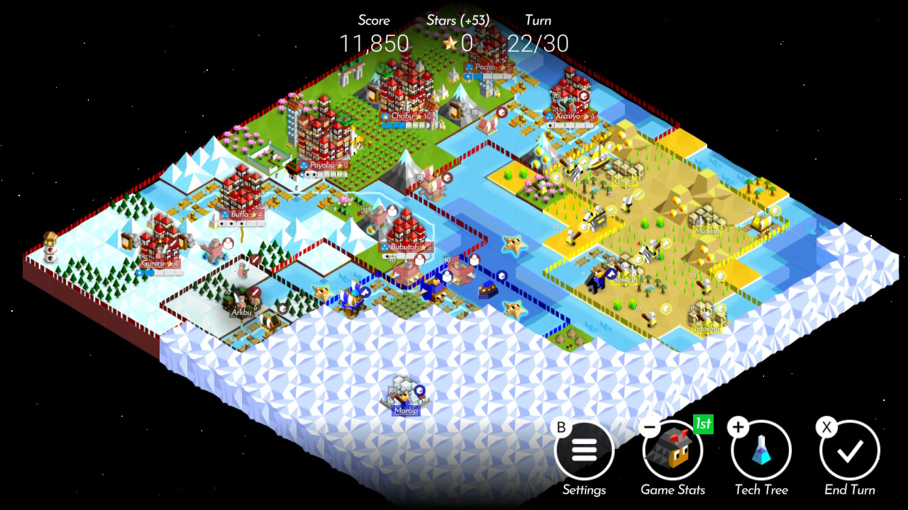

### Turn 22


#### Enemy actions – Oumaji


    Oumaji moved **Warrior** to the northeast of **Ghdor** to the **Port**, converting it to **Warrior (Raft)**, upgraded to **Scout (Warrior)**. 

Moved **Knight** south and southwest. 

Moved **Veteran Swordsman** southwest. 

Moved **Rider** in **Bakegh** northeast.

Trained **Warrior** in **Bakegh**.

Moved **Warrior** south of **Bakegh** southeast.

Moved **Warrior** southeast of **Bakegh** east.

Moved **Warrior** northwest of **Jimordu** southeast. 

Moved the **Warrior** in **Musilim** east to the **Port** tile, converting it to **Warrior (Raft)**.


#### Enemy actions – Bardur


    Bardur moves the damaged **Warrior (5HP)** south out of **Arkbu** and trains another **Warrior**.


#### Enemy actions – Imperius


    **Imperius Rider** moved west one tile, attacked **Oumaji Rider** dealing **6HP** of damage (taking the **Oumaji Rider** down to **4HP**). **Oumaji Rider** retaliates, dealing **2HP** of damage (taking **Imperius Rider** down to **8HP**). **Imperius Rider** moves east one tile following its attack.


    Moved **Rammer** northeast two tiles.


    Moved a **Rider** to **Port**, converting it **Rider (Raft)**, upgraded to a **Bomber**. 


    **Imperius Bomber** fires at the **Bardur Warrior** in **Arkbu**, dealing **4HP** of damage (taking the **Warrior** in **Arkbu** down to **6HP**). 


#### Player actions

Researched **Ramming** (twelve Stars) and **Aquatism** (seventeen Stars).

Moved **Swordsman 2** southwest, outside of **Arkbu**.  

Moved **Swordsman 3** south, to the tile previously occupied by **Swordsman 2**. 


    **Swordsman 2** attacked the **Bardur Warrior** in **Arkbu**, destroying it. **Swordsman 2** begins capturing **Arkbu**. 

Built **Mine** (five Stars) in **Gurøro**. 


    ***Gurøro upgraded to Level 3. Upgrade chosen: Resources.*** 

Built **Forge** (five Stars) in **Bufla** (+2 Population Points). 


    ***Bufla upgraded to Level 4. Upgrade chosen: Border Growth.*** 

Used **Clear Forest** on the **Forest** tile north of **Gurøro** (earned one Star).


    Built a second **Mine** (five Stars) in **Gurøro** and then a **Forge** (five Stars) (+6 Population Points).


    ***Gurøro upgraded to Level 4. Upgrade chosen: Border Growth.*** 

Discovered the western **Lighthouse** (+1 Population Point for **Chabu**).


    Moved **Giant 3** south on to the **Port**, converting it to **Juggernaut 3 (Giant 3)**. 


    **Juggernaut 3 (Giant 3)** attacks **Imperius Juggernaut** (which was hiding in the fog-of-war) dealing **4HP** of splash damage (taking it down to **36HP**).


    Moved **Juggernaut 4 (Giant 4)** south, attacking the damaged **Imperius Juggernaut** and an **Imperius Rammer** with splash damage;


        **Juggernaut 4 (Giant 4)** attacked the damaged **Imperius Juggernaut** dealing **5HP** of splash damage (taking the **Imperius Juggernaut** down to **31HP**).


        **Juggernaut 4 (Giant 4)** attacked an **Imperius Rammer** dealing **5HP** of splash damage, (taking the **Imperius Rammer** down to **5HP**).

**Warrior 5 (Raft)** extracts the **Starfish** (earns eight Stars). 

Upgraded **Warrior 2 (Raft)** to **Bomber 1 (Warrior 2)** (fifteen Stars). 

Moved **Bomber 1 (Warrior 2)** two tiles east.

Healed **Giant 1** for **4HP** (restoring it to **25HP**).

Healed **Giant 2** for **4HP** (restoring it to **25HP**).

Healed **Swordsman 1** for **2HP** (restoring it to **15HP**).

Offered Peace Treaty to **Oumaji**. 


<table>
  <tr>
   <td><strong>City</strong>
   </td>
   <td><strong>Level</strong>
   </td>
   <td><strong>SPT</strong>
   </td>
   <td><strong>Upgrades and Buildings</strong>
   </td>
   <td><strong>Monuments and Temples</strong>
   </td>
   <td><strong>Points</strong>
   </td>
  </tr>
  <tr>
   <td>Chabu
   </td>
   <td>7
   </td>
   <td>13
   </td>
   <td>Workshop, Resources, Farms (3), Mines (2), Border Growth, Market, Parks (1)
   </td>
   <td>Gate of Power
   </td>
   <td>1050
   </td>
  </tr>
  <tr>
   <td>Pocha-
   </td>
   <td>4
   </td>
   <td>10
   </td>
   <td>Workshop, Resources, Ports (1), Farms (1), Forge, Border Growth, Market
   </td>
   <td>
   </td>
   <td>250
   </td>
  </tr>
  <tr>
   <td>Poyobu
   </td>
   <td>7
   </td>
   <td>18
   </td>
   <td>Workshop, Farms (2), City Walls, Border Growth, Windmill, Market, Parks (1)
   </td>
   <td>Park of Fortune, Altar of Peace, Grand Bazaar
   </td>
   <td>1850
   </td>
  </tr>
  <tr>
   <td>Xiszuyo
   </td>
   <td>4
   </td>
   <td>4
   </td>
   <td>Explorer, Ports (1), Resources, Border Growth
   </td>
   <td>
   </td>
   <td>250
   </td>
  </tr>
  <tr>
   <td>Bufla
   </td>
   <td>4
   </td>
   <td>4
   </td>
   <td>City Walls, Border Growth
   </td>
   <td>
   </td>
   <td>250
   </td>
  </tr>
  <tr>
   <td>Gurøro
   </td>
   <td>4
   </td>
   <td>4
   </td>
   <td>Resources, Mines (2), Border Growth, Forge
   </td>
   <td>
   </td>
   <td>250
   </td>
  </tr>
  <tr>
   <td>Bubutof
   </td>
   <td>3
   </td>
   <td>3
   </td>
   <td>Ports (1), Resources
   </td>
   <td>
   </td>
   <td>200
   </td>
  </tr>
</table>


Ended turn.

*Stars left over: 0*

*SPT: 56*

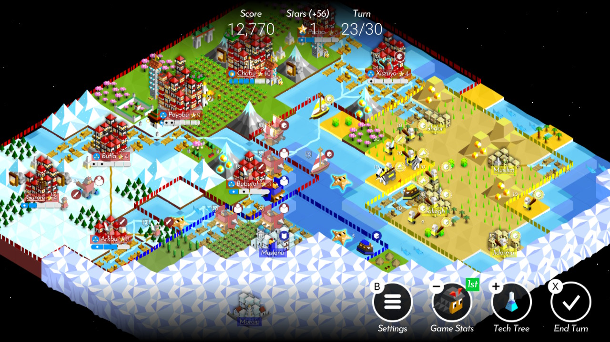

### Turn 23


#### Enemy actions – Oumaji


    **Oumaji** accepted the offer of a Peace Treaty. 


    Moved **Warrior** west of **Jidormu** northwest, attacked the **Imperius Rider**, dealing **6HP** of damage (reducing **Imperius Rider** to **2HP**). 


    **Imperius Rider** retaliates, dealing **1HP** of damage (reducing **Oumaji Warrior** to **9HP**). 


    **Oumaji Warrior** in **Bakegh** attacked and destroyed the **Imperius Rider**.


    Moved damaged **Rider (4HP)** west on to the **Port** tile, converting it to **Rider (Raft)**. Upgraded to a **Rammer (Rider)**. 


    Moved **Veteran Swordsman** west. 


    Moved **Scout** in the port of **Ghdor** east and south.


    Moved **Warrior (Raft)** southeast and east into the fog-of-war.


#### Enemy actions – Bardur

No actions detected. 


#### Enemy actions – Imperius


    Imperius moves **Juggernaut** north, attacking **Juggernaut 3 (Giant 3)** and **Juggernaut 4 (Giant 4)** with splash damage;


        **Imperius Juggernaut **attacked **Juggernaut 3 (Giant 3)** dealing **3HP** of splash damage (taking the **Imperius Juggernaut** down to **37HP**).


        **Imperius Juggernaut **attacked **Juggernaut 4 (Giant 4)** dealing **3HP** of splash damage (taking the **Imperius Juggernaut** down to **37HP**).

Moved damaged **Rammer (5HP)** southeast, towards the Village. 


#### Player actions

Researched **Archery** (twelve Stars) and **Spiritualism** (seventeen Stars).

**Swordsman 2** captures **Arkbu** – *Bardur is defeated. *


    Built a **Port** (seven Stars) in the tile northeast of **Bubutof**, moved **Giant 2** onto the **Port** tile, converting it to **Juggernaut 2 (Giant 2)**, attacking the **Imperius Juggernaut** dealing **4HP** of splash damage (reducing to **26HP**).


    **Bomber 1 (Warrior 2)** fired on the **Imperius Juggernaut**, dealing **7HP** of damage, reducing it to **19HP**. 


    Moved **Juggernaut 4 (Giant 4)** southwest one tile, attacking the **Imperius Juggernaut** dealing **6HP** of splash damage (taking the **Imperius Juggernaut** down to **13HP**).


    **Juggernaut 4 (Giant 4**) also discovered the **Imperius** city of **Muslonu**, dealing **4HP** of splash damage to the **Defender** stationed there (taking it down to **11HP**).


    Moved **Juggernaut 3 (Giant 3)** southwest one tile, dealing splash damage to the **Imperius Bomber** and a damaged **Warrior (5HP)**, hidden by the fog-of-war;


        **Juggernaut 3 (Giant 3)** attacked the damaged **Imperius Juggernaut** dealing **6HP** of splash damage (taking the **Imperius Bomber** down to **4HP**).


        **Juggernaut 3 (Giant 3)** attacked an **Imperius Warrior** dealing **5HP** of splash damage, destroying it.

Built two **Roads** (six Stars) on the tiles to the north and east of **Arkbu**.


    Moved **Swordsman 3** south and east two tiles, attacking and destroying the **Imperius Bomber**. 

Moved **Swordsman 1** southeast out of **Gurøro** towards **Arkbu**.

Healed **Giant 1** for **4HP**, (restoring it to **29HP**).

Trained **Swordsman 4** (five Stars) in **Bubutof**. 


    Upgraded **Warrior 5 (Raft)** to **Scout 1 (Warrior 5)** (five Stars).


    Moved **Scout 1 (Warrior 5)** south three tiles, attacked the **Imperius Juggernaut**, dealing **5HP** of damage (taking it down to **8HP**).


<table>
  <tr>
   <td><strong>City</strong>
   </td>
   <td><strong>Level</strong>
   </td>
   <td><strong>SPT</strong>
   </td>
   <td><strong>Upgrades and Buildings</strong>
   </td>
   <td><strong>Monuments and Temples</strong>
   </td>
   <td><strong>Points</strong>
   </td>
  </tr>
  <tr>
   <td>Chabu
   </td>
   <td>7
   </td>
   <td>13
   </td>
   <td>Workshop, Resources, Farms (3), Mines (2), Border Growth, Market, Parks (1)
   </td>
   <td>Gate of Power
   </td>
   <td>1050
   </td>
  </tr>
  <tr>
   <td>Pocha-
   </td>
   <td>4
   </td>
   <td>10
   </td>
   <td>Workshop, Resources, Ports (1), Farms (1), Forge, Border Growth, Market
   </td>
   <td>
   </td>
   <td>250
   </td>
  </tr>
  <tr>
   <td>Poyobu
   </td>
   <td>7
   </td>
   <td>18
   </td>
   <td>Workshop, Farms (2), City Walls, Border Growth, Windmill, Market, Parks (1)
   </td>
   <td>Park of Fortune, Altar of Peace, Grand Bazaar
   </td>
   <td>1850
   </td>
  </tr>
  <tr>
   <td>Xiszuyo
   </td>
   <td>4
   </td>
   <td>4
   </td>
   <td>Explorer, Ports (1), Resources, Border Growth
   </td>
   <td>
   </td>
   <td>250
   </td>
  </tr>
  <tr>
   <td>Bufla
   </td>
   <td>4
   </td>
   <td>4
   </td>
   <td>City Walls, Border Growth
   </td>
   <td>
   </td>
   <td>250
   </td>
  </tr>
  <tr>
   <td>Gurøro
   </td>
   <td>4
   </td>
   <td>4
   </td>
   <td>Resources, Mines (2), Border Growth, Forge
   </td>
   <td>
   </td>
   <td>250
   </td>
  </tr>
  <tr>
   <td>Bubutof
   </td>
   <td>3
   </td>
   <td>3
   </td>
   <td>Ports (1), Resources
   </td>
   <td>
   </td>
   <td>200
   </td>
  </tr>
  <tr>
   <td>Arkbu
   </td>
   <td>3
   </td>
   <td>4
   </td>
   <td>Workshop
   </td>
   <td>
   </td>
   <td>200
   </td>
  </tr>
</table>


```
Bardur's out – one down, two to go.

At this stage, I am comfortably ahead on points, the game is mine to lose. I intend to steam through Imperius before bringing the heat to Oumaji, unless Oumaji breaks the peace first.
```


Ended turn. 

*Stars left over: 1*

*SPT: 56*

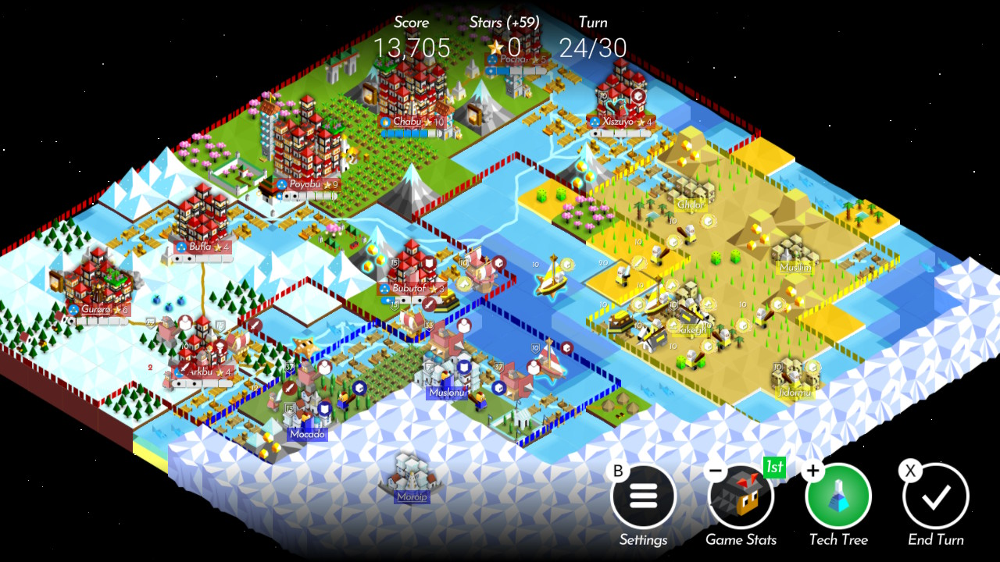

### Turn 24


#### Enemy actions – Oumaji


    Oumaji moved its **Scout** south, south and southeast, to the tile with the **Starfish**, and attacked the **Imperius Juggernaut**, dealing **8HP** of damage (reducing the **Imperius Juggernaut** to **2HP**). 


    Moved the **Rammer (Rider, 4HP)** two tiles west, attacking the damaged **Imperius Juggernaut**, destroying it.


     \
Moved **Warrior** southwest of **Bakegh** northwest on to the **Port**, converting it to **Warrior (Raft)**. upgraded **Rammer (Warrior)**. 


    Moved **Rider** north of **Bakegh** south onto the **Port**, converting it to **Rider (Raft)**. Upgraded **Rider (Raft)** to **Scout (Rider)**.


    Moved **Knight** northwest of **Bakegh** east, south, and southwest.


    Moved **Warrior** in **Bakegh** southeast. 


    Trained **Knight** in **Bakegh**. 


    Moved **Veteran Swordsman** south.


    Moved **Warrior** north of **Bakegh** northwest.


    Moved **Warrior** southwest of **Ghdor** southeast.


    Moved **Warrior** south of **Musilim** west.


#### Enemy actions – Imperius


    Imperius moved the **Defender** south into the fog-of-war. 


    Trained a new **Defender** in **Muslonu**.


    Moved a **Warrior** northwest.


    Healed **Rammer (Warrior, 5HP)** for **4HP**, (restoring it to **9HP**).


#### Player actions

Researched **Free Spirit** (fourteen Stars) and **Chivalry** (nineteen Stars). 


    *Genius* quest completed (research all technologies), **Tower of Wisdom** monument unlocked. 


    Moved **Scout 1** south and southeast to the tile with the **Starfish**, next to the damaged Imperius Rammer, revealing a Warrior on a **Field** tile southeast of **Muslonu**, plus more of the Imperius territory and coastline.


    Moved **Juggernaut 4 (Giant 4)** southeast two tiles, dealing splash damage to the **Defender** in **Muslonu**, and the **Rammer (Warrior) **to the east;


        **Juggernaut 4 (Giant 4)** attacked the **Defender** in **Muslonu**, dealing **4HP** of splash damage (reducing the **Imperius Defender** to **11HP**).


        **Juggernaut 4 (Giant 4)** attacked the **damaged Rammer (Warrior)**, dealing **5HP** of splash damage (reducing the **Imperius Rammer (Warrior) **to **4HP**).


    Moved **Juggernaut 2 (Giant 2)** south two tiles, dealing **4HP** of splash damage to the **Defender** in **Muslonu**, taking it down to **7HP**. 


    Moved **Juggernaut 3 (Giant 3)** southwest two tiles, disembarking, damaging the **Warrior** with splash damage. 


    **Giant 3** disembarking also reveals the **Imperius** city of **Mocado** along with a **Defender** inside **Mocado**, behind **City Walls**, and another **Warrior**, both also attacked with splash damage;


        **Giant 3** attacked the **Imperius Warrior** northwest of **Muslonu**, dealing **6HP** of splash damage (taking the **Imperius Warrior** down to **4HP**).


        **Giant 3** attacked the **Imperius Defender** in **Mocado**, dealing **5HP** of splash damage (taking the **Imperius Defender** down to **13HP**).


        **Giant 3** attacked the **Imperius Warrior** northeast of **Muslonu**, dealing **6HP** of splash damage (taking the **Imperius Warrior** down to **4HP**).


    **Swordsman 3** attacked and destroyed the **Imperius Warrior** to the northwest of Mocado, revealing a **Port** and a **Mountain** tile with **Metal Deposits**. 

Built a **Port** (seven Stars) in **Arkbu** (+1 Population Point). 


    ***Arkbu upgraded to Level 3. Upgrade chosen: City Walls.*** 

Moved **Swordsman 2** southwest. 

Moved **Giant 1** south. 

Trained **Mind Bender 1** (five Stars) in **Arkbu**.

Built a **Road** (three Stars) southeast of **Gurøro**.


    Moved **Swordsman 1** east and southeast, on to the **Port**, converting it to **Swordsman 1 (Raft)**. 

Moved **Swordsman 4** south, on to the **Port**, converting it to **Swordsman 4 (Raft)**.

Moved **Bomber 1** **(Warrior 2) **south and southeast. 

**Scout 1** attacked and destroyed the **damaged Imperius Rammer (4HP)**. 

Built two **Lumber Huts** (six Stars) in **Gurøro** (+2 Population Points).

 


    ***Gurøro upgraded to Level 5. Upgrade chosen: Park.***

Trained **Defender 1** (three Stars) in **Bubutof**. 


<table>
  <tr>
   <td><strong>City</strong>
   </td>
   <td><strong>Level</strong>
   </td>
   <td><strong>SPT</strong>
   </td>
   <td><strong>Upgrades and Buildings</strong>
   </td>
   <td><strong>Monuments and Temples</strong>
   </td>
   <td><strong>Points</strong>
   </td>
  </tr>
  <tr>
   <td>Chabu
   </td>
   <td>7
   </td>
   <td>13
   </td>
   <td>Workshop, Resources, Farms (3), Mines (2), Border Growth, Market, Parks (1)
   </td>
   <td>Gate of Power
   </td>
   <td>1050
   </td>
  </tr>
  <tr>
   <td>Pocha-
   </td>
   <td>4
   </td>
   <td>10
   </td>
   <td>Workshop, Resources, Ports (1), Farms (1), Forge, Border Growth, Market
   </td>
   <td>
   </td>
   <td>250
   </td>
  </tr>
  <tr>
   <td>Poyobu
   </td>
   <td>7
   </td>
   <td>18
   </td>
   <td>Workshop, Farms (2), City Walls, Border Growth, Windmill, Market, Parks (1)
   </td>
   <td>Park of Fortune, Altar of Peace, Grand Bazaar
   </td>
   <td>1700
   </td>
  </tr>
  <tr>
   <td>Xiszuyo
   </td>
   <td>4
   </td>
   <td>4
   </td>
   <td>Explorer, Ports (1), Resources, Border Growth
   </td>
   <td>
   </td>
   <td>250
   </td>
  </tr>
  <tr>
   <td>Bufla
   </td>
   <td>4
   </td>
   <td>4
   </td>
   <td>City Walls, Border Growth
   </td>
   <td>
   </td>
   <td>250
   </td>
  </tr>
  <tr>
   <td>Gurøro
   </td>
   <td>5
   </td>
   <td>6
   </td>
   <td>Resources, Mines (2), Border Growth, Forge, Lumber Huts (2), Parks (1)
   </td>
   <td>
   </td>
   <td>550
   </td>
  </tr>
  <tr>
   <td>Bubutof
   </td>
   <td>3
   </td>
   <td>3
   </td>
   <td>Ports (1), Resources
   </td>
   <td>
   </td>
   <td>200
   </td>
  </tr>
  <tr>
   <td>Arkbu
   </td>
   <td>3
   </td>
   <td>4
   </td>
   <td>Workshop, Ports (1), City Walls
   </td>
   <td>
   </td>
   <td>200
   </td>
  </tr>
</table>


```
Everything's set up nicely for taking Mocado and Muslonu next turn – not sure what's hiding out there for me in the fog-of-war – I just hope that Imperius doesn't have any catapults.
```


Ended turn.

*Stars: 0*

*SPT: 59*

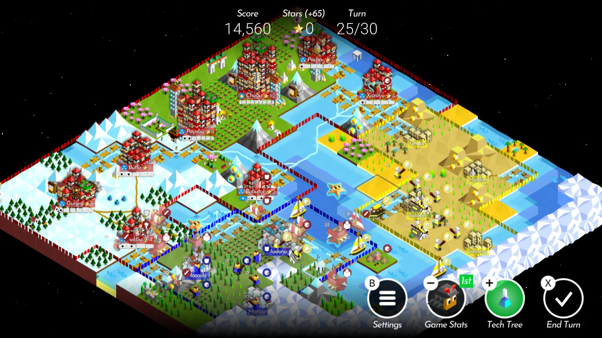

### Turn 25


#### Enemy actions – Oumaji


    Oumaji moved **Scout (Rider)**, southwest, southwest and south, fired on the **Defender** in **Muslonu (7HP)** causing **5HP** of damage (reducing it to **2HP**).


    Moved **Rammer (Rider, 4HP)** southwest and south, attacking and destroying the **Imperius Warrior (4HP)**, disembarking.


    Moved **Rammer (Warrior)** southwest, southwest, and west, attacking the **damaged Defender (2HP)**, destroying it and disembarking. 


    **Warrior (3HP)** starts capturing **Muslonu**.


    Moved **Scout (Warrior)** southwest and southwest.


    Moved **Veteran Swordsman** south onto the **Port** tile, converting it to **Veteran Swordsman (Raft)**, upgraded to **Rammer (Veteran Swordsman)**. 


    Moved **Scout (Warrior)** out of the fog-of-war and west one tile towards Imperius. 


    Moved **Warrior** south of **Bakegh** east. 


    Moved **Warrior** in **Jidormu** west. 


    Moved **Knight** southwest of **Bakegh** southeast. 


    Moved **Warrior** south of **Ghdor** south. 


    Trained **Knight** in **Bakegh**.


#### Enemy actions – Imperius


    Imperius trained a **Warrior** in **Moroip**, moved the **Defender** in **Mocado** west on to the **Port** tile, converting it to **Defender (Raft)**. 

Upgraded **Defender (Raft)** to **Scout (Defender)**. 


#### Player actions


    **Mind Bender 1** healed **Swordsman 2** (restoring it to **6HP**) and **Giant 1** (restoring it to **33HP**).


    Upgraded **Swordsman 1 (Raft)** to **Bomber 2 (Swordsman 1)** (fifteen Stars).


    **Bomber 2 (Swordsman 1)** attacked the **Imperius Scout (Defender)**, causing **10HP** of  damage (reducing it to **3HP**). 


    **Imperius Scout (Defender) **retaliates, dealing **1HP** of damage to **Bomber 2 (Swordsman 1)**, reducing it to **14HP**. 


    Moved **Swordsman 3** south on to the **Mountain** tile with **Metal Deposits**, revealing more of Imperius’s terrain, some **Ruins**, and the land around the capital city of **Moroip**. 

**Swordsman 3** attacked and destroyed **Imperius Scout (Defender)**. 

**Swordsman 3** achieved Veteran status – upgraded to **20HP**.

Built a **Road** (three Stars) on the tile occupied by **Giant 1**. 


    Moved **Giant 1** southeast two tiles on to the **Port**, converting it to **Juggernaut 1 (Giant 1)**. 

Healed **Giant 3** for **2HP**, restoring it to **38HP**. 


    Moved **Juggernaut 2 (Giant 2)** southeast and south, revealing more of the Imperius coast. 


    Moved **Scout 1 (Warrior 5)** southwest two tiles to the island with the **Village**, where it disembarked and turned back into **Warrior 5**. 

**Warrior 5** started capturing the **Village**. 

Moved **Juggernaut 4 (Giant 4)** southwest and west, onto the tile with the **Starfish**.

Moved **Bomber 1 (Warrior 2)** south two tiles. 


    Upgraded **Swordsman 4 (Raft)** to **Scout 2 (Swordsman 4)** (five Stars). Revealed more of the land around **Muslonu**.


    Moved **Scout 2 (Swordsman 4)** west two tiles and southwest one tile, adjacent to the Oumaji coast. 

Moved **Defender 1** south on to the **Port**, converting it into a **Defender 1 (Raft)**.

Trained **Defender 2** (three Stars) in **Bubutof**.


    Built a **Windmill** (five Stars) in **Chabu** (+2 Population Points) on the tile immediately south of the **Market** – the **Market** now generates 5 SPT.


    ***Chabu upgraded to Level 8. Upgrade chosen: Park***.


    Built a **Water Temple** (twenty Stars) on the ocean tile to the east of **Pocha- **(+1 Population Point).


    Used **Burn Forest** on the tile two squares northeast of **Pocha-** and turned the **Crops** into a **Farm** (five Stars) (+2 Population Points).


    ***Pocha- upgraded to Level 5. Upgrade chosen: Park.***


<table>
  <tr>
   <td><strong>City</strong>
   </td>
   <td><strong>Level</strong>
   </td>
   <td><strong>SPT</strong>
   </td>
   <td><strong>Upgrades and Buildings</strong>
   </td>
   <td><strong>Monuments and Temples</strong>
   </td>
   <td><strong>Points</strong>
   </td>
  </tr>
  <tr>
   <td>Chabu
   </td>
   <td>8
   </td>
   <td>15
   </td>
   <td>Workshop, Resources, Farms (3), Mines (2), Border Growth, Market, Parks (2)
   </td>
   <td>Gate of Power
   </td>
   <td>1100
   </td>
  </tr>
  <tr>
   <td>Pocha-
   </td>
   <td>5
   </td>
   <td>12
   </td>
   <td>Workshop, Resources, Ports (1), Farms (1), Forge, Border Growth, Market, Parks (1)
   </td>
   <td>
   </td>
   <td>550
   </td>
  </tr>
  <tr>
   <td>Poyobu
   </td>
   <td>7
   </td>
   <td>18
   </td>
   <td>Workshop, Farms (2), City Walls, Border Growth, Windmill, Market, Parks (1)
   </td>
   <td>Park of Fortune, Altar of Peace, Grand Bazaar
   </td>
   <td>1850
   </td>
  </tr>
  <tr>
   <td>Xiszuyo
   </td>
   <td>4
   </td>
   <td>4
   </td>
   <td>Explorer, Ports (1), Resources, Border Growth
   </td>
   <td>
   </td>
   <td>250
   </td>
  </tr>
  <tr>
   <td>Bufla
   </td>
   <td>4
   </td>
   <td>4
   </td>
   <td>City Walls, Border Growth
   </td>
   <td>
   </td>
   <td>250
   </td>
  </tr>
  <tr>
   <td>Gurøro
   </td>
   <td>5
   </td>
   <td>6
   </td>
   <td>Resources, Mines (2), Border Growth, Forge, Lumber Huts (2), Parks (1)
   </td>
   <td>
   </td>
   <td>550
   </td>
  </tr>
  <tr>
   <td>Bubutof
   </td>
   <td>3
   </td>
   <td>3
   </td>
   <td>Ports (1), Resources
   </td>
   <td>
   </td>
   <td>200
   </td>
  </tr>
  <tr>
   <td>Arkbu
   </td>
   <td>3
   </td>
   <td>4
   </td>
   <td>Workshop, Ports (1), City Walls
   </td>
   <td>
   </td>
   <td>200
   </td>
  </tr>
</table>


```
Looks like I might have handed Muslonu to Oumaji by mistake there. Hopefully Imperius will take it back next turn (and then I can take it off of them).
```


End turn.

*Stars: 0*

*SPT: 60*

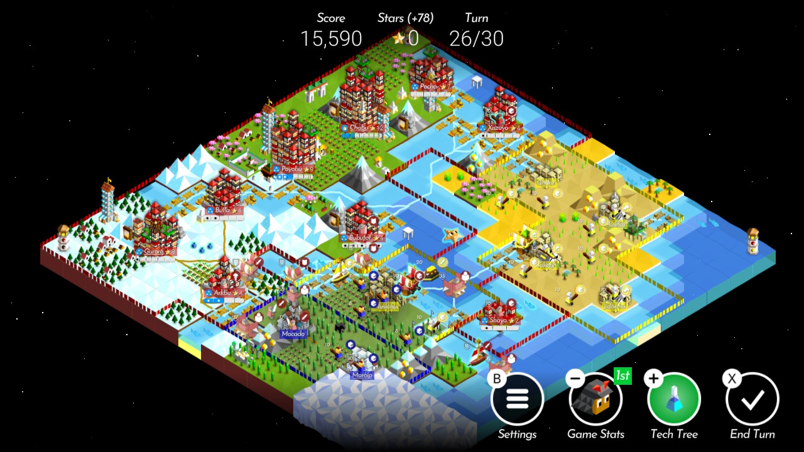

### Turn 26


#### Enemy actions – Oumaji

Oumaji captured **Muslonu** with its **damaged Warrior (3HP)**. 


    **Damaged Oumaji Rider (4HP)** attacked **damaged Imperius Defender (6HP)**, delivering **4HP** of damage (reducing the **Imperius Defender** to **2HP**). **Imperius Defender** retaliates, delivering **4HP** of damage, destroying the **Oumaji Rider**. 


    Moved **Scout (Warrior)** three tiles west, disembarking on the tile with the Imperius **Park of Fortune**.


    Moved **Scout (Rider)** northwest, west and west, disembarking on the tile northwest of **Muslonu**.


    Moved **Scout (Warrior)** west and southwest, attacked damaged **Imperius Defender (2HP)**, destroying it. 

Moved **Rammer (Veteran Swordsman)** west and southwest.


    Moved **Knight** south of **Bakegh** northwest and north onto a **Port** tile, converting it to **Knight (Raft)**, upgraded it to a **Bomber (Knight)** (fifteen Stars).

Moved **Warrior** northwest of **Bakegh** northwest onto the tile with **Crops**. 

Moved **Warrior** north of **Bakegh** north.

Moved **Warrior** northwest of **Bakegh** northwest.

Moved **Warrior** northeast of **Jidormu** north. 

Moved **Warrior** southeast of **Bakegh** northeast.

Trained **Rider** in Jidormu.

Trained **Rider** in Musilim.


#### Enemy actions – Imperius


    Imperius moved **damaged Warrior (5HP)** northwest, attacking and destroying the **damaged Oumaji Warrior (3HP)** in Muslonu. 


    Damaged **Imperius Warrior (5HP)** begins recapturing **Muslonu**. 


    **Imperius Warrior** attacks **Oumaji Rider**, dealing **6HP** of damage (reducing **Oumaji Rider** to **4HP**). **Oumaji Rider** retaliates, dealing **2HP** of damage (reducing **Imperius Warrior** down to **8HP**). 


    Moved damaged **Imperius Warrior (7HP)** north, attacked and destroyed **damaged Oumaji Rider**. 


    Moved damaged **Imperius Defender (14HP)** northwest one tile. 


    Trained **Defender** in **Mocado**. 


    **Imperius Warrior** attacks **Veteran Swordsman 3**, dealing **3HP** of damage (reducing **Veteran Swordsman 3 **to **17HP**). 


    **Veteran Swordsman 3** retaliates, dealing **9HP** of damage (reducing **Imperius Warrior** to **1HP**).


#### Player actions


    **Mind Bender 1** healed **Swordsman 2** (restoring it to **14HP**) and **Juggernaut 1 (Giant 1)** (restoring it to **37HP**) for **4HP** each, heals **Bomber 1 (Warrior 2)** for **1HP **(restoring it to **15HP**).


    Moved **Juggernaut 1 (Giant 1)** south, dealing splash damage to the **Imperius Defenders** standing in and around the city of **Mocado**;


        **Juggernaut 1 (Giant 1)** attacked the **damaged Imperius Defender (14HP)**, dealing **5HP** of splash damage (reducing the **Imperius Defender** to **9HP**).


        **Juggernaut 1 (Giant 1)** attacked the **Imperius Defender**, dealing **2HP** of splash damage (reducing the **Imperius Defender** to **13HP**).


    **Bomber 1 (Warrior 2)** attacks the **damaged Imperius Defender (13HP)** in **Mocado**, delivering **3HP** of damage (taking the **Imperius Defender** down to **10HP**).


    Splash damage from **Bomber 1 (Warrior 2)** delivers **5HP** of damage to the **Imperius Defender (9HP)** on the **Field** tile north of **Mocado** (reducing **Imperius Defender** to **4HP**).


    **Giant 3** attacks the **damaged Imperius Defender (10HP)** in **Mocado**, delivering **8HP** of damage (reducing the **Imperius Defender** to **2HP**). The **Imperius Defender** retaliates, delivering **8HP** of damage to **Giant 3**, taking it down to **30HP**.


    **Veteran Swordsman 3** attacks the **damaged Imperius Defender (2HP)** in **Mocado**, destroying it, and begins capturing **Mocado**.

Built a **Road** (three Stars) on the tile southwest of **Arkbu**. 


    Moved **Swordsman 2** northeast and east, attacking the **Imperius Defender (4HP)**, destroying it. 

Moved **Juggernaut 2 (Giant)** southeast two tiles, onto the tile with the **Starfish**.

Captured the **Village** with **Warrior 5**, converting it to the city of **Shayo**. 


    Presence of a nearby **Port** in neutral (**Oumaji**) territory immediately gives **Shayo** (+1 Population Point). 

Extracted **Fish** (two Stars) (+1 Population Point). 


    ***Shayo upgraded to Level 2. Upgrade chosen: Explorer.***


    **Explorer** headed east, removing all remaining fog-of-war squares from Oumaji’s territory, and discovering the eastern **Lighthouse** (+1 Population Point in **Chabu**).


    Moved **Scout 2 (Swordsman 4)** south three tiles, revealed more land around the Imperius coast, including a **Mountain** tile with **Metal Deposits**. 

Extracted the **Starfish** (eight Stars) with **Juggernaut 4 (Giant 4)**. 


    Built a **Water Temple** (twenty Stars) east of **Bubutof** (+1 Population Point) and a **Mine** (five Stars) on the **Mountain **tile to the northwest.


    ***Bubutof upgraded to Level 4. Upgrade chosen: Border Growth.***


    Built a **Lumber Hut** and a **Sawmill** west of **Gurøro** (+4 Population Points).


    Used **Grow Forest** on the tile northwest of the **Sawmill** and built a **Lumber Hut** (three Stars) (+2 Population Points) 


    ***Gurøro upgraded to Level 6. Upgrade chosen: Park.***


    Built a **Market** (five Stars) northwest of **Gurøro** in between the **Sawmill** and the **Forges** – **Market** generates 6 SPT. 

Moved **Defender 1 (Raft)** west and southwest, on to the tile with **Starfish**.

Moved **Defender 2 **south on to the **Port** of **Bubutof**, converting it to **Defender (Raft)**.

Trained **Defender 3** (three Stars) in Bubutof.


    Built two **Lumber Huts** in **Poyobu** and built a **Sawmill** in between (eleven Stars) (+4 Population Points).

	**Market** in **Poyobu** now generates 8 SPT.


    Used **Burn Forest** on the tile two squares northeast of **Arkbu** and turned the **Crops** into a **Farm** (five Stars) (+2 Population Points).


<table>
  <tr>
   <td><strong>City</strong>
   </td>
   <td><strong>Level</strong>
   </td>
   <td><strong>SPT</strong>
   </td>
   <td><strong>Upgrades and Buildings</strong>
   </td>
   <td><strong>Monuments and Temples</strong>
   </td>
   <td><strong>Points</strong>
   </td>
  </tr>
  <tr>
   <td>Chabu
   </td>
   <td>8
   </td>
   <td>15
   </td>
   <td>Workshop, Resources, Farms (3), Mines (2), Border Growth, Market, Parks (2)
   </td>
   <td>Gate of Power
   </td>
   <td>1100
   </td>
  </tr>
  <tr>
   <td>Pocha-
   </td>
   <td>5
   </td>
   <td>12
   </td>
   <td>Workshop, Resources, Ports (1), Farms (1), Forge, Border Growth, Market, Parks (1)
   </td>
   <td>
   </td>
   <td>300
   </td>
  </tr>
  <tr>
   <td>Poyobu
   </td>
   <td>7
   </td>
   <td>18
   </td>
   <td>Workshop, Farms (2), City Walls, Border Growth, Windmill, Market, Parks (1)
   </td>
   <td>Park of Fortune, Altar of Peace, Grand Bazaar
   </td>
   <td>1850
   </td>
  </tr>
  <tr>
   <td>Xiszuyo
   </td>
   <td>4
   </td>
   <td>4
   </td>
   <td>Explorer, Ports (1), Resources, Border Growth
   </td>
   <td>
   </td>
   <td>250
   </td>
  </tr>
  <tr>
   <td>Bufla
   </td>
   <td>4
   </td>
   <td>4
   </td>
   <td>City Walls, Border Growth
   </td>
   <td>
   </td>
   <td>250
   </td>
  </tr>
  <tr>
   <td>Gurøro
   </td>
   <td>6
   </td>
   <td>8
   </td>
   <td>Resources, Mines (2), Border Growth, Forge, Lumber Huts (2), Parks (1)
   </td>
   <td>
   </td>
   <td>600
   </td>
  </tr>
  <tr>
   <td>Bubutof
   </td>
   <td>4
   </td>
   <td>4
   </td>
   <td>Ports (1), Resources, Border Growth
   </td>
   <td>
   </td>
   <td>250
   </td>
  </tr>
  <tr>
   <td>Arkbu
   </td>
   <td>3
   </td>
   <td>4
   </td>
   <td>Workshop, Ports (1), City Walls
   </td>
   <td>
   </td>
   <td>250
   </td>
  </tr>
  <tr>
   <td>Shayo
   </td>
   <td>2
   </td>
   <td>2
   </td>
   <td>Explorer
   </td>
   <td>
   </td>
   <td>150
   </td>
  </tr>
</table>


```
I've basically handed the city of Muslonu to Oumaji on a plate. I did all the hard work of weakening the defences, they came in and reaped the reward. 

Considering breaking the peace just so I can take it back, and then start ravaging their cities. I should have gone after them at the same time as Bardur.

On the plus side, I will be able to discover the last Lighthouse soon, and unlock the Eye of God monument. 
```


*End turn.*

*Stars: 0*

*SPT: 60*

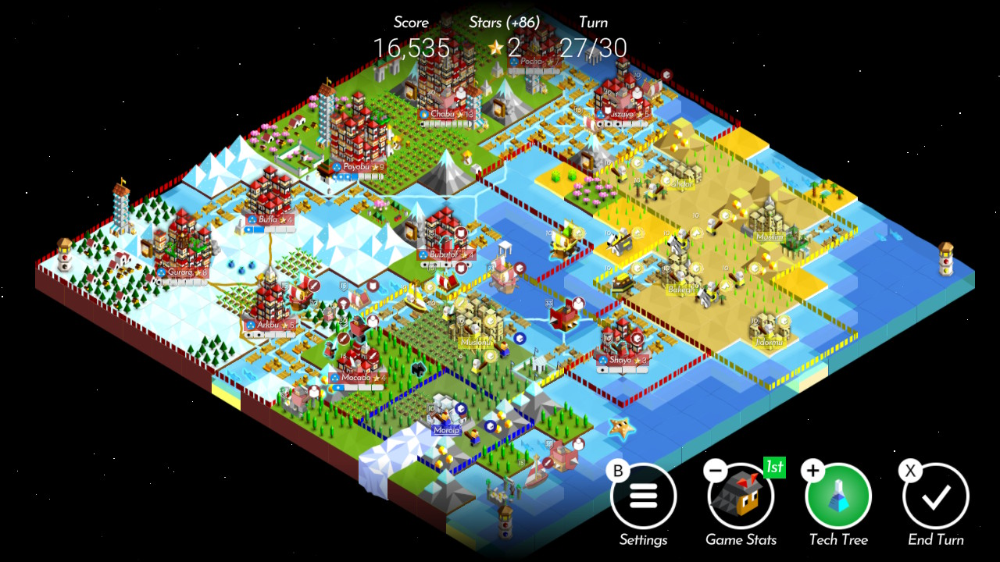

### Turn 27 


#### Enemy actions – Oumaji


    Oumaji’s **Scout (Warrior)** on the northern shore attacked and destroyed the **damaged Imperius Warrior (5HP)** recapturing **Muslonu**.


    Moved **Rammer (Veteran Swordsman)** west, attacked and destroyed the **Imperius Warrior (7HP)** on the shoreline, disembarking. 


    Moved **Bomber (Knight)** west and northwest. 


    Moved **Warrior** on the Park of Fortune tile east. **Oumaji Warrior** attacked the damaged **Imperius Warrior (8HP)**, delivering **5HP** of damage (reducing **Imperius Warrior** to **3HP**). 


    **Imperius Warrior** retaliates, dealing **4HP** of damage (reducing **Oumaji Warrior** to **6HP**).


    Moved the **Warrior** west of **Bakegh** northwest onto the **Port** tile, turning it into a **Warrior (Raft)**, upgraded to a **Rammer (Warrior)**. 


    Moved **Warrior** southeast of **Ghdor** north. 


    Moved **Warrior** south of **Ghdor** northwest.


    Moved **Rider** in **Musilim** southwest and west.


    Moved **Rider** in **Jidormu** two tiles northwest.


    Moved **Warrior** west of **Jidormu** east.


    Moved **Warrior** southwest of **Musilim** northwest.


    Moved **Knight** in **Bakegh** north and west. 


#### Enemy actions – Imperius


    **Imperius** moved **damaged Warrior (8HP)** north, attacking **Bomber 1 (Warrior 2)**, delivering **3HP** of damage, reducing it to **7HP**. 


    Moved **damaged Warrior (6HP)** northwest, attacking **Veteran Swordsman 3** delivering **2HP** of damage (reducing it to **15HP**). **Veteran Swordsman 3** retaliates, destroying the damaged **Warrior**. 


#### Player actions


    The **Water Temple** in **Pocha-** upgraded to Level 2, adding an extra 150 points.

Moved **Juggernaut 1 (Giant 1)** south, where it disembarked, entering the **Ruins**. 

**Veteran Swordsman 3** captured **Mocado**.

Moved **Mind Bender 1** east. 

Built **Windmill** (five Stars) north of **Arkbu** (+1 Population Point).


    Used **Burn Forest** (three Stars) on the tile south and southeast of **Bufla**. Built a **Farm** (five Stars) on the **Crops** (+2 Population Points), earning an additional Population Point for **Arkbu** via the **Windmill**. 


    ***Arkbu upgraded to Level 4. Upgrade chosen: Border Growth.***

Moved **Bomber 1 (Warrior 2)** north one tile. 

Extracted **Starfish** (earned eight Stars) with **Defender 1 (Raft)**. 


    Moved **Juggernaut 2 (Giant 2)** southwest two tiles, revealing edges of the Imperius coast. 


    Moved **Scout 2 (Swordsman 4)** southwest three tiles, discovered another **Mountain** tile with **Metal Deposits**, an **Imperius Warrior**, some **Ruins**, and the southern **Lighthouse** (+1 Population Point in **Chabu**). 


    *Explorer* quest completed (discover all four **Lighthouses**), **Eye of God** monument unlocked. 


    **Scout 2 (Swordsman 4)** attacked **Imperius Warrior** on the **Field** tile between the two **Mountains**, delivering **5HP** of damage (taking the **Imperius Warrior** down to **5HP**).


    Built a **Port** (seven Stars) northeast of **Xiszuyo**, moved **Warrior 1** onto the **Port**, converting it to **Warrior 1 (Raft)**. 

Trained **Defender 4** (three Stars) in **Xiszuyo**.


    Built two **Ports** (fourteen Stars) and a **Mine** (five Stars) in **Xiszuyo** (+4 Population Points).


        ***Xiszuyo upgraded to Level 5. Upgrade chosen; Super Unit (Giant 5).***


        *Defender 4 automatically displaced by **Giant 5** and moved southwest onto a **Port** tile, converting it to a **Defender 4 (Raft)**.*

Used **Clear Forest** on the tile northeast of **Pocha-**.


    Used **Grow Forest**, **Burn Forest,** and built a **Farm** (thirteen Stars) two tiles north of **Chabu**. 

Built two **Ports** (seven Stars) to the southeast of **Chabu** (+2 Population Points).


    ***Chabu upgraded to Level 9. Upgrade chosen; Super Unit (Giant 6).***


    Extracted **Fish** (two Stars) and built two **Ports** (fourteen Stars) in **Shayo** (+3 Population Points). 


    ***Shayo upgraded to Level 3. Upgrade chosen; City Wall.***


<table>
  <tr>
   <td><strong>City</strong>
   </td>
   <td><strong>Level</strong>
   </td>
   <td><strong>SPT</strong>
   </td>
   <td><strong>Upgrades and Buildings</strong>
   </td>
   <td><strong>Monuments and Temples</strong>
   </td>
   <td><strong>Points</strong>
   </td>
  </tr>
  <tr>
   <td>Chabu
   </td>
   <td>9
   </td>
   <td>16
   </td>
   <td>Workshop, Resources, Farms (3), Mines (2), Border Growth, Market, Parks (2)
   </td>
   <td>Gate of Power
   </td>
   <td>1150
   </td>
  </tr>
  <tr>
   <td>Pocha-
   </td>
   <td>5
   </td>
   <td>12
   </td>
   <td>Workshop, Resources, Ports (1), Farms (1), Forge, Border Growth, Market, Parks (1)
   </td>
   <td>
   </td>
   <td>250
   </td>
  </tr>
  <tr>
   <td>Poyobu
   </td>
   <td>7
   </td>
   <td>18
   </td>
   <td>Workshop, Farms (2), City Walls, Border Growth, Windmill, Market, Parks (1)
   </td>
   <td>Park of Fortune, Altar of Peace, Grand Bazaar
   </td>
   <td>1700
   </td>
  </tr>
  <tr>
   <td>Xiszuyo
   </td>
   <td>5
   </td>
   <td>5
   </td>
   <td>Explorer, Ports (1), Resources, Border Growth
   </td>
   <td>
   </td>
   <td>300
   </td>
  </tr>
  <tr>
   <td>Bufla
   </td>
   <td>4
   </td>
   <td>4
   </td>
   <td>City Walls, Border Growth
   </td>
   <td>
   </td>
   <td>250
   </td>
  </tr>
  <tr>
   <td>Gurøro
   </td>
   <td>6
   </td>
   <td>8
   </td>
   <td>Resources, Mines (2), Border Growth, Forge, Lumber Huts (2), Parks (2)
   </td>
   <td>
   </td>
   <td>600
   </td>
  </tr>
  <tr>
   <td>Bubutof
   </td>
   <td>4
   </td>
   <td>4
   </td>
   <td>Ports (1), Resources, Border Growth
   </td>
   <td>
   </td>
   <td>250
   </td>
  </tr>
  <tr>
   <td>Arkbu
   </td>
   <td>4
   </td>
   <td>5
   </td>
   <td>Workshop, Ports (1), City Walls, Border Growth
   </td>
   <td>
   </td>
   <td>250
   </td>
  </tr>
  <tr>
   <td>Shayo
   </td>
   <td>3
   </td>
   <td>3
   </td>
   <td>Explorer, City Walls
   </td>
   <td>
   </td>
   <td>200
   </td>
  </tr>
  <tr>
   <td>Mocado
   </td>
   <td>3
   </td>
   <td>4
   </td>
   <td>
   </td>
   <td>
   </td>
   <td>200
   </td>
  </tr>
</table>


```
There's no way Imperius can take Muslonu back now. 

Which means there's no way I can take Muslonu without breaking peace with Oumaji. 

I'd rather do that once I've got more units into position.
```


*End turn.*

*Stars: 2*

*SPT: 86*

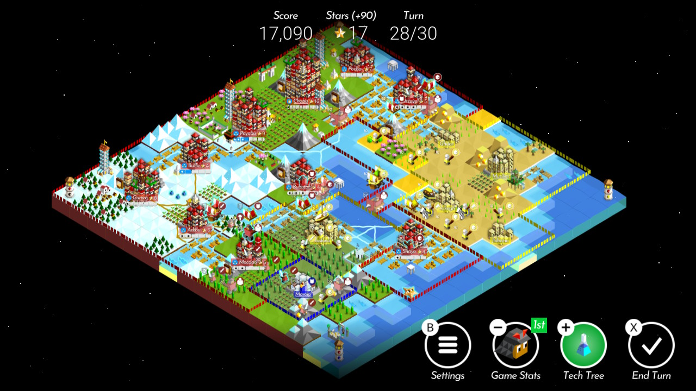

### Turn 28


#### Enemy actions – Oumaji


    Oumaji moved its **damaged Warrior (6HP)** south, attacking the damaged **Imperius Warrior (5HP)** near **Moroip**, destroying it. 

Extracted the **Starfish** with **Bomber (Knight)**.

Moved **Veteran Swordsman** south. 


    Moved **Scout** east, attacked **damaged Imperius Warrior (8HP)**, reducing it to **3HP**. **Imperius Warrior** cannot retaliate (out of range).


    Moved **Warrior** in **Muslonu** southeast, attacking and destroying the **damaged Imperius Warrior (3HP)**. 

Moved **Rammer (Warrior)** west of **Bakegh** northeast. 

Moved the **Knight** south on to the **Port**, converting it to a **Knight (Raft)**. 

Moved **Warrior** east of **Ghdor** south. 

Moved **Warrior** southwest of **Ghdor** southeast.

Moved **Warrior** in **Jimordu** west. 

Moved **Warrior** in **Bakegh** south.

Moved **Warrior** east of **Bakegh** southwest.

Moved **Rider** north of **Bakegh** south and southwest.


#### Enemy actions – Imperius


    Imperius moved **Warrior** northwest, attacking **Veteran Swordsman 3**, dealing **4HP** of damage (reducing **Veteran Swordsman 3 **to **11HP**). 


    **Veteran Swordsman 3** retaliates, dealing **7HP** of damage (reducing **Imperius Warrior** to **3HP**). 


#### Player actions

Bubutof’s **Water Temple** upgraded to Level 2, adding an extra 150 points. 


    Examined the **Ruins** with **Giant 1,** earned **Veteran Swordsman 5**.


    Moved **Swordsman 2** south one tile, attacking the **Imperius Warrior (3HP)**, destroying it. 

**Swordsman 2** achieved Veteran status – upgraded to **20HP**.

Moved **Veteran Swordsman 3 (11HP)** southeast two tiles, towards **Moroip**. 


    Moved **Scout 2 (Swordsman 4) **to the tile south of **Moroip**, disembarking.


    Moved **Juggernaut 2 (Giant 2)** two tiles northwest to the **Mountain** tile to the east of Moroip, disembarking, delivering **2HP** of splash damage to the **Defender**. 

Moved **Bomber 1 (Warrior 2)** northwest one tile. 

Moved **Juggernaut 4 (Giant 4)** north one tile. 


    Built three **Ports** (twenty-one Stars) in Shayo and one **Water Temple** (twenty Stars) (+4 Population Points).


    ***Shayo upgraded to Level 4. Upgrade chosen: Border Growth.***

Built a **Mine** (five Stars) and extracted a **Wild Animal** in Mocado (+3 Population Points). 


    ***Mocado upgraded to Level 4. Upgrade chosen: Border Growth.*** \


Trained **Swordsman 6** (five Stars) in **Mocado**. 

**Mind Bender 1** healed** Giant 3** for **4HP** (restoring it to **38HP**). 


    Built a **Windmill** (five Stars) in **Pocha-** and destroyed the **Farm** to the west (Population growth and loss neutralised). 


    Destroyed **Market** and rebuilt it on the tile previously occupied by the **Farm** (five Stars). This new **Market **generates 7 SPT. 

Built a **Road** (three Stars) connecting **Chabu** to its **Ports** to the southeast.

Moved **Giant 5** southwest one tile, turning it into **Juggernaut 5 (Giant 5)**. 

Moved **Giant 6** two tiles southwest, turning it into **Juggernaut 6 (Giant 6)**.

Trained **Swordsman 7** (five Stars) in **Xiszuyo**.


<table>
  <tr>
   <td><strong>City</strong>
   </td>
   <td><strong>Level</strong>
   </td>
   <td><strong>SPT</strong>
   </td>
   <td><strong>Upgrades and Buildings</strong>
   </td>
   <td><strong>Monuments and Temples</strong>
   </td>
   <td><strong>Points</strong>
   </td>
  </tr>
  <tr>
   <td>Chabu
   </td>
   <td>9
   </td>
   <td>16
   </td>
   <td>Workshop, Resources, Farms (3), Mines (2), Border Growth, Market, Parks (2)
   </td>
   <td>Gate of Power
   </td>
   <td>1150
   </td>
  </tr>
  <tr>
   <td>Pocha-
   </td>
   <td>5
   </td>
   <td>12
   </td>
   <td>Workshop, Resources, Ports (1), Farms (1), Forge, Border Growth, Market, Parks (1)
   </td>
   <td>
   </td>
   <td>300
   </td>
  </tr>
  <tr>
   <td>Poyobu
   </td>
   <td>7
   </td>
   <td>18
   </td>
   <td>Workshop, Farms (2), City Walls, Border Growth, Windmill, Market, Parks (1)
   </td>
   <td>Park of Fortune, Altar of Peace, Grand Bazaar
   </td>
   <td>1850
   </td>
  </tr>
  <tr>
   <td>Xiszuyo
   </td>
   <td>5
   </td>
   <td>5
   </td>
   <td>Explorer, Ports (1), Resources, Border Growth
   </td>
   <td>
   </td>
   <td>300
   </td>
  </tr>
  <tr>
   <td>Bufla
   </td>
   <td>4
   </td>
   <td>4
   </td>
   <td>City Walls, Border Growth
   </td>
   <td>
   </td>
   <td>250
   </td>
  </tr>
  <tr>
   <td>Gurøro
   </td>
   <td>6
   </td>
   <td>8
   </td>
   <td>Resources, Mines (2), Border Growth, Forge, Lumber Huts (2), Parks (2)
   </td>
   <td>
   </td>
   <td>600
   </td>
  </tr>
  <tr>
   <td>Bubutof
   </td>
   <td>4
   </td>
   <td>4
   </td>
   <td>Ports (1), Resources, Border Growth
   </td>
   <td>
   </td>
   <td>250
   </td>
  </tr>
  <tr>
   <td>Arkbu
   </td>
   <td>4
   </td>
   <td>5
   </td>
   <td>Workshop, Ports (1), City Walls, Border Growth
   </td>
   <td>
   </td>
   <td>250
   </td>
  </tr>
  <tr>
   <td>Shayo
   </td>
   <td>4
   </td>
   <td>4
   </td>
   <td>Explorer, City Walls, Border Growth
   </td>
   <td>
   </td>
   <td>250
   </td>
  </tr>
  <tr>
   <td>Mocado
   </td>
   <td>4
   </td>
   <td>5
   </td>
   <td>Border Growth
   </td>
   <td>
   </td>
   <td>250
   </td>
  </tr>
</table>


```
The noose tightens around the last Imperius city – I did not attack the Defender, as I knew I'd lose that combat, and see the Swordsman destroyed.

I have removed the last fog-of-war tiles from the map, meaning I can now see everything. 

I'll break peace with Oumaji next turn and put the hurt on them – I should be able to take Ghdor and Bakegh, and maybe Muslonu, too. 

I have left it too late to capture everything – my fault for being so nice – so I'll grab what I can.
```


*End turn.*

*Stars: 17*

*SPT: 90*

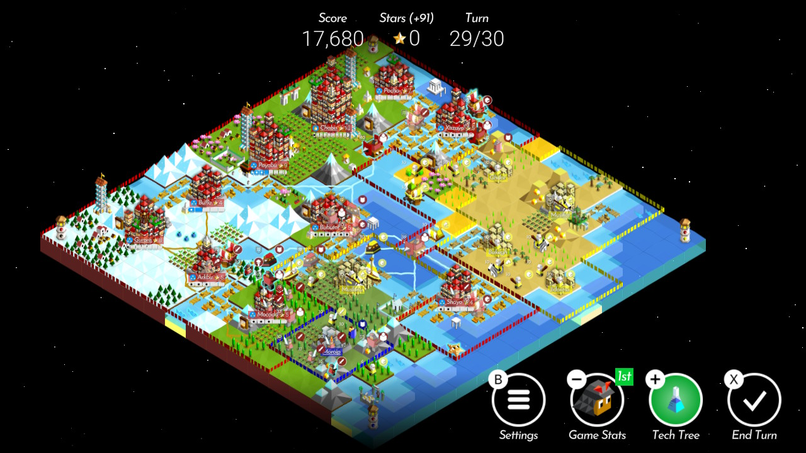

### Turn 29


#### Enemy actions – Oumaji

Oumaji broke the Peace Treaty.


    Moved **Warrior** southeast of **Muslonu** north onto the **Port**, becoming a **Warrior (Raft)**, upgraded to **Scout (Warrior)**.

 


    Moved **Veteran Swordsman** south, attacked **damaged Imperius Defender (13HP)** in **Moroip (Walls)**, dealing **3HP** of damage (reducing **Imperius Defender** to **10HP**). 


    **Damaged Imperius Defender (10HP)** retaliates, dealing **10HP** of damage (reducing the Oumaji **Veteran Swordsman** to **10HP**). 

Moved **Bomber (Knight)** north one tile. 

Moved **Rammer (Warrior)** northwest of **Bakegh** west two tiles. 

Moved **Knight (Raft)** north two tiles, disembarking.

Moved **Scout** north of **Muslonu** west and southwest.

Moved **Warrior** in **Muslonu** west.

Moved **Warrior** west of **Jimordu** east.

Moved **Warrior** south of **Bakegh** southeast.

Moved **Warrior** north of **Jimordu** southwest.

Moved **Rider** southeast of **Bakegh** southwest.

Moved **Rider** southwest of **Bakegh** west and northwest. 

Moved **Warrior** south of **Ghdor** north.

Moved **Warrior** on **Crops** tile southwest of **Ghdor** north. 

Trained **Warrior** in **Bakegh**. 

Trained **Knight** in **Musilim**.

Trained **Knight** in **Muslonu**. 


#### Enemy actions – Imperius


    Imperius moved the **damaged Defender (10HP)** northeast out of **Moroip**, and trained a new **Defender**. 


#### Player actions

*Wealth* quest completed (accumulate 100 stars), **Emperor’s Tomb** monument unlocked.

**Pocha-**’s **Water Temple** upgraded to Level 3, adding an extra 200 points.


    Built three **Roads** (nine Stars) from the tile where **Veteran Swordsman 5** was spawned from the Ruins.

Moved **Veteran Swordsman 3** south.

Moved **Veteran Swordsman 2** southeast.

Moved **Veteran Swordsman 5** east and southeast.


    Attacked **Imperius Defender** in **Moroip** with **Giant 2 (35HP)**, delivering **6HP** of damage (reducing **Imperius Defender** to **9HP**). 


    **Imperius Defender** in **Moroip** retaliates, delivering **10HP** of damage (reducing **Giant 2** to **25HP**).


    Attacked **Defender** in **Moroip** with **Veteran Swordsman 5**, delivering **4HP** of damage (reducing **Defender** to **5HP**). 


    **Imperius Defender** in **Moroip** retaliates, delivering **10HP** of damage (reducing **Veteran Swordsman 5** to **10HP**).


    Attacked and destroyed **Imperius Defender** in **Moroip** with **Veteran Swordsman 2**.


    **Veteran Swordsman 2** begins capturing **Moroip**.

Moved **Swordsman 6** northeast. 

Trained **Swordsman 8** (five Stars) in **Mocado**.

Moved **Giant 1** northeast two tiles. 


    Trained **Catapult 1** (eight Stars) in **Arkbu**.


    Upgraded **Defender 1 (Raft)** to **Rammer 1 (Defender 1) **(five Stars). Moved **Rammer 1 (Defender 1)** southwest.


    Upgraded **Defender 2 (Raft)** to **Rammer 2 (Defender 2)** (five Stars). Moved **Rammer 2 (Defender 2)** southwest.


    Moved **Defender 4 (Raft)** southeast and east, onto the **Mountain** tile north of **Ghdor**, disembarking as **Defender 4**. 

Upgraded **Warrior 1 (Raft)** to **Bomber 3 (Warrior 1)** (fifteen Stars).


    Moved **Swordsman 7** west, converted to **Swordsman 7 (Raft)**, upgraded to **Bomber 4 (Swordsman 7)** (fifteen Stars).

**Mind Bender 1** healed **Bomber 1 (Warrior 2)** for **3HP** (restoring it to **10HP**). 


    Moved **Defender 3** in **Bubutof** northeast, converting it to **Defender 3 (Raft)**, upgraded **Rammer 3 (Defender 3)** (five Stars).

Healed **Juggernaut 4** for **2HP** (restoring it to **39HP**). 


    Moved **Warrior 5** southeast to the **Port** in **Shayo**, converting it to **Warrior 5 (Raft)**. Upgraded to **Bomber 5 (Warrior 5)** (fifteen Stars).

Trained **Swordsman 9** (five Stars) in **Shayo**.

Used **Clear Forest** on the tile southwest of the **Mine** in **Mocado**. 


    Built **Forge** (five Stars) in **Bubutof**, extracted **Fish** (two Stars) and built two **Ports** (seven Stars) (+5 Population Points).


    ***Bubutof upgraded to Level 5. Upgrade chosen; Super Unit (Giant 8).***


<table>
  <tr>
   <td><strong>City</strong>
   </td>
   <td><strong>Level</strong>
   </td>
   <td><strong>SPT</strong>
   </td>
   <td><strong>Upgrades and Buildings</strong>
   </td>
   <td><strong>Monuments and Temples</strong>
   </td>
   <td><strong>Points</strong>
   </td>
  </tr>
  <tr>
   <td>Chabu
   </td>
   <td>9
   </td>
   <td>16
   </td>
   <td>Workshop, Resources, Farms (3), Mines (2), Border Growth, Market, Parks (2)
   </td>
   <td>Gate of Power
   </td>
   <td>1150
   </td>
  </tr>
  <tr>
   <td>Pocha-
   </td>
   <td>5
   </td>
   <td>12
   </td>
   <td>Workshop, Resources, Ports (1), Farms (1), Forge, Border Growth, Market, Parks (1)
   </td>
   <td>
   </td>
   <td>300
   </td>
  </tr>
  <tr>
   <td>Poyobu
   </td>
   <td>7
   </td>
   <td>18
   </td>
   <td>Workshop, Farms (2), City Walls, Border Growth, Windmill, Market, Parks (1)
   </td>
   <td>Park of Fortune, Altar of Peace, Grand Bazaar
   </td>
   <td>1850
   </td>
  </tr>
  <tr>
   <td>Xiszuyo
   </td>
   <td>5
   </td>
   <td>5
   </td>
   <td>Explorer, Ports (1), Resources, Border Growth
   </td>
   <td>
   </td>
   <td>300
   </td>
  </tr>
  <tr>
   <td>Bufla
   </td>
   <td>4
   </td>
   <td>4
   </td>
   <td>City Walls, Border Growth
   </td>
   <td>
   </td>
   <td>250
   </td>
  </tr>
  <tr>
   <td>Gurøro
   </td>
   <td>6
   </td>
   <td>8
   </td>
   <td>Resources, Mines (2), Border Growth, Forge, Lumber Huts (2), Parks (2)
   </td>
   <td>
   </td>
   <td>600
   </td>
  </tr>
  <tr>
   <td>Bubutof
   </td>
   <td>5
   </td>
   <td>5
   </td>
   <td>Ports (1), Resources, Border Growth
   </td>
   <td>
   </td>
   <td>300
   </td>
  </tr>
  <tr>
   <td>Arkbu
   </td>
   <td>4
   </td>
   <td>5
   </td>
   <td>Workshop, Ports (1), City Walls, Border Growth
   </td>
   <td>
   </td>
   <td>250
   </td>
  </tr>
  <tr>
   <td>Shayo
   </td>
   <td>4
   </td>
   <td>4
   </td>
   <td>Explorer, City Walls, Border Growth
   </td>
   <td>
   </td>
   <td>250
   </td>
  </tr>
  <tr>
   <td>Mocado
   </td>
   <td>4
   </td>
   <td>5
   </td>
   <td>Border Growth
   </td>
   <td>
   </td>
   <td>250
   </td>
  </tr>
</table>


```
A lot of positioning and building happening in this, the penultimate turn. 

Moroip is mine, there's no way Oumaji can lift the siege. 

I have belatedly realised that I could have pulled off a clean sweep in this game – I was too cautious, and really should have swept through Oumaji's land way sooner. 

I am going to try to at least get a unit – likely Defender 4 – to capture Ghdor.

I have deliberately spread out my units so as to minimise the splash damage posed by the sole Oumaji Bomber – which I suspect will fire on the units clustered outside of Bubutof. I deliberately chose a Super Unit for my upgrade here, because with 40HP, the Giant will be able to absorb the damage better – assuming that Oumaji targets the Giant first. 
```


*End turn.*

*Stars: 0*

*SPT: 91*

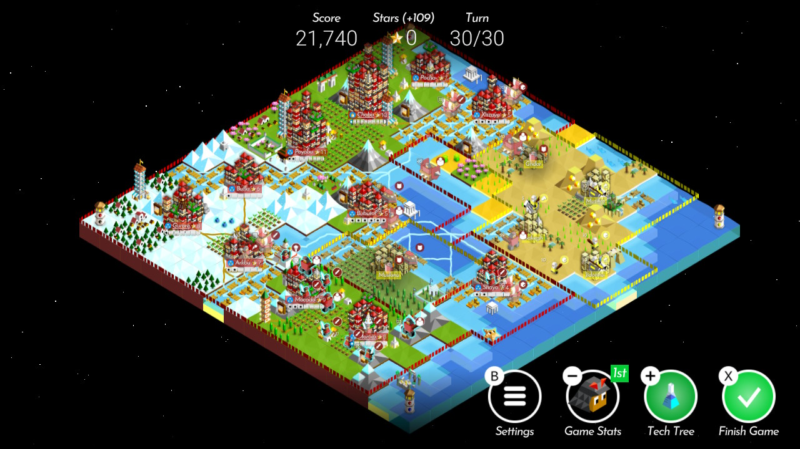

### Turn 30


#### Enemy actions – Oumaji


    Oumaji attacked **Bomber 1 (Warrior 2)** with its **Scout (Warrior)** based northeast of **Muslonu**, dealing **4HP** of damage (reducing **Bomber 1 (Warrior 2)** to **6HP**). 

Moved **Rammer (Warrior)** northwest, attacking and destroying **Bomber 1 (Warrior 2)**.


    Moved **Scout (Warrior)** west of **Muslonu** north, and attacked **Bomber 2 (Swordsman 1)** dealing **4HP** of damage (reducing **Bomber 2 (Swordsman 1)** to **11HP**). 

Moved **Bomber** north and northwest, did not attack. 


    Moved a **Warrior** northwest from **Ghdor** onto the **Port**, converted to **Warrior (Raft)** and upgraded it to a **Scout (Warrior)**. 

Moved **Knight (Raft)** north two tiles, disembarking southwest of **Ghdor**.

Moved the **Knight** in **Musilim** west then northwest two tiles, to the east of **Ghdor**.


    Attacked **Giant 1 (37HP)** with a damaged **Veteran Swordsman (10HP)** for **3HP** of damage. 

**Giant 1** retaliates, destroying the **Veteran Swordsman**. 


    Attacked **Veteran Swordsman 2** with the adjacent **Warrior (6HP)** for **1HP** of damage. 


    **Veteran Swordsman 2** retaliates, destroying the **Warrior**. 


    Moved the **Knight** in **Muslonu** northwest, attacked **Rammer 2 (Defender 2)** dealing **7HP** of damage (reducing **Rammer 2 (Defender 2) **to **8HP**). 


    **Rammer 2 (Defender 2)** retaliates, dealing **8HP** of damage (reducing **Oumaji Knight** to **2HP**). 


    Attacked **Rammer 2 (Defender 2)** with a **Warrior**, dealing **4HP** of damage. 


    **Rammer 2 (Defender 2)** retaliates, dealing **7HP** of damage (reducing **Oumaji Warrior** to **3HP**). 


    Moved **Rider** east of **Bakegh** northwest two tiles. 


    Moved **Rider** south of **Bakegh** northwest. 


    Moved **Warrior** east of **Jidormu** north.


    Moved **Warrior** in **Jidormu** east.


    Moved **Warrior** northwest of **Jidormu** northeast.


#### Enemy actions – Imperius

No action.


#### Player actions


    **Bomber 2 (Swordsman 1)** fired on the damaged **Knight (2HP)** northwest of **Muslonu**, destroying the **Knight**, delivering splash damage to the Oumaji units clustered in and around **Muslonu**; 


        **Bomber 2 (Swordsman 1)** attacked the **damaged Oumaji Warrior (3HP)**, destroying it.


        **Bomber 2 (Swordsman 1)** attacked the **Oumaji Warrior** in **Muslonu**, delivering **3HP** of splash damage (reducing **Oumaji Warrior** to **7HP**).


         \
**Bomber 2 (Swordsman 1)** attacked the **Scout (Warrior)**, delivering **4HP** of splash damage (reducing the **Scout (Warrior) **to **6HP**). 


    **Catapult 1** attacked and destroyed the **Scout (Warrior)** to the west of **Muslonu**. 


    Moved **Rammer 1 (Defender 1)** east two tiles, attacking and destroying the damaged **Oumaji Warrior (7HP)** in **Muslonu**, disembarking. **Defender 1** begins capturing **Muslonu**. 


    Moved **Rammer 2 (Defender 2)** east one tile and attacking and destroying the damaged **Oumaji Scout (6HP)**.


    **Bomber 5 (Warrior 5)** attacked **Oumaji Warrior** in **Bakegh**, delivering **7HP** of damage, reducing **Oumaji Warrior** to **3HP**, delivering splash damage to the **Oumaji** units around **Bakegh**; 


        **Bomber 5 (Warrior 5)** attacked the **Oumaji Rider** north of **Bakegh**, delivering **5HP** of splash damage (reducing **Oumaji Rider** to **5HP**).


        **Bomber 5 (Warrior 5)** attacked the **Oumaji Rider** southwest of **Bakegh**, delivering **5HP** of splash damage (reducing **Oumaji Rider** to **5HP**).


         \
**Bomber 2 (Swordsman 1)** attacked the **Oumaji Warrior** southeast of **Bakegh**,  delivering **4HP** of splash damage (reducing **Oumaji Warrior **to **6HP**).


    Moved **Juggernaut 4 (Giant 4)** east and southwest, landing on the tile southwest of **Bakegh**, destroying all nearby units. 


    Moved **Giant 8** southeast, attacking and destroying the **Oumaji Rammer**, and becoming **Juggernaut 7 (Giant 8)** in the process. 


    **Rammer 3 (Defender 3)** attacked the **Oumaji Bomber**, delivering **8HP** of damage, (reducing **Oumaji Bomber** to **2HP**).


    Moved **Juggernaut 6 (Giant 6)** south and southeast, destroying the **Oumaji Bomber**, and dealing **7HP** of splash damage to the **Oumaji Knight** on the shore (reducing **Oumaji Knight** to **3HP**).


    Moved **Juggernaut 5 (Giant 5)** south to the **Port** tile northwest of **Ghdor**, destroying the **Scout**, **Knight**, and both **Warriors**. 

Moved **Defender 4** south into **Ghdor** – **Defender 4** starts capturing **Ghdor**.

**Bomber 4 (Swordsman 7) **fired on the **Oumaji** **Knight**, destroying it. 

**Veteran Swordsman 2** captures **Moroip** – *Imperius is defeated.*


    Built a **Port** (seven Stars), **Forge** (five Stars), and a **Mountain Temple** (twenty Stars) in **Poyobu** (+4 Population Points).


    ***Poyobu upgraded to Level 8. Upgrade chosen: Park.***


    Used **Clear Forest** on the tile to the east of **Arkbu**. Built the **Emperor’s Tomb** monument (+3 Population Points), extracted **Fish** (two Stars) and built a **Port** (seven Stars) in **Arkbu** (+5 Population Points).


    ***Arkbu upgraded to Level 5. Upgrade chosen: Park.***


    Built two **Ports** (fourteen Stars) and a **Lumber Hut** (three Stars) in **Bufla** (+3 Population Points).


    ***Bufla upgraded to Level 5. Upgrade chosen: Park.***

Built a **Mine** (five Stars) in **Moroip**  (+2 Population Points). 


    ***Moroip upgraded to Level 4. Upgrade chosen: Border Growth***.

Built another **Mine** and a **Forge** (ten Stars) in **Moroip** (+6 Population Points). 


    ***Moroip upgraded to Level 5. Upgrade chosen: Park***.


    Used **Clear Forest** on the tile to the west of **Moroip**. Built **Windmill** (five Stars) on the same tile (+4 Population Points).

Extracted **Fish** (two Stars) near **Moroip** (+1 Population Point).


    ***Moroip upgraded to Level 6. Upgrade chosen: Park***.


    Used **Burn Forest** on the tile southwest of **Mocado**, turned the **Crops** into a **Farm** (eight Stars) (+2 Population Points).


    Used **Clear Forest** on the tile to the east of **Mocado**, built **Windmill** (five Stars) on the same tile (+2 Population Points).

Used **Clear Forest** on the two **Forest** tiles to the south of **Moroip**. 


    Built a **Lumber Hut **(three Stars) on the tile to the north of **Mocado** (+1 Population Point).


    ***Mocado upgraded to Level 5. Upgrade chosen: Park***.


    Built the **Eye of God** and **Tower of Wisdom** monuments to the northwest and southwest of **Mocado**. 


    ***Mocado upgraded to Level 6. Upgrade chosen: Park.***


<table>
  <tr>
   <td><strong>City</strong>
   </td>
   <td><strong>Level</strong>
   </td>
   <td><strong>SPT</strong>
   </td>
   <td><strong>Upgrades and Buildings</strong>
   </td>
   <td><strong>Monuments and Temples</strong>
   </td>
   <td><strong>Points</strong>
   </td>
  </tr>
  <tr>
   <td>Chabu
   </td>
   <td>9
   </td>
   <td>16
   </td>
   <td>Workshop, Resources, Farms (3), Mines (2), Border Growth, Market, Parks (2)
   </td>
   <td>Gate of Power
   </td>
   <td>1150
   </td>
  </tr>
  <tr>
   <td>Pocha-
   </td>
   <td>5
   </td>
   <td>12
   </td>
   <td>Workshop, Resources, Ports (1), Farms (1), Forge, Border Growth, Market, Parks (1)
   </td>
   <td>
   </td>
   <td>300
   </td>
  </tr>
  <tr>
   <td>Poyobu
   </td>
   <td>8
   </td>
   <td>20
   </td>
   <td>Workshop, Farms (2), City Walls, Border Growth, Windmill, Market, Parks (2)
   </td>
   <td>Park of Fortune, Altar of Peace, Grand Bazaar
   </td>
   <td>2100
   </td>
  </tr>
  <tr>
   <td>Xiszuyo
   </td>
   <td>5
   </td>
   <td>5
   </td>
   <td>Explorer, Ports (1), Resources, Border Growth
   </td>
   <td>
   </td>
   <td>300
   </td>
  </tr>
  <tr>
   <td>Bufla
   </td>
   <td>5
   </td>
   <td>6
   </td>
   <td>City Walls, Border Growth, Parks (1)
   </td>
   <td>
   </td>
   <td>300
   </td>
  </tr>
  <tr>
   <td>Gurøro
   </td>
   <td>6
   </td>
   <td>8
   </td>
   <td>Resources, Mines (2), Border Growth, Forge, Lumber Huts (2), Parks (2)
   </td>
   <td>
   </td>
   <td>600
   </td>
  </tr>
  <tr>
   <td>Bubutof
   </td>
   <td>5
   </td>
   <td>5
   </td>
   <td>Ports (1), Resources, Border Growth
   </td>
   <td>
   </td>
   <td>300
   </td>
  </tr>
  <tr>
   <td>Arkbu
   </td>
   <td>5
   </td>
   <td>7
   </td>
   <td>Workshop, Ports (1), City Walls, Parks (1)
   </td>
   <td>
   </td>
   <td>500
   </td>
  </tr>
  <tr>
   <td>Shayo
   </td>
   <td>4
   </td>
   <td>4
   </td>
   <td>Explorer, City Walls, Border Growth
   </td>
   <td>
   </td>
   <td>250
   </td>
  </tr>
  <tr>
   <td>Mocado
   </td>
   <td>6
   </td>
   <td>8
   </td>
   <td>Border Growth, Parks (2)
   </td>
   <td>
   </td>
   <td>850
   </td>
  </tr>
  <tr>
   <td>Moroip
   </td>
   <td>6
   </td>
   <td>8
   </td>
   <td>Border Growth, Parks (2)
   </td>
   <td>
   </td>
   <td>850
   </td>
  </tr>
</table>


```
Endgame – failed to really make a dent in Oumaji's territory, but I have been comfortably ahead for the last few turns, so I don't mind that much. 

As it's a Perfection game, meaning the winner is whoever nets the most points, it's not all about territory and conquest. 

To cement my lead, I spend the last few actions upgrading my cities and spamming Parks, giving me an extra 1,000 points (250 points per Park) in total.
```


*End turn. *

*Stars: 0*

*SPT: 91*

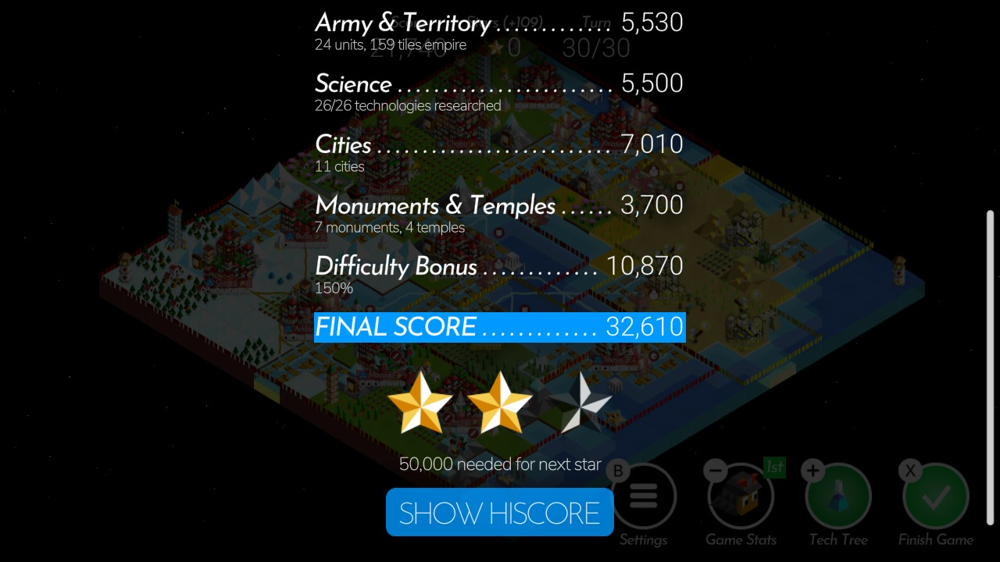

### Analysis 

Focusing on creating as many Giants as I could early on proved effective, but I failed to build on the momentum I gained against Bardur. 

My cautious approach towards Oumaji cost me points; I could have easily swept through their defences, and should have, once I realised the state of their economy, while keeping Imperius at bay at the same time.

Unlocking all of the monuments and technologies was satisfying, but I could have built more temples sooner, as well as avoided a peace treaty with a weak opponent. 

All of these things could have improved my final score.
